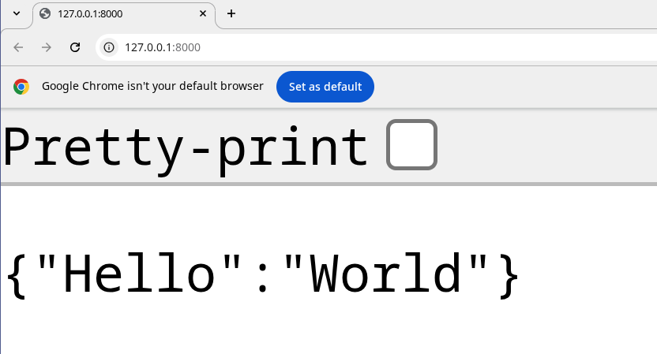

# Getting Started

In this chapter, we will establish a minimal FastAPI development environment, covering prerequisites, package management with **uv**, and the orchestration of a basic service.

## Prerequisites

Before proceeding, ensure the following tools are installed on your system:

- **Python 3.12+**: The core language runtime.
- **Text Editor**: A modern editor such as [VS Code](https://code.visualstudio.com/), [PyCharm](https://www.jetbrains.com/pycharm/), or [Zed](https://zed.dev/).
- **Unix-like Environment**: Linux, macOS, or Windows with [WSL](https://learn.microsoft.com/en-us/windows/wsl/install).
- **Git**: For version control.
- **Docker & Docker Compose**: For containerization and service orchestration.

> [!NOTE]
> This guide uses VS Code with the [Microsoft Python Extension](https://marketplace.visualstudio.com/items?itemName=ms-python.python) on an [Arch Linux system](https://endeavouros.com/) with the [Fish shell](https://fishshell.com/). However, the instructions are compatible with any standard Unix-like environment and shell.

## Introduction to uv

Throughout this course, we will use [uv](https://docs.astral.sh/uv/) as our primary package and project manager. Written in Rust, **uv** is an exceptionally fast and modern alternative to traditional tools such as [pip](https://pip.pypa.io/en/stable/), [pipenv](https://pipenv.pypa.io/en/latest/), and [poetry](https://python-poetry.org/).

Beyond package installation, **uv** provides robust features for:

- **Python Version Management**: Seamlessly switching between Python runtimes.
- **Dependency Resolution**: Rapid and reliable resolution for complex dependency trees.
- **Building & Publishing**: Streamlined workflows for package distribution.
- **Script Execution**: Running scripts within isolated, reproducible environments.

### Installation Methods

Multiple installation methods are available for **uv**, depending on your operating system:

**Using Curl** (Linux, macOS, and Unix-derived platforms)
```bash
$ curl -LsSf https://astral.sh/uv/install.sh | sh
```

**Using PowerShell** (Windows)
```bash
PS> powershell -c "irm https://astral.sh/uv/install.ps1 | iex"
```

**Using Pipx**
```bash
$ pipx install uv
```

For comprehensive details, refer to the official [uv installation documentation](https://docs.astral.sh/uv/getting-started/installation/).

### Initializing a uv Project

After installation, verify the setup by executing the `uv` command:

```bash
$ uv
An extremely fast Python package manager.

Usage: uv [OPTIONS] <COMMAND>

Commands:
    auth     Manage authentication
    run      Run a command or script
    init     Create a new project
    add      Add dependencies to the project
    remove   Remove dependencies from the project
    version  Read or update the project's version
```

The **uv** tool suite also includes **uvx**, a utility designed for executing binaries and Python tools directly without permanent installation:

```bash
$ uvx
Provide a command to run with `uvx <command>`.

See `uvx --help` for more information.
```

To initialize a new project, use the `uv init` command:

```bash
$ uv init fastapi-beyond-crud
Initialized project `fastapi-beyond-crud`
```

This command generates a directory named `fastapi-beyond-crud` containing the following structure:

```text
.
├── main.py
├── pyproject.toml
├── .python-version
└── README.md
```

#### Project File Overview

- **`main.py`**: A boilerplate Python script to verify the environment.
    ```python
    def main():
        print("Hello from fastapi-beyond-crud!")

    if __name__ == "__main__":
        main()
    ```

- **`pyproject.toml`**: The primary configuration file for the project, handling dependency management, metadata, and tool-specific settings.
    ```toml
    [project]
    name = "fastapi-beyond-crud"
    version = "0.1.0"
    description = "Add your description here"
    readme = "README.md"
    requires-python = ">=3.13"
    dependencies = []
    ```

- **`.python-version`**: Specifies the Python version pinned for the project.
    ```text
    3.13
    ```

- **`README.md`**: A Markdown file for project documentation.

### Executing the Project

With the project structure established, use the `uv run` command to execute the starter script:

```bash
$ uv run main.py
Using CPython 3.13.11
Creating virtual environment at: .venv
Hello from fastapi-beyond-crud!
```

Upon execution, **uv** automatically creates an isolated virtual environment in the `.venv` directory and generates a `uv.lock` file to ensure deterministic builds by pinning specific dependency versions.

```text
.
├── .gitignore
├── main.py
├── pyproject.toml
├── .python-version
├── README.md
├── uv.lock
└── .venv
```

The `uv run` command can execute standalone Python scripts or binaries available within the project environment. Running `uv run` without arguments displays available binaries:

```bash
$ uv run
Provide a command or script to invoke with `uv run <command>` or `uv run <script>.py`.

The following commands are available in the environment:

- python
- python3
- python3.13
```

To enter an interactive Python REPL within the project environment:

```bash
$ uv run python
Python 3.13.11 (main, Dec 17 2025, 21:08:16) [Clang 21.1.4 ] on linux
Type "help", "copyright", "credits" or "license" for more information.
>>> 
```

### Dependency Management

**Adding Dependencies**: To install a new package, use `uv add`:
```bash
$ uv add <package-name>
```

**Removing Dependencies**: To uninstall a package, use `uv remove`:
```bash
$ uv remove <package-name>
```

## Installing FastAPI

With the project initialized, the next step is to install FastAPI. We utilize the `uv add` command to install the framework along with its standard production dependencies.

```bash
$ uv add "fastapi[standard]"
```

The `fastapi[standard]` meta-package installs several key dependencies:

- **`email-validator`**: Provides email validation via Pydantic.
- **`httpx`**: Necessary for using the `TestClient` during automated testing.
- **`jinja2`**: The default template engine.
- **`python-multipart`**: Required for processing form data.
- **`uvicorn`**: A high-performance ASGI server.
- **`fastapi-cli`**: Provides the `fastapi` command-line interface.

### Verifying the Installation

After installation, verify the available commands by running `uv run`:

```bash
$ uv run
The following commands are available in the environment:

- fastapi
- uvicorn
- ...
```

The `fastapi` command is the primary entry point for managing and running your application. You can explore its capabilities using the `--help` flag:

```bash
$ uv run fastapi --help
 Usage: fastapi [OPTIONS] COMMAND [ARGS]...

 FastAPI CLI - The fastapi command line app. 😎

 Manage your FastAPI projects, run your FastAPI apps, and more.
```

The FastAPI CLI provides several essential subcommands:
- **`dev`**: Starts the application in development mode with auto-reload enabled.
- **`run`**: Executes the application in production mode.
- **`deploy`**: Facilitates deployment to FastAPI Cloud.

## Creating a Basic Application

To test the installation, update `main.py` with the following minimal FastAPI application:

```python
from fastapi import FastAPI

app = FastAPI()

@app.get("/")
def index() -> dict:
    return {"Hello": "World"}
```

### Running the Development Server

Execute the application using the `fastapi dev` command:

```bash
$ uv run fastapi dev
   FastAPI   Starting development server 🚀
 
    server   Server started at http://127.0.0.1:8000
    server   Documentation at http://127.0.0.1:8000/docs
 
       tip   Running in development mode; for production, use: fastapi run
```

In development mode, the server will automatically monitor for file changes and reload the application, ensuring a seamless development workflow.

> [!NOTE]
> FastAPI CLI can automatically detect your application if you specify it in your `pyproject.toml` file. This allows you to run `uv run fastapi dev` or `uv run fastapi run` without manually specifying the application object.
>
> You can configure this by adding the following to your `pyproject.toml`:
>
> ```toml
> [tool.fastapi]
> entrypoint = "main:app"
> ```

With this configuration, you can directly run:

```bash
$ uv run fastapi dev
```

Instead of the more verbose:

```bash
$ uv run fastapi dev [PATH]
```

Where `[PATH]` is the path to your application instance (e.g., `main.py`). You can also use the following options:

- **`--host`**: The address to serve on (default: `127.0.0.1`).
- **`--port`**: The port to serve on (default: `8000`).
- **`--reload`**: Enables auto-reload on code changes.
- **`--entrypoint`**: Manually specifies the app import string (e.g., `main:app`).


Let us navigate to the docs at http://127.0.0.1:8000/ and we should see the following:



> [!TIP]
> You can still use traditional virtual environments with `uv venv`, activate them with `source .venv/bin/activate`, and use `uv pip` if you prefer a more familiar workflow.

## Scaffolding with `fastapi-new`

For an even faster setup, you can use `fastapi-new` to bootstrap a project structure automatically:

```bash
$ uvx run fastapi-new
Installed 11 packages in 40ms

   FastAPI   Creating a new project 🚀
 
       env   Setting up environment with uv
 
      deps   Installing dependencies...
 
  template   Writing template files...
 
   success   ✨ Success! Created FastAPI project: fastapi-beyond-crud
 
             Next steps:
                $ cd fastapi-beyond-crud
                $ uv run fastapi dev
 
             Visit http://localhost:8000
 
             Deploy to FastAPI Cloud:
               $ uv run fastapi login
               $ uv run fastapi deploy
 
             💡 Tip: Use 'uv run' to automatically use the project's environment
```

Following these steps will generate the same FastAPI application we built manually, but with significantly less effort.

## Conclusion

In this chapter, we established a robust foundation for FastAPI development using **uv**. We covered project initialization, dependency management, and running a development server with the FastAPI CLI. With an auto-reloading environment ready, we can now move on to building more complex features.

