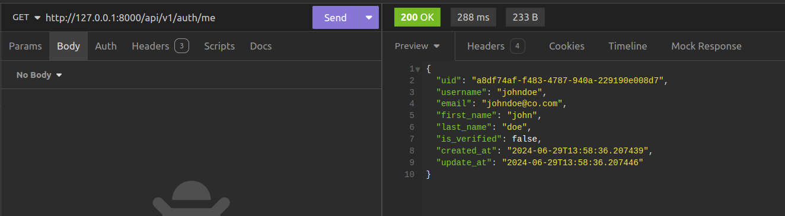
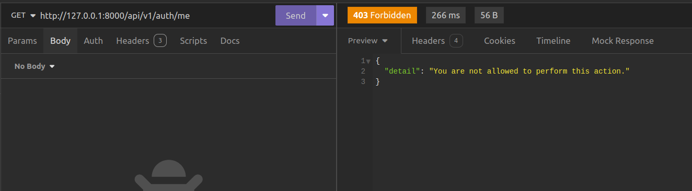

# Role Based Access Control
## Introduction
With  our JWT Authentication set, let us set up a system that will allow users to access specific parts of our app based on their role within our application. This is what is referred to as **Role-Based Access Control (RBAC). 


### Add Roles To Users
Role-Based access control regulates access to resources within an application based on the roles that have. Users are assigned roles, and to each of these roles, permissions can be assigned. To implement this, we are going to first of all need a role assigned to each of our users.


To do that, Let us go to `src/auth/models.py` and make some changes to the user authentication model.
```python title="adding role attribute"

class User(SQLModel, table=True):
    __tablename__ = "users"
    uid: uuid.UUID = Field(
        sa_column=Column(pg.UUID, nullable=False, primary_key=True, default=uuid.uuid4)
    )
    username: str
    email: str
    first_name: str
    last_name: str
    
    # let us add this line
    role: str = Field(
        sa_column=Column(pg.VARCHAR, nullable=False, server_default="user")
    ) 
    is_verified: bool = Field(default=False)
    password_hash: str 
    created_at: datetime = Field(sa_column=Column(pg.TIMESTAMP, default=datetime.now))
    update_at: datetime = Field(sa_column=Column(pg.TIMESTAMP, default=datetime.now))

    def __repr__(self):
        return f"<User {self.username}>"
```

What we have done is to add a `role` field to the user authentication model. Let us apply this to the database using Alembic.

```console
$ alembic revision --autogenerate -m "add role to users table"
```

We have created a revision to add the role to our table. To make it refelect in the database, we are going to apply it to the database using this command.

```console
$ alembic upgrade head
```
### Get The Current Authenticated User

Now that we've successfully added the role field to the database table without encountering errors, let's proceed to create a dependency that enables us to retrieve the currently authenticated user. Please incorporate the following code into src/auth/dependencies.py.

```python title="dependency to get the currently logged in user"
async def get_current_user(
    token_details: dict = Depends(AccessTokenBearer()),
    session: AsyncSession = Depends(get_session),
):
    user_email = token_details["user"]["email"]

    user = await user_service.get_user_by_email(user_email, session)

    return user
```

This dependency uses the `AccessTokenBearer` dependency to obtain the details of an access token and then extract the user details from it. Once the user details are extracted, the `get_user_by_email` method of the `user_service` object is utilized to retrieve the user object based on the email obtained. The user object is then returned, completing the process of identifying and fetching the currently authenticated user. This ensures that the application can accurately verify the identity and role of the user making the request.

!!! Note
    Dependencies can also be injected into other dependencies. You can not use dependencies inside functions that will not be injected into API paths.


Let us now create an API endpoint for getting the current authenticated user. Edit `src/auth/routes.py` to add the following code.

```python title="getting the current authenticated user"
from fastapi import APIRouter, Depends, status
from .schemas import UserBooksModel, UserCreateModel, UserLoginModel, UserModel
from .dependencies import (AccessTokenBearer, RefreshTokenBearer,get_current_user)


auth_router = APIRouter()
user_service = UserService()


@auth_router.get("/me", response_model=UserBooksModel)
async def get_current_user(user=Depends(get_current_user)):
    return user

```

The code above gets the currently logged in user by using the `get_current_user` dependency that returns the user object. 

When tested, this gives the response shown below.



### Creating the Role Checker dependency

Let us proceed by creating the role checker dependency. Let us add the following code to the `src/auth/dependencies.py`

```python title="Role checker dependencies"
class RoleChecker:
    def __init__(self, allowed_roles: List[str]) -> None:
        self.allowed_roles = allowed_roles

    def __call__(self, current_user: User = Depends(get_current_user)) -> Any:
        if current_user.role in self.allowed_roles:
            return True

        raise HTTPException(
            status_code = status.HTTP_403_FORBIDDEN,
            detail="You are not allowed to perform this action.
        )
```

The RoleChecker class allows us to create objects that will enforce role-based access control for API endpoints. By specifying a list of roles in allowed_roles, we can restrict access to endpoints based on the user's role.

The `__call__` method uses the Depends function to get the currently authenticated user. It then checks if the user's role is in the list of allowed_roles. If the role is not in the list, an HTTPException with a 403 status code is raised, indicating that the user does not have permission to perform the action.

To use the RoleChecker dependency, let’s start by adding Role-Based Access Control (RBAC) to the endpoint that allows us to retrieve the currently logged-in user. Inside `src/auth/routes`, add the following code:

```python title="using the role checker dependency"
from .dependencies import (
    AccessTokenBearer,
    RefreshTokenBearer,
    RoleChecker,
    get_current_user,
)

auth_router = APIRouter()
role_checker = RoleChecker(["admin"])

... # rest of the code insde here

@auth_router.get("/me", response_model=UserBooksModel)
async def get_current_user(
    user=Depends(get_current_user), _: bool = Depends(role_checker)
):
    return user
```

To test this, we shall get to our client and make a request to the endpoint.
 


As shown in the example, the current user is denied access to the endpoint because they lack sufficient permissions, specifically, they are not an admin.

To address this, we can modify the role_checker to include the user role, thereby granting access to users with either the admin or user role. This change ensures that both admins and regular users can access the endpoint.

```python title="role checker with user role"
role_checker = RoleChecker(["admin","user"])
```

By updating the role_checker to include the user role, we allow users who have the role of user to access the endpoint in addition to those with the admin role. This makes the endpoint accessible to a broader range of users, depending on the defined roles and permissions.


### Use RBAC with other API endpoints


Let's proceed to enhance the security of all book endpoints by implementing Role-Based Access Control. In src/books/routes.py, let's update the code with the following modifications.
```python title="Book routes with RBAC"
from fastapi import APIRouter, status, Depends
from fastapi.exceptions import HTTPException
from .schemas import Book, BookUpdateModel, BookCreateModel, BookDetailModel
from sqlmodel.ext.asyncio.session import AsyncSession
from src.books.service import BookService
from src.db.main import get_session
from typing import List
from src.auth.dependencies import AccessTokenBearer, RoleChecker


book_router = APIRouter()
book_service = BookService()
acccess_token_bearer = AccessTokenBearer()
role_checker = Depends(RoleChecker(["admin", "user"]))


@book_router.get("/", response_model=List[Book], dependencies=[role_checker])
async def get_all_books(
    session: AsyncSession = Depends(get_session),
    token_details: dict = Depends(acccess_token_bearer),
):
    books = await book_service.get_all_books(session)
    return books

@book_router.get("/user/{user_uid}", response_model=List[Book], dependencies=[role_checker])
async def get_user_book_submissions(
    user_uid:str,
    session: AsyncSession = Depends(get_session),
    token_details: dict = Depends(acccess_token_bearer),
):
    books = await book_service.get_user_books(user_uid,session)
    return books


@book_router.post(
    "/",
    status_code=status.HTTP_201_CREATED,
    response_model=Book,
    dependencies=[role_checker],
)
async def create_a_book(
    book_data: BookCreateModel,
    session: AsyncSession = Depends(get_session),
    token_details: dict = Depends(acccess_token_bearer),
) -> dict:
    user_id = token_details.get("user")["user_uid"]
    new_book = await book_service.create_book(book_data, user_id, session)
    return new_book


@book_router.get("/{book_uid}", response_model=BookDetailModel, dependencies=[role_checker])
async def get_book(
    book_uid: str,
    session: AsyncSession = Depends(get_session),
    token_details: dict = Depends(acccess_token_bearer),
) -> dict:
    book = await book_service.get_book(book_uid, session)

    if book:
        return book
    else:
        raise HTTPException(
            status_code=status.HTTP_404_NOT_FOUND, detail="Book not found"
        )


@book_router.patch("/{book_uid}", response_model=Book, dependencies=[role_checker])
async def update_book(
    book_uid: str,
    book_update_data: BookUpdateModel,
    session: AsyncSession = Depends(get_session),
    token_details: dict = Depends(acccess_token_bearer),
) -> dict:
    updated_book = await book_service.update_book(book_uid, book_update_data, session)

    if updated_book is None:
        raise HTTPException(
            status_code=status.HTTP_404_NOT_FOUND, detail="Book not found"
        )

    else:
        return updated_book


@book_router.delete(
    "/{book_uid}", status_code=status.HTTP_204_NO_CONTENT, dependencies=[role_checker]
)
async def delete_book(
    book_uid: str,
    session: AsyncSession = Depends(get_session),
    token_details: dict = Depends(acccess_token_bearer),
):
    book_to_delete = await book_service.delete_book(book_uid, session)

    if book_to_delete is None:
        raise HTTPException(
            status_code=status.HTTP_404_NOT_FOUND, detail="Book not found"
        )
    else:
        return {}
```

In ths above code, we have gone ahead to create a `role_checker` dependency by providing it as an argument to the `Depends` function. Not that this time we add it as a member to the `dependencies` list, an argument to the http method we create from the FastAPI `app` instance. THis makes our code cleaner since we do not need to use it in our route handler code as we have done for the rest of the other dependencies.
```python
@book_router.get("/{book_uid}", response_model=BookDetailModel, dependencies=[role_checker])
```  

## Conclusion
By implementing the steps outlined, we have successfully integrated Role-Based Access Control (RBAC) into our API endpoints. This ensures that only users with the appropriate roles can access specific parts of the application, enhancing security and maintaining proper access management.