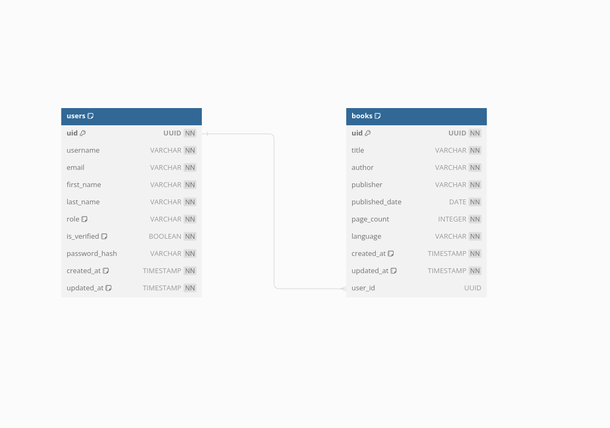
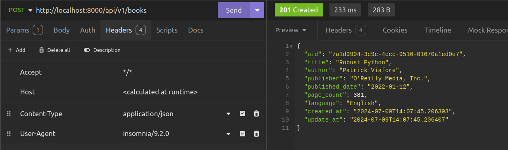
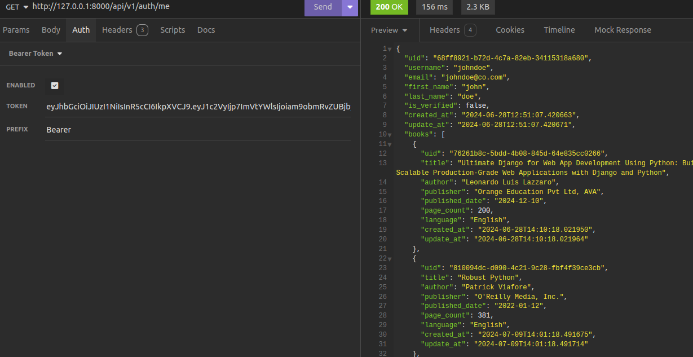
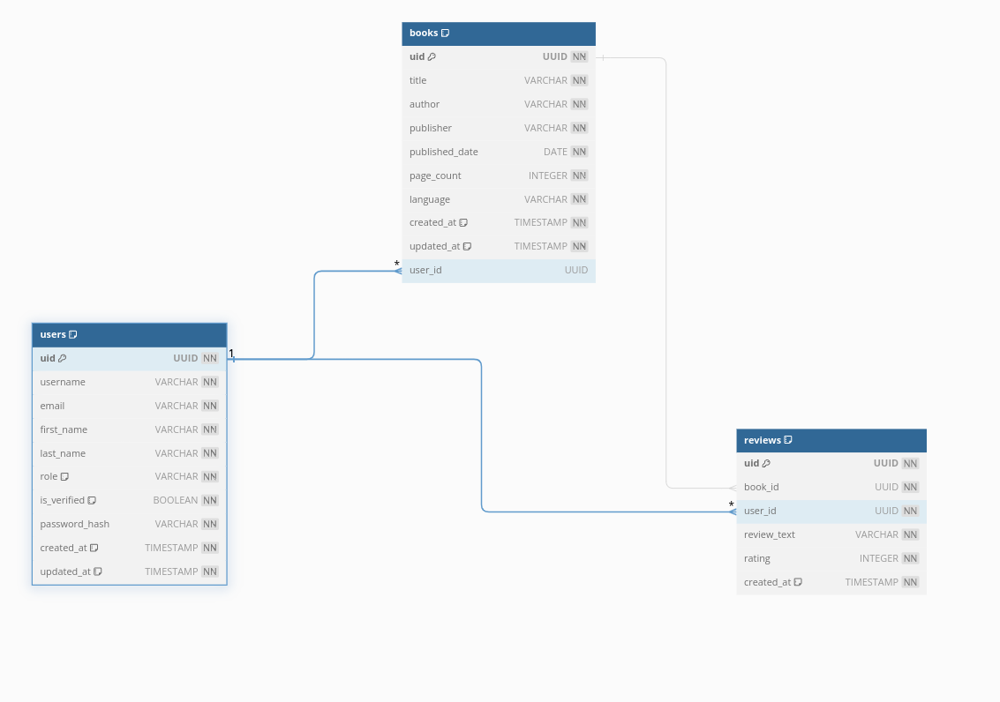
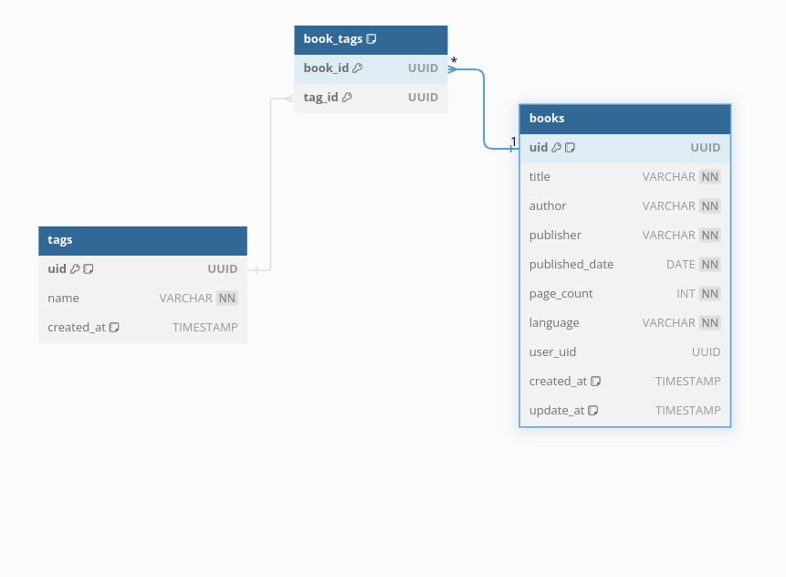

# Model And Schema Relationships

## Introduction

At this point, the only database tables that we have in our database look like the following. If you want such good database design diagrams, please use [DB Diagrams](https://dbdiagram.io/)


To ensure that users can submit multiple books in a one-to-many relationship, we can modify the database structure. Here's how the updated structure would look:



In this structure, we have not really made changes to the `users` table and we have modified the `books` table by adding the `user_uid` that referencing the `uid` field on the `users` table to establish a foreign key relationship.This relationship signifies that each book entry in the books table is associated with a single user who submitted it.

### Associating Books With Users (One To Many Relationship)

To achieve this, let us modify the `Book` database model in `src/books/models.py` to make the above changes take effect.

```python title="the modified books table"

class Book(SQLModel, table=True):
    __tablename__ = "books"

    uid: uuid.UUID = Field(
        sa_column=Column(pg.UUID, nullable=False, primary_key=True, default=uuid.uuid4)
    )
    title: str
    author: str
    publisher: str
    published_date: date
    page_count: int
    language: str
    # add this line below
    user_uid: Optional[uuid.UUID] = Field(default=None, foreign_key="users.uid")
    created_at: datetime = Field(sa_column=Column(pg.TIMESTAMP, default=datetime.now))
    update_at: datetime = Field(sa_column=Column(pg.TIMESTAMP, default=datetime.now))

    def __repr__(self):
        return f"<Book {self.title}>"
```

The user_uid field in the Book class represents a foreign key relationship to the uid field in a hypothetical users table, linking each book entry to the user who submitted it. This field is optional (Optional[uuid.UUID]) and defaults to None, allowing for books that may not be associated with a specific user. When a user submits a book, their unique identifier (uid) would typically be stored in this field, enabling queries that link books to their respective owners. This design supports database integrity and enables efficient retrieval of books based on user ownership within the application's data model.

For this change to reflect in the database, let us create an Alembic revision for it.

```console
$ alembic revision --autogenerate -m "add user_uid foreignkey to books"
```

After that, we shall apply this revision to the database by using the following command

```console
$ alembic upgrade head
```

The updated table structure of the `books` table will look like this. This shows that the`user_uid` has successfully been added to the `books` table.

```console
$ psql --username=jod35 --dbname=books
psql (16.3 (Ubuntu 16.3-1.pgdg22.04+1))
Type "help" for help.

books=# \d books
                             Table "public.books"
     Column     |            Type             | Collation | Nullable | Default
----------------+-----------------------------+-----------+----------+---------
 uid            | uuid                        |           | not null |
 title          | character varying           |           | not null |
 author         | character varying           |           | not null |
 publisher      | character varying           |           | not null |
 published_date | date                        |           | not null |
 page_count     | integer                     |           | not null |
 language       | character varying           |           | not null |
 user_uid       | uuid                        |           |          |
 created_at     | timestamp without time zone |           |          |
 update_at      | timestamp without time zone |           |          |

```

### Associate users with books

To ensure each book submission is associated with the currently authenticated user's user_uid, we'll modify the BookService class in src/books/service.py. Here's how you can adjust the code to accommodate this:

```python
class BookService:
    ... # rest of the code

    async def get_user_books(self, user_uid: str, session: AsyncSession):
        statement = (
            select(Book)
            .where(Book.user_uid == user_uid)
            .order_by(desc(Book.created_at))
        )

        result = await session.exec(statement)

        return result.all()

    async def create_book(
        self, book_data: BookCreateModel, user_uid: str, session: AsyncSession
    ):
        book_data_dict = book_data.model_dump()

        new_book = Book(**book_data_dict)

        new_book.published_date = datetime.strptime(
            book_data_dict["published_date"], "%Y-%m-%d"
        )

        new_book.user_uid = user_uid

        session.add(new_book)

        await session.commit()

        return new_book

```

The modified `BookService` class includes two asynchronous methods to handle book submissions and retrievals, ensuring each book is associated with the currently authenticated user's `user_uid`. The `get_user_books` method retrieves all books submitted by a specific user, identified by their `user_uid`. It constructs a SQL query using SQLModel's select to fetch books where the `user_uid` matches the provided value, ordered by the book's creation date in descending order. The result of the query is executed asynchronously and returned as a list of books.

The `create_book` method handles the creation of a new book entry. It takes in book data (wrapped in a BookCreateModel), the `user_uid` of the currently authenticated user, and an asynchronous database session (AsyncSession). The method converts the book data into a dictionary format and initializes a new Book instance with this data. It then parses and sets the `published_date` field and assigns the `user_uid` to link the book with the authenticated user. The new book instance is added to the session, and the session commits the transaction asynchronously, saving the new book to the database. This ensures each book submission is correctly associated with the user who submitted it.

Let us also make these changes reflect in our routes.

```python title="modified route for creating books"
from fastapi import APIRouter, status, Depends
from fastapi.exceptions import HTTPException
from .schemas import Book, BookUpdateModel, BookCreateModel, BookDetailModel
from sqlmodel.ext.asyncio.session import AsyncSession
from src.books.service import BookService
from src.db.main import get_session
from typing import List
from src.auth.dependencies import AccessTokenBearer, RoleChecker


book_router = APIRouter()
book_service = BookService()
acccess_token_bearer = AccessTokenBearer()
role_checker = Depends(RoleChecker(["admin", "user"]))


@book_router.post(
    "/",
    status_code=status.HTTP_201_CREATED,
    response_model=Book,
    dependencies=[role_checker],
)
async def create_a_book(
    book_data: BookCreateModel,
    session: AsyncSession = Depends(get_session),
    token_details: dict = Depends(acccess_token_bearer),
) -> dict:
    user_id = token_details.get("user")["user_uid"]
    new_book = await book_service.create_book(book_data, user_id, session) # change this
    return new_book
```

The modified route for creating books now includes extracting the `user_uid` from the token details of the currently authenticated user. This `user_uid` is then passed to the `create_book` method of the `BookService` class. After we retrieve the user's unique identifier from the token:

```python title="getting the user_uid from token details"
user_id = token_details.get("user")["user_uid"]
```

To ensure that each book submission is correctly associated with the user who submitted it, we link the book to the user using the `user_uid`:

```python title="create book with user who added it"
new_book = await book_service.create_book(book_data, user_id, session)
```

Creating a Book will result in:



In the database, the book will be saved with the `user_uid`.

### Relationship attributes

With the relationship between books and users established, let's explore a method of performing CRUD operations in a more object-oriented manner using relationship attributes. These attributes enable us to define fields in our model classes that serve not as database rows but as means to access related objects. For instance, we will retrieve all books added by a user using user.books, where books is the attribute that provides access to all the books submitted by the user.

To begin, we shall create the attribute on the user tables that shall enable us get the books a user has sbumitted. Let us modify the `User` database model to include the following.

```python
import uuid
from datetime import date, datetime
from typing import List, Optional

import sqlalchemy.dialects.postgresql as pg
from sqlmodel import Column, Field, Relationship, SQLModel


class User(SQLModel, table=True):
    __tablename__ = "users"
    uid: uuid.UUID = Field(
        sa_column=Column(pg.UUID, nullable=False, primary_key=True, default=uuid.uuid4)
    )
    username: str
    email: str
    first_name: str
    last_name: str
    role: str = Field(
        sa_column=Column(pg.VARCHAR, nullable=False, server_default="user")
    )
    is_verified: bool = Field(default=False)
    password_hash: str = Field(
        sa_column=Column(pg.VARCHAR, nullable=False), exclude=True
    )
    created_at: datetime = Field(sa_column=Column(pg.TIMESTAMP, default=datetime.now))
    update_at: datetime = Field(sa_column=Column(pg.TIMESTAMP, default=datetime.now))

    # add this
    books: List["Book"] = Relationship(
        back_populates="user", sa_relationship_kwargs={"lazy": "selectin"}
    )

    def __repr__(self):
        return f"<User {self.username}>"
```

The change defines a relationship attribute `books` for a `User` model, which is a list of `Book` objects. The `Relationship` function establishes a two-way connection between the `User` and `Book` models, with `back_populates="user"` indicating that each `Book` instance is linked back to the `User` instance that added it.

The `sa_relationship_kwargs={"lazy": "selectin"}` parameter optimizes the query performance by loading related `Book` objects in a single query when the `User` object is accessed, reducing the number of database queries and improving efficiency.

Let us also modify our Book model to have this change. Inside `src/books/models.py`,

```python title="books with a user relationship"
class Book(SQLModel, table=True):
    __tablename__ = "books"
    uid: uuid.UUID = Field(
        sa_column=Column(pg.UUID, nullable=False, primary_key=True, default=uuid.uuid4)
    )
    title: str
    author: str
    publisher: str
    published_date: date
    page_count: int
    language: str
    user_uid: Optional[uuid.UUID] = Field(default=None, foreign_key="users.uid")
    created_at: datetime = Field(sa_column=Column(pg.TIMESTAMP, default=datetime.now))
    update_at: datetime = Field(sa_column=Column(pg.TIMESTAMP, default=datetime.now))
    user: Optional[User] = Relationship(back_populates="books") #add this

    def __repr__(self):
        return f"<Book {self.title}>"

```

On the Book model, we have defined a relationship attribute `user`, which optionally refers to a User object. The `Relationship` function establishes a connection where each `Book` instance can be associated with a single `User` instance, specified by `back_populates="books"`. This bidirectional relationship means that for every Book, there is a corresponding User who owns or is associated with that book.

### Pydantic Relationships

Let us modify the user schemas to make sure we return a user as well as the books that are associated with their account. To begin, we shall go to `src/auth/schemas.py` and add the following.

```python title="schema for listing user submitted books"
 import uuid
from datetime import datetime
from typing import List

from pydantic import BaseModel, Field

from src.books.schemas import Book
from src.reviews.schemas import ReviewModel

... # rest of the code

class UserModel(BaseModel):
    uid: uuid.UUID
    username: str
    email: str
    first_name: str
    last_name: str
    is_verified: bool
    password_hash: str = Field(exclude=True)
    created_at: datetime
    update_at: datetime


class UserBooksModel(UserModel):
    books: List[Book]

... # rest of the file
```

In the above code, we have created a subclass of `UserModel` called `UserBooksModel` that inherits all its attributes. The `UserBooksModel` uses the `typing.List` type to return a list of `Book` objects that a user has submitted. Now, let's use this schema to return the currently logged-in user along with all the books associated with them. Let's go back to `src/auth/routes.py`.

```python title="return user and related books"
... # rest of imports
from .dependencies import (AccessTokenBearer, RefreshTokenBearer, RoleChecker,
                           get_current_user)
from .schemas import UserBooksModel, UserCreateModel, UserLoginModel, UserModel

... # rest of the routes

@auth_router.get("/me", response_model=UserBooksModel)
async def get_current_user(
    user=Depends(get_current_user), _: bool = Depends(role_checker)
):
    return user

```

What we have done is add the `response_model` argument to the HTTP method of the path to get the current user. This is provided the value of the `UserBooksModel`, meaning that the `user` will be returned with a list of books they have submitted. To test this, let us use our API client, Insomnia.



With that, we shall notice that we can get the currently logged in user as well as the books that they added.

### Asssociating Books With Reviews

Let us now create the relationship between books, users, and reviews. In our application, we want users to have the ability to add reviews to books. These reviews are just comments about what they feel about the book that has been submitted. The diagram below shows the relationship in detail.



From the diagram above, we notice that we are going to have a more complex one-to-many relationship connecting three tables: users, reviews, and books. A user can make many reviews (forming a one-to-many relationship), and a book can also have many reviews. This means that we shall a one to many relationship on both the user's side and also the books side.

To begin, we shall create a `Review` model to hold reviews that users will make on books. To do that, we are going to begin by making one really major change. We shall move all our models inside the `src/db` directory. Our new folder structure will look like this.

```console
├── alembic.ini
├── migrations
│   ├── env.py
│   ├── README
│   ├── script.py.mako
│   └── versions
│       ├── # your alembic version files
├── requirements.txt
└── src/
|-- ├── auth
|-- │   ├── dependencies.py
|-- │   ├── __init__.py
|-- │   ├── models.py
|-- │   ├── routes.py
|-- │   ├── schemas.py
|-- │   ├── service.py
|-- │   └── utils.py
|-- ├── books
|-- │   ├── __init__.py
|-- │   ├── models.py
|-- │   ├── routes.py
|-- │   ├── schemas.py
|-- │   └── service.py
|-- ├── config.py
`-- ├── db/
    |-- ├── __init__.py
    |-- ├── main.py
    `-- ├── models.py
```

As you will see, we have created a `models.py` file where all the database models are going to reside. The reason behind this is that as we create these relationships, the relationship attributes shall require us to import database models from all places they are within our application. This will increase the chances of errors due to circular imports.

This also means we shall get rid of the `models.py` files we have been creating in the different directories we have so far.

```python title="src/models.py"
import uuid
from datetime import date, datetime
from typing import List, Optional

import sqlalchemy.dialects.postgresql as pg
from sqlmodel import Column, Field, Relationship, SQLModel


class User(SQLModel, table=True):
    __tablename__ = "users"
    uid: uuid.UUID = Field(
        sa_column=Column(pg.UUID, nullable=False, primary_key=True, default=uuid.uuid4)
    )
    username: str
    email: str
    first_name: str
    last_name: str
    role: str = Field(
        sa_column=Column(pg.VARCHAR, nullable=False, server_default="user")
    )
    is_verified: bool = Field(default=False)
    password_hash: str = Field(
        sa_column=Column(pg.VARCHAR, nullable=False), exclude=True
    )
    created_at: datetime = Field(sa_column=Column(pg.TIMESTAMP, default=datetime.now))
    update_at: datetime = Field(sa_column=Column(pg.TIMESTAMP, default=datetime.now))
    books: List["Book"] = Relationship(
        back_populates="user", sa_relationship_kwargs={"lazy": "selectin"}
    )
    reviews: List["Review"] = Relationship(
        back_populates="user", sa_relationship_kwargs={"lazy": "selectin"}
    )

    def __repr__(self):
        return f"<User {self.username}>"

class Book(SQLModel, table=True):
    __tablename__ = "books"
    uid: uuid.UUID = Field(
        sa_column=Column(pg.UUID, nullable=False, primary_key=True, default=uuid.uuid4)
    )
    title: str
    author: str
    publisher: str
    published_date: date
    page_count: int
    language: str
    user_uid: Optional[uuid.UUID] = Field(default=None, foreign_key="users.uid")
    created_at: datetime = Field(sa_column=Column(pg.TIMESTAMP, default=datetime.now))
    update_at: datetime = Field(sa_column=Column(pg.TIMESTAMP, default=datetime.now))
    user: Optional[User] = Relationship(back_populates="books")
    reviews: List["Review"] = Relationship(
        back_populates="book", sa_relationship_kwargs={"lazy": "selectin"}
    )

    def __repr__(self):
        return f"<Book {self.title}>"


class Review(SQLModel, table=True):
    __tablename__ = "reviews"
    uid: uuid.UUID = Field(
        sa_column=Column(pg.UUID, nullable=False, primary_key=True, default=uuid.uuid4)
    )
    rating: int = Field(lte=5)
    review_text: str = Field(sa_column=Column(pg.VARCHAR, nullable=False))
    user_uid: Optional[uuid.UUID] = Field(default=None, foreign_key="users.uid")
    book_uid: Optional[uuid.UUID] = Field(default=None, foreign_key="books.uid")
    created_at: datetime = Field(sa_column=Column(pg.TIMESTAMP, default=datetime.now))
    update_at: datetime = Field(sa_column=Column(pg.TIMESTAMP, default=datetime.now))
    user: Optional[User] = Relationship(back_populates="reviews")
    book: Optional[Book] = Relationship(back_populates="reviews")

    def __repr__(self):
        return f"<Review for book {self.book_uid} by user {self.user_uid}>"
```

Let us first look at the `Review` model. The `Review` model has four fields;

- `rating`: An integer rating ( this should be less than or equal to 5)
- `review_text`: The text for the review.
- `user_uid`: The ID of the user who made the review
- `book_uid`: The ID of the user who submitted the review

We have also added relationship attributes;

- `user`: To relate to the user who submitted a review.
- `book`: To relate to the book on which a review has been made.

Also on the `User` model is the `reviews` relationship attribute that will be responsible for getting all reviews that have been submitted by a user.

!!! Note
    At this point, you need to have disabled the lifespan event we created at in [chapter 5](./chapter5.md). This is because we shall be using Alembic to make changes to our database,
    ```python title="removing the lifespan event"
    app = FastAPI(
        title="Bookly",
        description="A REST API for a book review web service",
        version=version,
        lifespan=lifespan # remove this
    )   
    ```

So let us now make the Alembic revision and make the reviews table in the database.

```console title="creating the reviews revision"
$ alembic revision --autogenerate -m "add reviews table"
```

Finally, let us apply this to the database.

```console title="applying the change to the database"
$ alembic upgrade
```

With this change, the database table for reviews has been created and has the folowing structure.

```console title="reviews table structure"
books=# \d reviews
                           Table "public.reviews"
   Column    |            Type             | Collation | Nullable | Default
-------------+-----------------------------+-----------+----------+---------
 uid         | uuid                        |           | not null |
 rating      | integer                     |           | not null |
 review_text | character varying           |           | not null |
 user_uid    | uuid                        |           |          |
 book_uid    | uuid                        |           |          |
 created_at  | timestamp without time zone |           |          |
 update_at   | timestamp without time zone |           |          |
Indexes:
    "reviews_pkey" PRIMARY KEY, btree (uid)
Foreign-key constraints:
    "reviews_book_uid_fkey" FOREIGN KEY (book_uid) REFERENCES books(uid)
    "reviews_user_uid_fkey" FOREIGN KEY (user_uid) REFERENCES users(uid)

```

### Reviews CRUD
Now that we have created the reviews table, Let us go ahead to create all review API endpoints, Let us start by creating a `reviews` directory inside `src`.
Then add `service.py`,`routes.py` and `schemas.py`.

```python title="src/reviews/service.py"
import logging

from fastapi import status
from fastapi.exceptions import HTTPException
from sqlmodel import desc, select
from sqlmodel.ext.asyncio.session import AsyncSession

from src.auth.service import UserService
from src.books.service import BookService
from src.db.models import Review

from .schemas import ReviewCreateModel

book_service = BookService()
user_service = UserService()


class ReviewService:
    async def add_review_to_book(
        self,
        user_email: str,
        book_uid: str,
        review_data: ReviewCreateModel,
        session: AsyncSession,
    ):
        try:
            book = await book_service.get_book(book_uid=book_uid, session=session)
            user = await user_service.get_user_by_email(
                email=user_email, session=session
            )
            review_data_dict = review_data.model_dump()
            new_review = Review(**review_data_dict)

            if not book:
                raise HTTPException(
                    detail="Book not found", status_code=status.HTTP_404_NOT_FOUND
                )

            if not user:
                raise HTTPException(
                    detail="Book not found", status_code=status.HTTP_404_NOT_FOUND
                )

            new_review.user = user

            new_review.book = book

            session.add(new_review)

            await session.commit()

            return new_review

        except Exception as e:
            logging.exception(e)
            raise HTTPException(
                detail="Oops... somethig went wrong!",
                status_code=status.HTTP_500_INTERNAL_SERVER_ERROR,
            )

    async def get_review(self, review_uid: str, session: AsyncSession):
        statement = select(Review).where(Review.uid == review_uid)

        result = await session.exec(statement)

        return result.first()

    async def get_all_reviews(self, session: AsyncSession):
        statement = select(Review).order_by(desc(Review.created_at))

        result = await session.exec(statement)

        return result.all()

    async def delete_review_to_from_book(
        self, review_uid: str, user_email: str, session: AsyncSession
    ):
        user = await user_service.get_user_by_email(user_email, session)

        review = await self.get_review(review_uid, session)

        if not review or (review.user is not user):
            raise HTTPException(
                detail="Cannot delete this review",
                status_code=status.HTTP_403_FORBIDDEN,
            )

        session.add(review)

        await session.commit()


```

This code defines a `ReviewService` class with methods for managing book reviews using FastAPI and SQLModel with asynchronous operations. The `add_review_to_book` method allows a user to add a review to a book, checking if the book and user exist before creating the review and committing it to the database. If the book or user is not found, or if any other exception occurs, appropriate HTTP exceptions are raised. 

The `get_review` method retrieves a specific review by its UID, and the `get_all_reviews` method retrieves all reviews, ordered by creation date in descending order. The `delete_review_to_from_book` method allows a user to delete their review, ensuring that only the user who created the review can delete it. If the review is not found or the user is not authorized, an HTTP exception is raised. Logging is used to capture exceptions that occur during these operations.


```python title="src/reviews/schemas.py"
import uuid
from datetime import datetime
from typing import Optional

from pydantic import BaseModel, Field


class ReviewModel(BaseModel):
    uid: uuid.UUID
    rating: int = Field(lte=5)
    review_text: str
    user_uid: Optional[uuid.UUID]
    book_uid: Optional[uuid.UUID]
    created_at: datetime
    update_at: datetime


class ReviewCreateModel(BaseModel):
    rating: int = Field(lt=5)
    review_text: str

```
Inside `schemas.py`, we define two Pydantic models, `ReviewModel` and `ReviewCreateModel`, to handle book reviews. The `ReviewModel` includes fields for a unique identifier (`uid`), an integer rating with a maximum value of 5 (`rating`), the text of the review (`review_text`), optional unique identifiers for the user (`user_uid`) and the book (`book_uid`), and timestamps for when the review was created and last updated (`created_at` and `update_at`). 

The `ReviewCreateModel` is a simplified version for creating new reviews, containing only the `rating` and `review_text` fields. This model ensures that data for creating and managing reviews is properly validated and structured.


```python title="src/reviews/routes.py"
from fastapi import APIRouter, Depends, status
from sqlmodel.ext.asyncio.session import AsyncSession

from src.auth.dependencies import RoleChecker, get_current_user
from src.db.main import get_session
from src.db.models import User

from .schemas import ReviewCreateModel
from .service import ReviewService

review_service = ReviewService()
review_router = APIRouter()
admin_role_checker = Depends(RoleChecker(["admin"]))
user_role_checker = Depends(RoleChecker(["user", "admin"]))


@review_router.get("/", dependencies=[admin_role_checker])
async def get_all_reviews(session: AsyncSession = Depends(get_session)):
    books = await review_service.get_all_reviews(session)

    return books


@review_router.get("/{review_uid}", dependencies=[user_role_checker])
async def get_review(review_uid: str, session: AsyncSession = Depends(get_session)):
    book = await review_service.get_review(review_uid, session)

    if not book:
        raise


@review_router.post("/book/{book_uid}", dependencies=[user_role_checker])
async def add_review_to_books(
    book_uid: str,
    review_data: ReviewCreateModel,
    current_user: User = Depends(get_current_user),
    session: AsyncSession = Depends(get_session),
):
    new_review = await review_service.add_review_to_book(
        user_email=current_user.email,
        review_data=review_data,
        book_uid=book_uid,
        session=session,
    )

    return new_review


@review_router.delete(
    "/{review_uid}",
    dependencies=[user_role_checker],
    status_code=status.HTTP_204_NO_CONTENT,
)
async def delete_review(
    review_uid: str,
    current_user: User = Depends(get_current_user),
    session: AsyncSession = Depends(get_session),
):
    await review_service.delete_review_to_from_book(
        review_uid=review_uid, user_email=current_user.email, session=session
    )

    return None

```


Inside `src/reviews/routes.py` we define defines API routes for managing book reviews. An `APIRouter` named `review_router` is created, along with dependencies for role checkers that ensure only users with the appropriate roles can access specific endpoints. The `ReviewService` class is instantiated to handle the core review-related operations.

- The `get_all_reviews` endpoint is restricted to admin users and retrieves all reviews from the database using an asynchronous session. This ensures that only administrators can access the complete list of reviews, maintaining control over the data.

- The `get_review` endpoint allows both users and administrators to retrieve a specific review by its unique identifier (UID). This endpoint checks the review's existence and is designed to raise an appropriate exception if the review is not found, thus handling potential errors gracefully.

- The `add_review_to_books` endpoint enables users to add a review to a book. It requires the book's UID, review data, and the current user's information. The `ReviewService` handles the actual addition of the review, ensuring that the review is associated with the correct user and book, and then commits the changes to the database.

- The `delete_review` endpoint allows users to delete their reviews, verifying that the user attempting the deletion is the one who created the review. If the operation is successful, the endpoint returns a 204 No Content status code, indicating that the review has been deleted without any issues. This setup ensures secure and efficient management of reviews, leveraging dependency injection for role checking, authentication, and database session handling.


We need to then include this router to our app. Let us proceed to do that in `src/__init__.py`. 
```python title="registering review routes"
from fastapi import FastAPI, status
from fastapi.responses import JSONResponse
from src.auth.routes import auth_router
from src.books.routes import book_router
from src.reviews.routes import review_router


version = "v1"

app = FastAPI(
    title="Bookly",
    description="A REST API for a book review web service",
    version=version,
)


app.include_router(book_router, prefix=f"/api/{version}/books", tags=["books"])
app.include_router(auth_router, prefix=f"/api/{version}/auth", tags=["auth"])
app.include_router(review_router, prefix=f"/api/{version}/reviews", tags=["reviews"]) #add this
```


### Associate Books With Tags
All we have been looking at is creating one to many relationships and now let us look at a many to many relationship that we can set up. This is the relationship between books and tags. We want  to use tags to group all books within many categories, we can also be able to search related books, basing on their tags. To begin, let us look at the structure that book tags will have.



From the structure, it's evident that alongside our existing books table, we've introduced two additional tables: tags and book_tags. We've established a many-to-many relationship between books and tags, facilitated by the book_tags table. This table serves as an association table, linking instances from books to tags. 


The `book_tags` table functions as an intermediary or association table connecting the `books` and `tags` tables in a many-to-many relationship. It consists of two primary columns: `book_id`, which serves as a foreign key referencing the `uid` column in the `books` table to identify the book associated with a tag, and `tag_id`, a foreign key referencing the uid column in the tags table to identify the tag associated with a book. 

To create the database structure, we we should introduce the `Tag` and `BookTag` models. To do that, let us go to `src/db/models.py` and add the following code.


```python title="the book tag models"
... # the rest of the file

class BookTag(SQLModel, table=True):
    book_id: uuid.UUID = Field(default=None, foreign_key="books.uid", primary_key=True)
    tag_id: uuid.UUID = Field(default=None, foreign_key="tags.uid", primary_key=True)


class Tag(SQLModel, table=True):
    __tablename__ = "tags"
    uid: uuid.UUID = Field(
        sa_column=Column(pg.UUID, nullable=False, primary_key=True, default=uuid.uuid4)
    )
    name: str = Field(sa_column=Column(pg.VARCHAR, nullable=False))
    created_at: datetime = Field(sa_column=Column(pg.TIMESTAMP, default=datetime.now))
    books: List["Book"] = Relationship(
        link_model=BookTag,
        back_populates="tags",
        sa_relationship_kwargs={"lazy": "selectin"},
    )

    def __repr__(self) -> str:
        return f"<Tag {self.name}>"

... # the rest of the file

```

The code defines two SQLModel classes designed for the relationships between books and tags in a database-driven application. First, the `BookTag` class serves as an intermediary model representing the association between books and tags. It inherits from `SQLModel` and includes two primary fields: `book_id` and `tag_id`. These fields are UUID types and act as foreign keys referencing the `uid` columns in the `books` and `tags` tables, respectively. With `primary_key=True`, each combination of `book_id` and `tag_id` uniquely identifies an association. This setup establishes a many-to-many relationship, allowing multiple tags to be linked to multiple books efficiently.

Next, the `Tag` class represents a tag entity in the database. It inherits from `SQLModel` and is associated with the `tags` table. The class includes essential fields such as `uid` for the tag's unique identifier, `name` to store the tag's name, and `created_at` to timestamp when the tag was created. The `books` attribute is a list of `Book` instances, defined as a relationship using `Relationship`. It specifies `link_model=BookTag`, indicating that the association between `Tag` and `Book` instances is managed through the `BookTag` class. 


The `back_populates="tags"` attribute ensures bidirectional navigation, allowing efficient access to related `Book` instances associated with each `Tag`. Additionally, `sa_relationship_kwargs={"lazy": "selectin"}` configures lazy loading, optimizing performance by retrieving related `Book` instances selectively when accessing `Tag` objects.

With the tables set up, let us now go ahead to add these changes to the database using Alembic. To begin, we shall begin by creating the revisions with;
```console title="alembic revision for adding the tag tables"
$ alembic revision --autogenerate -m "add book tags table"
``` 
Apply the revision with;
```console title="applying the alembic revision"
$ alembic upgrade
``` 

The database table for tags will look like this, 

```console title="tags table structure"
books=# \d tags
                            Table "public.tags"
   Column   |            Type             | Collation | Nullable | Default 
------------+-----------------------------+-----------+----------+---------
 uid        | uuid                        |           | not null | 
 name       | character varying           |           | not null | 
 created_at | timestamp without time zone |           |          | 
Indexes:
    "tags_pkey" PRIMARY KEY, btree (uid)
Referenced by:
    TABLE "booktag" CONSTRAINT "booktag_tag_id_fkey" FOREIGN KEY (tag_id) REFERENCES tags(uid)
```

The link table for tags and books will look like the following.

```console title="book tags table structure"
books=# \d booktag
             Table "public.booktag"
 Column  | Type | Collation | Nullable | Default 
---------+------+-----------+----------+---------
 book_id | uuid |           | not null | 
 tag_id  | uuid |           | not null | 
Indexes:
    "booktag_pkey" PRIMARY KEY, btree (book_id, tag_id)
Foreign-key constraints:
    "booktag_book_id_fkey" FOREIGN KEY (book_id) REFERENCES books(uid)
    "booktag_tag_id_fkey" FOREIGN KEY (tag_id) REFERENCES tags(uid)

```

### Tags CRUD
Now that we have the tables in our database. Let us now use the models to perform CRUD on the tags. Let us start by creating the `tags` directory and add the following files to it.
```python title="schemas.py"
import uuid
from datetime import datetime
from typing import List

from pydantic import BaseModel


class TagModel(BaseModel):
    uid: uuid.UUID
    name: str
    created_at: datetime


class TagCreateModel(BaseModel):
    name: str


class TagAddModel(BaseModel):
    tags: List[TagCreateModel]

```

Inside `src/tags/schemas.py`, are three Pydantic models that will be used to serialize and deserialize objects in our application. 

- `TagModel`: Represents a tag with a UUID (uid), name (name), and creation timestamp (created_at). Used for reading and returning tag data from the API.

- `TagCreateModel`: Contains a single field (name) for creating new tags, ensuring the necessary data is provided.

- `TagAddModel`: Contains a list of TagCreateModel instances (tags), used for adding multiple tags to a book.


```python title="service.py"
from fastapi import status
from fastapi.exceptions import HTTPException
from sqlmodel import desc, select
from sqlmodel.ext.asyncio.session import AsyncSession

from src.books.service import BookService
from src.db.models import Tag

from .schemas import TagAddModel, TagCreateModel

book_service = BookService()


server_error = HTTPException(
    status_code=status.HTTP_500_INTERNAL_SERVER_ERROR, detail="Something went wrong"
)


class TagService:

    async def get_tags(self, session: AsyncSession):
        """Get all tags"""

        statement = select(Tag).order_by(desc(Tag.created_at))

        result = await session.exec(statement)

        return result.all()

    async def add_tags_to_book(
        self, book_uid: str, tag_data: TagAddModel, session: AsyncSession
    ):
        """Add tags to a book"""

        book = await book_service.get_book(book_uid=book_uid, session=session)

        if not book:
            raise HTTPException(
                detail="Book not found",
                status_code=status.HTTP_404_NOT_FOUND,
            )

        for tag_item in tag_data.tags:
            result = await session.exec(select(Tag).where(Tag.name == tag_item.name))

            tag = result.one_or_none()
            if not tag:
                tag = Tag(name=tag_item.name)

            book.tags.append(tag)
        session.add(book)
        await session.commit()
        await session.refresh(book)
        return book

    async def get_tag_by_uid(self, tag_uid: str, session: AsyncSession):
        """Get tag by uid"""

        statement = select(Tag).where(Tag.uid == tag_uid)

        result = await session.exec(statement)

        return result.first()

    async def add_tag(self, tag_data: TagCreateModel, session: AsyncSession):
        """Create a tag"""

        statement = select(Tag).where(Tag.name == tag_data.name)

        result = await session.exec(statement)

        tag = result.first()

        if tag:
            raise TagAlreadyExists()
        new_tag = Tag(name=tag_data.name)

        session.add(new_tag)

        await session.commit()

        return new_tag

    async def update_tag(
        self, tag_uid, tag_update_data: TagCreateModel, session: AsyncSession
    ):
        """Update a tag"""

        tag = await self.get_tag_by_uid(tag_uid, session)

        if not tag:
            raise HTTPException(status_code=status.HTTP_404_NOT_FOUND)

        update_data_dict = tag_update_data.model_dump()

        for k, v in update_data_dict.items():
            setattr(tag, k, v)

            await session.commit()

            await session.refresh(tag)

        return tag

    async def delete_tag(self, tag_uid: str, session: AsyncSession):
        """Delete a tag"""

        statement = select(Tag).where(Tag.uid == tag_uid)

        result = await session.exec(statement)

        tag = result.first()

        if not tag:
            raise HTTPException(
                detail="Tag not found",
                status_code=status.HTTP_404_NOT_FOUND,
            )


        await session.delete(tag)

        await session.commit()
```
In `src/tags/service.py`, we have created the `TagService` class which will be used to manage tags. It imports necessary modules, including `status` from FastAPI for HTTP status codes, `HTTPException` for handling exceptions, and `desc`, `select` from `sqlmodel` for database queries using SQL statements in an asynchronous session. Additionally, it relies on `AsyncSession` from `sqlmodel.ext.asyncio.session` for asynchronous database interactions.

Within the class, an instance of `BookService` is initialized to facilitate operations related to books. Error handling is streamlined with a predefined `server_error` `HTTPException` instance set for `500 Internal Server Error`.

The class defines several asynchronous methods to perform CRUD operations on tags:

- `get_tags`: Retrieves all tags ordered by their creation date (`created_at`) from the database using a descending order query 

```python title="getting all tags"
select(Tag).order_by(desc(Tag.created_at))
```

- `add_tags_to_book`: Adds tags to a specific book identified by `book_uid`. It verifies the existence of the book with `book_service.get_book`, raising an `HTTPException` if the book isn't found. For each tag in `tag_data.tags`, it checks if the tag already exists in the database and creates a new tag if not. Tags are appended to the book's `tags` list and committed to the database.

- `get_tag_by_uid`: Retrieves a tag by its unique identifier (`tag_uid`) using a `SELECT` query with a `WHERE` clause.

```python title="retrieve a single tag"
select(Tag).where(Tag.uid == tag_uid)
```

- `add_tag`: Creates a new tag based on `tag_data`. It checks if a tag with the same name already exists in the database using a `SELECT` query . If the tag doesn't exist, a new `Tag` instance is created and added to the database.

```python title="retrieving a tag using its name"
select(Tag).where(Tag.name == tag_data.name)
```

- `update_tag`: Updates an existing tag identified by `tag_uid` with new data (`tag_update_data`). It retrieves the tag, raises a `HTTPException` with status `404` if not found, updates its attributes, and commits the changes.

- `delete_tag`: Deletes a tag identified by `tag_uid` from the database. It retrieves the tag, raises an `HTTPException` if not found, deletes it from the session, and commits the deletion.


```python title="routes.py"
from typing import List

from fastapi import APIRouter, Depends, status
from sqlmodel.ext.asyncio.session import AsyncSession


from src.auth.dependencies import RoleChecker
from src.books.schemas import Book
from src.db.main import get_session

from .schemas import TagAddModel, TagCreateModel, TagModel
from .service import TagService

tags_router = APIRouter()
tag_service = TagService()
role_checker = RoleChecker([''])


@tags_router.get("/", response_model=List[TagModel])
async def get_all_tags(session: AsyncSession = Depends(get_session)):
    tags = await tag_service.get_tags(session)

    return tags


@tags_router.post("/", response_model=TagModel, status_code=status.HTTP_201_CREATED)
async def add_tag(
    tag_data: TagCreateModel, session: AsyncSession = Depends(get_session)
) -> TagModel:

    tag_added = await tag_service.add_tag(tag_data=tag_data, session=session)

    return tag_added


@tags_router.post("/book/{book_uid}/tags", response_model=Book)
async def add_tags_to_book(
    book_uid: str, tag_data: TagAddModel, session: AsyncSession = Depends(get_session)
) -> Book:

    book_with_tag = await tag_service.add_tags_to_book(
        book_uid=book_uid, tag_data=tag_data, session=session
    )

    return book_with_tag


@tags_router.put("/{tag_uid}", response_model=TagModel)
async def update_tag(
    tag_uid: str,
    tag_update_data: TagCreateModel,
    session: AsyncSession = Depends(get_session),
) -> TagModel:
    updated_tag = await tag_service.update_tag(tag_uid, tag_update_data, session)

    return updated_tag


@tags_router.delete("/{tag_uid}", status_code=status.HTTP_204_NO_CONTENT)
async def delete_tag(
    tag_uid: str, session: AsyncSession = Depends(get_session)
) -> None:
    updated_tag = await tag_service.delete_tag(tag_uid, session)

    return updated_tag

```

The `tags_router` in this code defines several endpoints for managing tags. This router relies on `TagService` to perform various CRUD operations and utilizes `AsyncSession` for asynchronous database access. The endpoints handle requests for retrieving all tags, adding new tags, associating tags with books, updating tags, and deleting tags.

The `get_all_tags` endpoint fetches all tags from the database, returning a list of tags in the response model `TagModel`. It uses `Depends(get_session)` to inject the database session and calls the `get_tags` method from `TagService`. The `add_tag` endpoint creates a new tag, accepting `TagCreateModel` as input data. The `tag_service.add_tag` method is called to add the tag to the database, and the newly created tag is returned with a `201 Created` status.

For associating tags with books, the `add_tags_to_book` endpoint takes a book UID and tag data (`TagAddModel`), adds the tags to the specified book using the `add_tags_to_book` method of `TagService`, and returns the updated book information. The `update_tag` endpoint updates an existing tag identified by its UID with new data provided in `TagCreateModel`. It calls the `update_tag` method from `TagService` and returns the updated tag.

Lastly, the `delete_tag` endpoint deletes a tag specified by its UID. It calls the `delete_tag` method from `TagService`, which removes the tag from the database and returns a `204 No Content` status to indicate successful deletion. Each endpoint is designed to handle specific HTTP methods and routes, facilitating efficient tag management within the application.