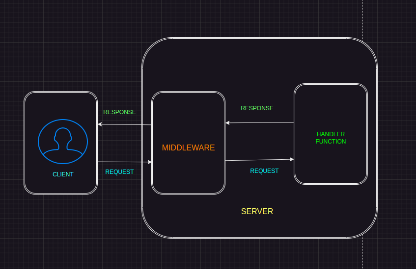
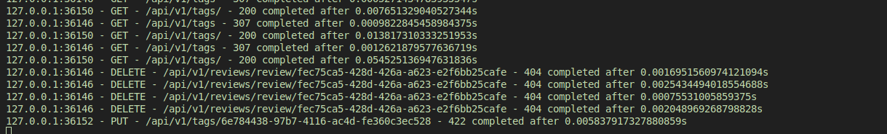

# Middleware

We have explored many aspects of FastAPI so far. In this chapter, we will delve into another interesting topic: Middleware. Middleware are components (functions or classes) that lie between the requests and responses, allowing for the modification of requests before they are processed and responses before they are sent to clients.

## What is Middleware in FastAPI?

A simple diagram can explain this.



From the diagram, we have the client and the server as the two main components. Inside the server, middleware sits right between the client and the route-handler functions.

Each request made to the server will pass through the middleware before it is handled by the route handlers.

Once the server has handled the request, a response is generated and still passes through the middleware before being returned to the client.

## Functions of Middleware

Using middleware, we can enhance FastAPI functionalities. Here are some of the ways we can use it:

1. **Logging**: Middleware can modify how the server logs details of requests and responses for monitoring and debugging purposes.

2. **Authentication**: Middleware can handle authentication by verifying if the tokens or credentials provided by clients are valid before the requests reach the application.

3. **Handling CORS**: Middleware can determine which domains are allowed to access your application's resources.

4. **Request Modification**: Middleware can modify requests by adding or altering headers before they reach the application.

5. **Response Modification**: Middleware can modify responses by providing custom headers, changing the response body, and so on.

These are some of the ways that middleware can be useful in a FastAPI application.

## Creating Middleware

As explained in the introduction of this chapter, middleware can be functions or classes. Let us create our first middleware function to modify how the application logs the details of requests and responses.

To begin, we will create a new file `src/middleware.py` and add the following code to it.

```python title="a logging middleware"
from fastapi import FastAPI, status
from fastapi.requests import Request
from fastapi.responses import JSONResponse
import time
import logging

logger = logging.getLogger("uvicorn.access")
logger.disabled = True


@app.middleware("http")
async def custom_logging(request: Request, call_next):
    start_time = time.time()

    response = await call_next(request)
    processing_time = time.time() - start_time

    message = f"{request.client.host}:{request.client.port} - {request.method} - {request.url.path} - {response.status_code} completed after {processing_time}s"

    print(message)
    return response
```

First, we disable the default logging provided by FastAPI by getting the logger that FastAPI uses and disabling it.

```python
import logging

logger = logging.getLogger("uvicorn.access")
logger.disabled = True
```

Next, we create a function `custom_logging` to use as our logging middleware. To make it a middleware, we use the `app` FastAPI instance to create a decorator using the `middleware` method. This takes a `middleware_type` argument, which in our case is `http`.

```python title="decorator for the middleware function"
@app.middleware("http")
```

The function `custom_logging` takes in two parameters:

- `request`: The request object for the current request.
- `call_next`: A function that represents the route handler or any other middleware registered on the application.

Before processing the request, we define a variable `start_time` to record the start time.

```python title="recording the start time"
start_time = time.time()
```

To get the response, we call `call_next` with the `request` object as an argument.

```python title="getting the response object"
response = await call_next(request)
```

Before returning the `response`, we need to record the processing time of the request by subtracting the `start_time` from the current time. We then create a custom message that logs the requests to our application. This message contains the client's IP address, request method, request URL, status code, and processing time. We use the Python `print` statement to print the message to our output.

```python title="rest of the middleware"
response = await call_next(request)
processing_time = time.time() - start_time

message = f"{request.client.host}:{request.client.port} - {request.method} - {request.url.path} - {response.status_code} completed after {processing_time}s"

print(message)
return response
```

Finally, we return the `response` object. This middleware function logs detailed information about each request and response, which is useful for monitoring and debugging purposes.

To add this middleware, we wrap the middleware we created in our `register_middleware` function. This function takes in the FastAPI `app` instance.

```python title="register middleware"
def register_middleware(app: FastAPI):

    @app.middleware("http")
    async def custom_logging(request: Request, call_next):
        start_time = time.time()

        response = await call_next(request)
        processing_time = time.time() - start_time

        message = f"{request.client.host}:{request.client.port} - {request.method} - {request.url.path} - {response.status_code} completed after {processing_time}s"

        print(message)
        return response
```

Next, we make our middleware work with the application by registering it with the main `app` instance in `src/__init__.py`.

```python
from fastapi import FastAPI
from src.auth.routes import auth_router
from src.books.routes import book_router
from src.reviews.routes import review_router
from src.tags.routes import tags_router
from .errors import register_error_handlers
from .middleware import register_middleware

version = "v1"

app = FastAPI(
    title="Bookly",
    description="A REST API for a book review web service",
    version=version,
)

register_error_handlers(app)
register_middleware(app)  # Add this

app.include_router(book_router, prefix=f"/api/{version}/books", tags=["books"])
app.include_router(auth_router, prefix=f"/api/{version}/auth", tags=["auth"])
app.include_router(review_router, prefix=f"/api/{version}/reviews", tags=["reviews"])
app.include_router(tags_router, prefix=f"/api/{version}/tags", tags=["tags"])
```

By doing this, we have modified our logging to provide more detailed output for debugging and monitoring purposes. Initially, FastAPI logged our responses and requests like this:


After changing our logging using the middleware we created, the logging will look like this:



## Using Custom Middleware

FastAPI is an ASGI (Asynchronous Server Gateway Interface) based framework, and any middleware that is ASGI-based can be used with it by simply importing it and using the `add_middleware` method of the main FastAPI instance.

### CORS Middleware

FastAPI provides middleware to handle CORS (Cross-Origin Resource Sharing), allowing us to specify which domains will have access to the resources in our application.

```python title="adding CORS middleware"
from fastapi import FastAPI, status
from fastapi.requests import Request
from fastapi.responses import JSONResponse
from fastapi.middleware.cors import CORSMiddleware  # Add this
import time
import logging

logger = logging.getLogger("uvicorn.access")
logger.disabled = True


def register_middleware(app: FastAPI):

    @app.middleware("http")
    async def custom_logging(request: Request, call_next):
        start_time = time.time()

        response = await call_next(request)
        processing_time = time.time() - start_time

        message = f"{request.client.host}:{request.client.port} - {request.method} - {request.url.path} - {response.status_code} completed after {processing_time}s"

        print(message)
        return response

    # Add this
    app.add_middleware(
        CORSMiddleware,
        allow_origins=["*"],
        allow_methods=["*"],
        allow_headers=["*"],
        allow_credentials=True,
    )
```

To set up CORS (Cross-Origin Resource Sharing) middleware in FastAPI, you use the `CORSMiddleware` from `fastapi.middleware.cors`. This middleware allows you to specify which origins, methods, and headers are permitted to make requests to your API. First, you need to create a FastAPI application instance.

Then, you can add the `CORSMiddleware` to your app using the `add_middleware` method.

```python title="CORS Configuration"
app.add_middleware(
    CORSMiddleware,
    allow_origins=["*"],
    allow_methods=["*"],
    allow_headers=["*"],
    allow_credentials=True,
)
```

This method accepts several configuration options: `allow_origins` to specify a list of allowed origins (you can use `["*"]` to allow all origins), `allow_credentials` to enable cookies and authentication headers, `allow_methods` to specify which HTTP methods are permitted (use `["*"]` to allow all methods), and `allow_headers` to define which headers are allowed in requests (use `["*"]` to allow all headers). By configuring the middleware in this way, you ensure that your FastAPI application can handle cross-origin requests according to the specified rules, providing flexibility and security in accessing your API from different origins.

### Trusted Host Middleware

To add the Trusted Host Middleware, you can do the following:

```python
from fastapi.middleware.trustedhost import TrustedHostMiddleware

def register_middleware(app: FastAPI):
    ...  # rest of the middleware code
    app.add_middleware(
        TrustedHostMiddleware,
        allowed_hosts=["localhost", "127.0.0.1"],
    )
```

By doing so, we have imported the `TrustedHostMiddleware` and added it to our application. We have also specified which hosts are allowed to access our application.

## Conclusion

Middleware in FastAPI is a powerful feature that allows you to enhance the functionality of your application by modifying requests before they are processed and responses before they are sent to clients. We have explored various uses of middleware, such as logging, authentication, handling CORS, and modifying requests and responses.

We created a custom logging middleware to log detailed information about each request and response. We also set up CORS middleware to manage cross-origin requests, ensuring our API is accessible according to specified rules. Finally, we added the Trusted Host Middleware to restrict the allowed hosts that can make requests to our application, adding an extra layer of security.

By understanding and utilizing middleware, you can build more robust and secure FastAPI applications, tailored to meet the specific needs of your projects.