# Email Support

We've developed numerous features in our application but deliberately skipped those involving email functionality. This allows us to dedicate an entire chapter to thoroughly exploring this topic. Sending emails is essential for user communication, identity verification, and password resets.

## FastAPI-Mail

If you've worked with Flask, you're probably familiar with [Flask-Mail](https://flask-mail.readthedocs.io/en/latest/), the most popular extension for adding email functionality. Flask-Mail offers a simple setup for sending emails. In FastAPI, the equivalent is [FastAPI-Mail](https://sabuhish.github.io/fastapi-mail/), which not only provides a similar configuration process but also supports asynchronous operations and Pydantic models.

To get started, let's install FastAPI-Mail. In your terminal, within the active virtual environment, run:

```console
$ pip install fastapi-mail
```

## Configuring FastAPI-Mail


Let's create a file to set up FastAPI-Mail and centralize all email-sending logic. Inside the src/ directory, create a file called mail.py and add the following code:

```python
from fastapi_mail import FastMail, ConnectionConfig, MessageSchema, MessageType
from src.config import Config
from pathlib import Path


# get the parent directory
BASE_DIR = Path(__file__).resolve().parent


# create the config for sending emails
mail_config = ConnectionConfig(
    MAIL_USERNAME=Config.MAIL_USERNAME,
    MAIL_PASSWORD=Config.MAIL_PASSWORD,
    MAIL_FROM=Config.MAIL_FROM,
    MAIL_PORT=587,
    MAIL_SERVER=Config.MAIL_SERVER,
    MAIL_FROM_NAME=Config.MAIL_FROM_NAME,
    MAIL_STARTTLS=True,
    MAIL_SSL_TLS=False,
    USE_CREDENTIALS=True,
    VALIDATE_CERTS=True,
    TEMPLATE_FOLDER=Path(BASE_DIR, "templates"),
)


# create the object to send emails with the config
mail = FastMail(config=mail_config)

def create_message(recipients: list[str], subject: str, body: str):
    message = MessageSchema(
        recipients=recipients, subject=subject, body=body, subtype=MessageType.html
    )
    return message
```

### Explanation

The code snippet includes the following imports and their purposes:

```python title="The imports"
from fastapi_mail import FastMail, ConnectionConfig, MessageSchema, MessageType
from src.config import Config
from pathlib import Path
```

- `FastMail`: Creates the `mail` object, allowing access to email-sending methods.
- `ConnectionConfig`: Sets up the email configuration for FastAPI-Mail.
- `MessageSchema`: Structures an email before sending it.
- `MessageType`: Specifies the type of content to send via email, such as HTML.
- `Config`: Imports application-specific configurations, including email settings.
- `Path`: Helps create paths, particularly for determining the location of the templates folder.

Next, we'll configure FastAPI-Mail using the values from our `Config` object:

```python title="email config"
mail_config = ConnectionConfig(
    MAIL_USERNAME=Config.MAIL_USERNAME,
    MAIL_PASSWORD=Config.MAIL_PASSWORD,
    MAIL_FROM=Config.MAIL_FROM,
    MAIL_PORT=587,
    MAIL_SERVER=Config.MAIL_SERVER,
    MAIL_FROM_NAME=Config.MAIL_FROM_NAME,
    MAIL_STARTTLS=True,
    MAIL_SSL_TLS=False,
    USE_CREDENTIALS=True,
    VALIDATE_CERTS=True,
    TEMPLATE_FOLDER=Path(BASE_DIR, "templates"),
)
```

| Key               | Explanation                                                                                                                                                                                                 |
| ----------------- | ----------------------------------------------------------------------------------------------------------------------------------------------------------------------------------------------------------- |
| `MAIL_USERNAME`   | The username of the email address sending the emails. Set via an environment variable.                                                                                                                      |
| `MAIL_PASSWORD`   | The password for the SMTP server. For Gmail, this is an [app-specific password](https://support.google.com/mail/thread/205453566/how-to-generate-an-app-password?hl=en). Set via an environment variable.   |
| `MAIL_FROM`       | The email address of the sender. Set via an environment variable.                                                                                                                                           |
| `MAIL_PORT`       | The port used to connect to the SMTP server (usually 587 for TLS).                                                                                                                                          |
| `MAIL_SERVER`     | The SMTP server used to send emails (e.g., smtp.gmail.com).                                                                                                                                                |
| `MAIL_FROM_NAME`  | The name displayed as the sender of the email.                                                                                                                                                              |
| `MAIL_STARTTLS`   | Enables the STARTTLS command, which upgrades the connection to a secure TLS/SSL connection.                                                                                                                 |
| `MAIL_SSL_TLS`    | Indicates whether to use SSL/TLS for the connection from the start. Set to False if `MAIL_STARTTLS` is True.                                                                                                |
| `USE_CREDENTIALS` | Specifies whether to use credentials (username and password) to authenticate with the SMTP server.                                                                                                          |
| `VALIDATE_CERTS`  | Specifies whether to validate the server's SSL certificates.                                                                                                                                               |
| `TEMPLATE_FOLDER` | Specifies the folder containing email templates, useful for sending HTML emails with Jinja templates. This is set using `BASE_DIR` to point to a `templates` folder in our `src` directory.                 |

The `mail` object is created using the `FastMail` class and configured with `mail_config`.

```python
mail = FastMail(config=mail_config)
```

A function create_message is defined to create an email message. It takes recipients, subject, and body as parameters and returns a MessageSchema object:

```python
def create_message(recipients: list[str], subject: str, body: str):
    message = MessageSchema(
        recipients=recipients, subject=subject, body=body, subtype=MessageType.html
    )
    return message
```

- `recipients`: A list of email addresses to send the email to.
- `subject`: The subject line of the email.
- `body`: The body content of the email, which can be plain text or HTML.

In the `Settings` class located in `src.config.py`, email-related configuration variables are added. These variables are used to configure the email sending settings:

```python
class Settings(BaseSettings):
    DATABASE_URL: str
    JWT_SECRET: str
    JWT_ALGORITHM: str
    REDIS_HOST: str
    REDIS_PORT: str
    # add these
    MAIL_USERNAME: str
    MAIL_PASSWORD: str
    MAIL_FROM: str
    MAIL_PORT: int
    MAIL_SERVER: str
    MAIL_FROM_NAME: str
    MAIL_STARTTLS: bool = True
    MAIL_SSL_TLS: bool = False
    USE_CREDENTIALS: bool = True
    VALIDATE_CERTS: bool = True
    DOMAIN: str
    model_config = SettingsConfigDict(env_file=".env", extra="ignore")
```

The `.env` file should be updated with the relevant environment variables for email configuration:

```console
DATABASE_URL=<your postgresql url>
JWT_SECRET=<your jwt secret>
JWT_ALGORITHM=<your jwt algorithm>
REDIS_HOST=localhost
REDIS_PORT=6379

MAIL_USERNAME=<your mail username>
MAIL_PASSWORD=<your mail password>
MAIL_SERVER=smtp.gmail.com
MAIL_PORT=587
MAIL_FROM=<your email address>
MAIL_FROM_NAME=Bookly

DOMAIN=localhost:8000
```

!!! Note
    The `DOMAIN` environment variable shall be set to help us when we create the verification and password reset
    links.

### Sending Our First Email


To send an email, we simply call the send_message method on the mail object. Let's implement this in src/auth/routes.py:
`.

```python title="sending emails"
.... # rest of the imports
from src.mail import mail, create_message
from src.celery_tasks import send_email
from src.auth.schemas import EmailModel

auth_router = APIRouter()


@auth_router.post("/send_mail")
async def send_mail(emails: EmailModel):
    emails = emails.addresses

    html = "<h1>Welcome to the app</h1>"
    subject = "Welcome to our app"

    message = create_message(recipients=emails, subject=subject, body=html)
    mail.send_message(message)

    return {"message": "Email sent successfully"}
```

We’ve set up an API endpoint accessible at the `/auth/send_mail` path, with its handler function named `send_mail`. This function accepts an `EmailModel` object as input, which contains a list of email addresses intended for the email.

In the handler function, we first extract these email addresses from the `EmailModel` object. We then define a basic HTML structure (`html`) and a `subject` line for the email content. Next, we use the `create_message` function to generate a `MessageSchema` object by providing it with the recipient email addresses, subject, and HTML content. This message object is then passed to the `mail.send_message` method to dispatch the email. Finally, the function returns a success message to indicate that the email was sent successfully.

The `EmailModel` class, found in `src/auth/schemas.py`, is a Pydantic model designed to validate incoming email addresses. It requires a list of email strings within the `addresses` field.

```python title="pydantic model for getting recipient email addresses"
class EmailModel(BaseModel):
    addresses : List[str]

```


Let us test this. Accessing the endpoint and making a request results in the following response:

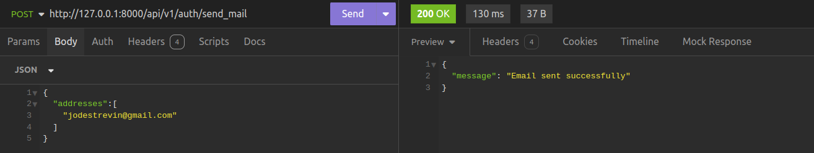

To confirm if our email has been sent:

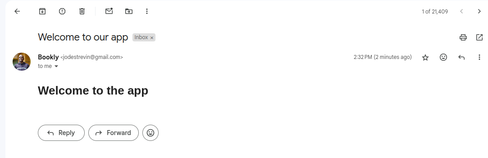

!!! Note
    You may notice a slight delay between the sending of the emails and the response indicating that an email has been successfully sent. This is because, to send the email, we are making another request to the SMTP server we use. We will explore an approach to speed this up in a later chapter.

## User Account Verification
If you’ve been following this series from the beginning, you’ll recall that we created a `User` authentication database model. In this model, we included an `is_verified` field to manage the activation of user accounts. We’ll now begin implementing the verification process using the email address provided by the user during signup.

User account verification is crucial because it helps prevent the creation of fake accounts. Additionally, it allows us to collect user email addresses for communication and other purposes.

### ItsDangerous
To securely transfer data from our server to an untrusted environment, we will use [ItsDangerous](https://itsdangerous.palletsprojects.com/en/2.2.x/). ItsDangerous is a Python package that enables us to cryptographically sign data, ensuring that it has not been tampered with when received. The recipient can read the data but cannot modify it without access to the sender’s secret key.

This package will be essential for creating URL-safe tokens that we will include in the user verification links sent via email.

To install it we shall run
```console
$ pip install itsdangerous
```

To set it up, let us navigate to `src/auth/utils.py` and add the following code.

```python title="serializing and deserializing user's email address"
... #rest of the imports

from itsdangerous import URLSafeTimedSerializer

... # rest of the code 

serializer = URLSafeTimedSerializer(
    secret_key=Config.JWT_SECRET, salt="email-configuration"
)

def create_url_safe_token(data: dict):
    """Serialize a dict into a URLSafe token"""

    token = serializer.dumps(data)

    return token

def decode_url_safe_token(token:str):
    """Deserialize a URLSafe token to get data"""
    try:
        token_data = serializer.loads(token)

        return token_data
    
    except Exception as e:
        logging.error(str(e))
        
```

In the code provided, we begin by importing the `URLSafeTimedSerializer` class, which is used to create the `serializer` object. This object is crucial for serializing the user’s email address. We configure the serializer with a `secret_key` (the same key used for creating access tokens) and a `salt`, which we set to the string "email-verification."

We then define two functions: `create_url_safe_token` and `decode_url_safe_token`. The `create_url_safe_token` function serializes a `data` dictionary into a token, while the `decode_url_safe_token` function deserializes the token, extracting the data and handling any potential errors.

With these functions, we can manage user email verification during signup. Here’s the process flow:

1. A user creates an account with a valid email address.
2. An email verification link is sent to the user’s email.
3. The user clicks the verification link.
4. The user is redirected to our app, and upon successful verification, we send them a success response.


### Sending the verification Email
To make this work, we are going to add the following code to `src/auth/routes.py`
```python title="Email verification on user signup"
... # many imports here
from .schemas import (
    ... # more imports
    UserCreateModel,
)
from .service import UserService
from .utils import (
    ... # more imports
    create_url_safe_token,
    decode_url_safe_token,
)
from src.mail import mail, create_message

... # rest of the code

@auth_router.post("/signup", status_code=status.HTTP_201_CREATED)
async def create_user_Account(
    user_data: UserCreateModel, session: AsyncSession = Depends(get_session)
):
    if user_exists:
        raise UserAlreadyExists()

    new_user = await user_service.create_user(user_data, session)

    token = create_url_safe_token({"email": email})

    link = f"http://{Config.DOMAIN}/api/v1/auth/verify/{token}"

    html_message = f"""
    <h1>Verify your Email</h1>
    <p>Please click this <a href="{link}">link</a> to verify your email</p>
    """

    message = create_message(
        recipients=[email], subject="Verify your email", body=html_message
    )

    await mail.send_message(message)

    return {
        "message": "Account Created! Check email to verify your account",
        "user": new_user,
    }


```

First, we import the `create_url_safe_token` and `decode_url_safe_token` functions. We then follow a similar approach to sending a sample email to send the email verification link.

```python title="creating the verification link"
token = create_url_safe_token({"email": email})

link = f"http://{Config.DOMAIN}/api/v1/auth/verify/{token}"

html_message = f"""
<h1>Verify your Email</h1>
<p>Please click this <a href="{link}">link</a> to verify your email</p>
"""

message = create_message(
    recipients=[email], subject="Verify your email", body=html_message
)

await mail.send_message(message)
```


We start by creating the token using the `create_url_safe_token` function. Next, we construct the verification link by combining the `DOMAIN` and the `token`. We then create the message by including the `html_message`, `subject`, and the verification link. Finally, we use the `mail.send_message` function to send the email.

Let us test this 

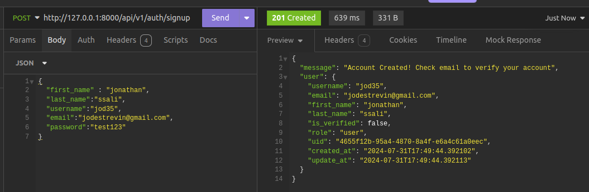

We can confirm that the email has been sent 

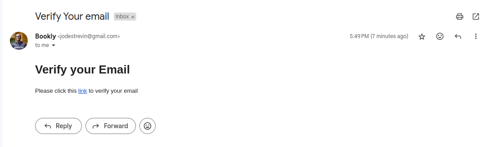

Clicking the verification link will redirect the user back to the app, where the verification process is completed.


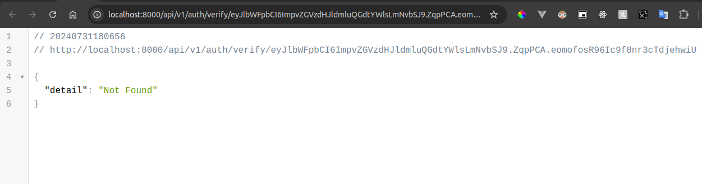


### Verifying Emails

To handle user account verification when users click the verification link, add the following code just below the signup endpoint:

```python title="Verifying the user account"
from .schemas import (
    ... # more imports
    UserCreateModel,
)
from .service import UserService
from .utils import (
    ... # more imports
    create_url_safe_token,
    decode_url_safe_token,
)
from src.mail import mail, create_message


@auth_router.get("/verify/{token}")
async def verify_user_account(token: str, session: AsyncSession = Depends(get_session)):

    token_data = decode_url_safe_token(token)

    user_email = token_data.get("email")

    if user_email:
        user = await user_service.get_user_by_email(user_email, session)

        if not user:
            raise UserNotFound()

        await user_service.update_user(user, {"is_verified": True}, session)

        return JSONResponse(
            content={"message": "Account verified successfully"},
            status_code=status.HTTP_200_OK,
        )

    return JSONResponse(
        content={"message": "Error occured during verification"},
        status_code=status.HTTP_500_INTERNAL_SERVER_ERROR,
    )

```

What we have done is to create the path `/verify` that will use a `token` path parameter. This path will be accessed via the GET method. Its path handler `verify_user_account` will take in the `token` path param as well as the `session` dependency. Once we get the token, we deserialize it with the `decode_url_safe_token` function.

Having got the `token_data`, we obtain the user's email, check if the email is not None and if not, we obtain the user account and update the `is_verified`  field on the account to `True`. We then raise an exception in case the email was not obtained. 


To ensure the verification link expires after a certain time, we'll modify the `decode_url_safe_token` function. This function will be updated to handle token expiration, ensuring that tokens are only valid for a specified duration.

First, we'll update the `decode_url_safe_token` function in src/auth/utils. We use the `URLSafeTimedSerializer` from the itsdangerous package to create tokens with expiration times. In the updated function, we'll include logic to check whether the token has expired based on the time it was created.

```python title ="update create_url_safe_token"

def create_url_safe_token(data: dict, expiration=3600) -> str:
    """
    Create a URL-safe token with an expiration time.
    """
    return serializer.dumps(data, salt=salt, expires_in=expiration)

def decode_url_safe_token(token: str, max_age=3600) -> dict:
    """
    Decode a URL-safe token and check for expiration.
    """
    try:
        # Deserialize the token and check if it's expired
        data = serializer.loads(token, salt=salt, max_age=max_age)
        return data
    except SignatureExpired:
        raise HTTPException(status_code=400, detail="Token has expired")
    except BadSignature:
        raise HTTPException(status_code=400, detail="Invalid token")
```

The serializer's `dumps` method accepts an `expires_in` parameter, which specifies how long the token should be valid (in seconds). For example, a token might be valid for 1 hour (3600 seconds).

The `decode_url_safe_token` function will handle token decoding and check if the token is still valid. If the token is expired, it raises a `SignatureExpired` exception. If the token is invalid for any other reason, it raises a `BadSignature` exception. These exceptions will be used to provide appropriate error messages to the user.

With these changes, the token will be checked for expiration when a user attempts to verify their email. If the token is no longer valid, the user will receive a message indicating that the token has expired or is invalid.

Next, we update the `/verify` endpoint to use the modified `decode_url_safe_token` function. This endpoint receives the token as a path parameter, decodes it, and validates the email contained within. If the email is valid and the token is not expired, the user’s account is marked as verified. If the token is invalid or expired, the endpoint raises an HTTP exception with an appropriate error message.

Let us try to verify a user account again. With different credentials, I will create a new user account as shown below.

Creating a user account sends an email successfully.

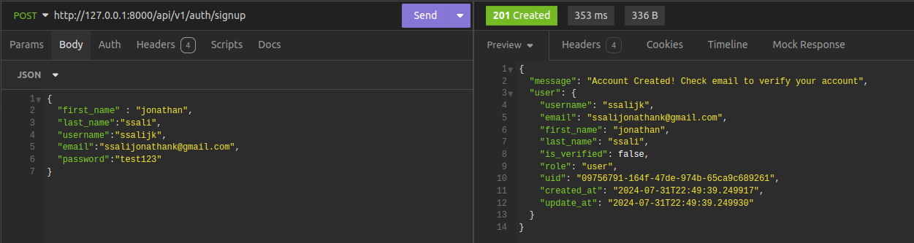

The verification will be sent successfully and the link will be sent as shown below.

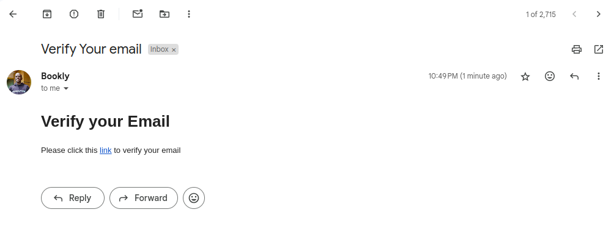

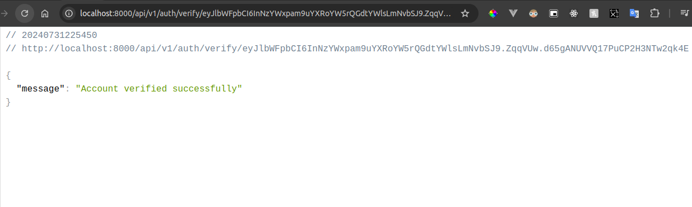


### Custom Exception Class for Unverified Accounts

We shall create a custom exception class, `AccountNotVerified`, to handle cases where a user who hasn't verified their account tries to access a protected endpoint. This exception class will help provide clear feedback when an unverified user attempts to access restricted parts of your application.

Here’s the implementation in `src/errors.py`:

```python
# src/errors.py
from fastapi import FastAPI, status
from fastapi.exceptions import RequestValidationError
from typing import Any
from fastapi.responses import JSONResponse

class AccountNotVerified(Exception):
    """Exception raised when the user account is not verified."""
    pass

... # create_exception_handler code

def register_all_errors(app: FastAPI):
    app.add_exception_handler(
        AccountNotVerified,
        create_exception_handler(
            status_code=status.HTTP_403_FORBIDDEN,
            initial_detail={
                "message": "Account Not Verified",
                "error_code": "account_not_verified",
                "resolution": "Please check your email for verification details"
            },
        ),
    )

    # Register other exception handlers as needed
```

### RoleChecker Dependency with Verification Check

You updated the `RoleChecker` dependency in `src/auth/dependencies.py` to first check if the user account is verified before checking their role. Here’s how you integrated this check:

```python
# src/auth/dependencies.py
from typing import List, Any
from fastapi import Depends
from src.auth.models import User
from src.auth.utils import get_current_user
from src.errors import AccountNotVerified

class RoleChecker:
    def __init__(self, allowed_roles: List[str]) -> None:
        self.allowed_roles = allowed_roles

    def __call__(self, current_user: User = Depends(get_current_user)) -> Any:
        if not current_user.is_verified:
            raise AccountNotVerified()
        if current_user.role in self.allowed_roles:
            return True
        raise InsufficientPermission()
```

In this setup:
- **Verification Check**: Before checking if the user’s role is allowed, the `RoleChecker` verifies if the user’s account is marked as verified. If the user is not verified, the `AccountNotVerified` exception is raised.
- **Role Check**: If the user is verified, the system then checks if the user has the necessary role to access the endpoint.

### Testing the Implementation

To test the implementation:
1. **Create a New User Account**: Create a new user account with a vague email address and ensure that the verification email is sent.
2. **Verify the Account**: Click on the verification link in the email to mark the account as verified.
3. **Access Protected Endpoints**: Try accessing protected endpoints with both verified and unverified accounts to ensure that only verified accounts are allowed access.

By following these steps, you can verify that the implementation correctly restricts access based on the user’s verification status. This ensures that only users with verified accounts can access protected resources in your application.

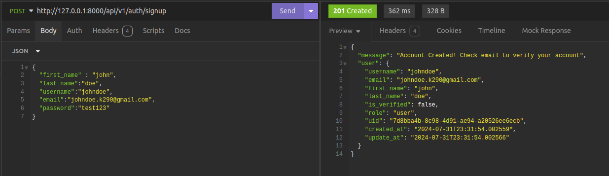

After obtaining authentication credentials for the user (access and refresh tokens), Let us use them to access a protect endpoint such as that to get all books. 

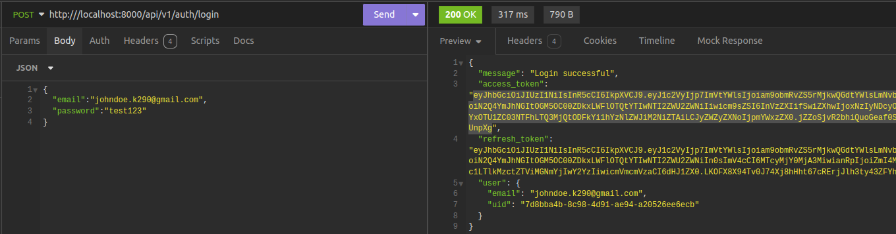

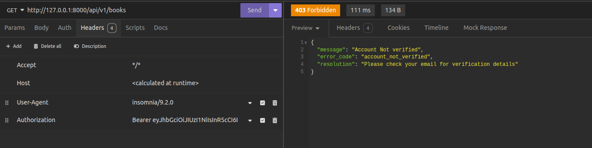

And like that, we have built the user account verification.


### Password Reset 
Now that we have verified user emails, we shall proceed to allow users reset their passwords once they have forgotten them. Now the approcah for sending and decoding user details 1n the emails is the same we shall use.

Let us begin by creating the schemas for the password resets in `src/auth/routes.py`.

```python title="password reset schemas"

... #the rest of the code
class PasswordResetRequestModel(BaseModel):
    email: str


class PasswordResetConfirmModel(BaseModel):
    new_password: str
    confirm_new_password: str
```

We have created the `PasswordResetRequestSchema` which shall allow users to provide their email address to which an email verification link shall be sent.

In addition to that is the `PasswordResetConfirmModel` which we shall use to to set a new password.

Let us now add the endpoints for requesting a password reset and resetting a password respectively.

```python title="password reset endpoints"
@auth_router.post("/password-reset-request")
async def password_reset_request(email_data: PasswordResetRequestModel):
    email = email_data.email

    token = create_url_safe_token({"email": email})

    link = f"http://{Config.DOMAIN}/api/v1/auth/password-reset-confirm/{token}"

    html_message = f"""
    <h1>Reset Your Password</h1>
    <p>Please click this <a href="{link}">link</a> to Reset Your Password</p>
    """
    subject = "Reset Your Password"

    send_email.delay([email], subject, html_message)
    return JSONResponse(
        content={
            "message": "Please check your email for instructions to reset your password",
        },
        status_code=status.HTTP_200_OK,
    )


@auth_router.post("/password-reset-confirm/{token}")
async def reset_account_password(
    token: str,
    passwords: PasswordResetConfirmModel,
    session: AsyncSession = Depends(get_session),
):
    new_password = passwords.new_password
    confirm_password = passwords.confirm_new_password

    if new_password != confirm_password:
        raise HTTPException(
            detail="Passwords do not match", status_code=status.HTTP_400_BAD_REQUEST
        )

    token_data = decode_url_safe_token(token)

    user_email = token_data.get("email")

    if user_email:
        user = await user_service.get_user_by_email(user_email, session)

        if not user:
            raise UserNotFound()

        passwd_hash = generate_passwd_hash(new_password)
        await user_service.update_user(user, {"password_hash": passwd_hash}, session)

        return JSONResponse(
            content={"message": "Password reset Successfully"},
            status_code=status.HTTP_200_OK,
        )

    return JSONResponse(
        content={"message": "Error occured during password reset."},
        status_code=status.HTTP_500_INTERNAL_SERVER_ERROR,
    )

```

The first endpoint `/password-reset-request` will get a user's emailvia a POST request and send a password reset link via the provided email address.

The second one will receive the `new_password` and the `confirm_new_password` and `token` sent in the verification link. From the `token`, the user's email shall be got and then the user account related to that email address shall be retrieved. 

If it exists, the user password shall be updated with the hash of the provided new password else a `UserNotFound` exception shall be raised.


## Conclusion
In this chapter, we have added email support to our application using FastAPI-Mail. We have also looked at how we can securely transfer data from our application to other unsafe environment such as where we sent emails. Using such, we have built the email verification and password reset functionality.


