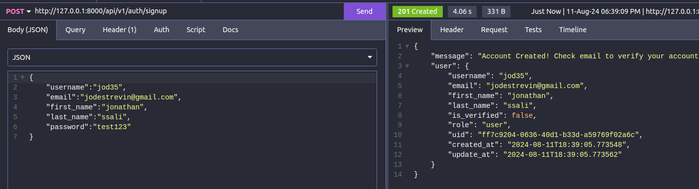
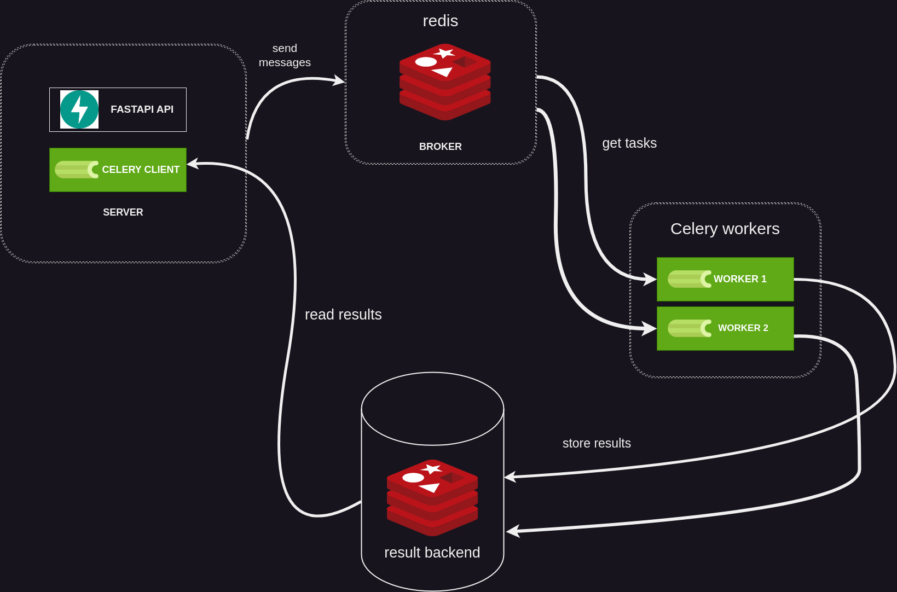

# Background Processing
We have built several features in our API that work as intended. However, some endpoints take longer to respond, causing a poor user experience and affecting our app's performance. To fix this, we need to optimize these endpoints to make them faster and more efficient. This is important to keep our app running smoothly and keep our users happy.


## FastAPI Background tasks
FastAPI provides a built-in solution for implementing background tasks, allowing us to offload tasks from the server and run them in the background.

We can achieve this by using the `BackgroundTasks` class. To create background tasks, we need to inject an object of this class as a parameter into any path handler containing logic we want to push to the background.


Let us start by testing the endpoints for creating user accounts.



It takes about 4 seconds for the server to return a response to the client. While it seems minimal, This can lead to perfoemance issues most especiallky if there are many requests being made to the application.

To fix this, we are going to modify the user creation API path to make sure that the user verification email is sent to a background task.

```python title="changing to a background task"
from fastapi import BackgroundTasks

@auth_router.post("/signup", status_code=status.HTTP_201_CREATED)
async def create_user_Account(
    user_data: UserCreateModel,
    bg_tasks: BackgroundTasks,
    session: AsyncSession = Depends(get_session),
):
    """
    Create user account using email, username, first_name, last_name
    params:
        user_data: UserCreateModel
    """
    email = user_data.email

    user_exists = await user_service.user_exists(email, session)

    if user_exists:
        raise UserAlreadyExists()

    new_user = await user_service.create_user(user_data, session)

    token = create_url_safe_token({"email": email})

    link = f"http://{Config.DOMAIN}/api/v1/auth/verify/{token}"

    html_message = f"""
    <h1>Verify your Email</h1>
    <p>Please click this <a href="{link}">link</a> to verify your email</p>
    """

    message = create_message(
        recipients=[email], subject="Verify your email", body=html_message
    )

    bg_tasks.add_task(mail.send_message, message)

    return {
        "message": "Account Created! Check email to verify your account",
        "user": new_user,
    }

```


In the `create_user_Account` function, after creating a new user and generating a verification link, the background task functionality is used to send an email verification asynchronously. By adding the task `mail.send_message` to `bg_tasks`, the email containing the verification link is sent without blocking the main thread, allowing the response to be returned immediately while the email is sent in the background. 

Let us now testing this with background tasks.


You can notice that the response is returned after 468 milliseconds. Adding the email sending function to background tasks sends the response immediately while the user verification link is sent via email in the backround.


## Background Processing with Celery

FastAPI's background tasks are a convenient way to handle asynchronous operations without blocking the main thread. However, as the number of background tasks increases, running them all on the same FastAPI server can lead to performance bottlenecks. To address this, we can use Celery, a more scalable solution that allows tasks to be distributed across multiple worker processes and servers. This helps manage high loads efficiently and ensures that your application remains responsive even when handling a large number of background tasks.

### What is Celery?

Celery is an open-source, distributed task queue system in Python that allows you to execute tasks asynchronously in the background. It’s particularly useful for handling time-consuming operations like sending emails, processing images, or performing complex calculations without blocking the main application thread.

Before setting up Celery, it's important to understand the key concepts involved:



Let’s break down the working of Celery using the diagram above.

1. **Celery Tasks (Client):**  
   On the server, we have the Celery **tasks** and the FastAPI code where these tasks will be used. A **task** in Celery is simply a Python function that you want to run asynchronously. This can include operations like sending emails, processing data, or interacting with external APIs. We refer to the code that sends tasks to Celery as the **Celery client**.

2. **Broker:**  
   The **broker** acts as a message queue that facilitates communication between the **Celery client** (where tasks are created) and the **workers** (where tasks are executed). The broker holds tasks until they are picked up by a worker. Celery supports various brokers, with RabbitMQ and Redis being the most popular choices. In our setup, we are using Redis as the task queue.

3. **Worker:**  
   A **worker** is a process that runs in the background and is responsible for executing tasks. Celery can manage multiple workers simultaneously, even across different machines, which allows for parallel task processing and resource distribution.

4. **Result Backend:**  
   Once a worker completes a task, its result is stored in the **result backend**. This is an optional component that keeps track of task outcomes, allowing you to check task status and retrieve results later. Common backends include Redis, RabbitMQ, or databases like PostgreSQL. In our case, Redis also serves as the result backend.

### Creating Celery Tasks

To create a Celery task, you decorate any function with the `@app.task` decorator, where `app` is the Celery instance. Let's walk through setting up Celery and creating your first task.

#### Setting Up Celery

First, create a new file called `src/celery_tasks.py` and add the following code:

```python title="src/celery_tasks.py"
from celery import Celery
from src.mail import mail, create_message
from asgiref.sync import async_to_sync

c_app = Celery()

c_app.config_from_object("src.config")

```
Here, we import the Celery class and use it to create the `c_app` (Celery app) instance. We then configure it using the `config_from_object` method, pointing to `src/config.py`.

Next, update `src/config.py` to include settings for the Celery app:

```python
from pydantic_settings import BaseSettings, SettingsConfigDict

class Settings(BaseSettings):
    DATABASE_URL: str
    JWT_SECRET: str
    JWT_ALGORITHM: str
    # add the following setting
    REDIS_URL: str = "redis://localhost:6379/0"
    MAIL_USERNAME: str
    MAIL_PASSWORD: str
    MAIL_FROM: str
    MAIL_PORT: int
    MAIL_SERVER: str
    MAIL_FROM_NAME: str
    MAIL_STARTTLS: bool = True
    MAIL_SSL_TLS: bool = False
    USE_CREDENTIALS: bool = True
    VALIDATE_CERTS: bool = True
    DOMAIN: str
    model_config = SettingsConfigDict(env_file=".env", extra="ignore")

Config = Settings()

# Celery configuration
broker_url = Config.REDIS_URL
result_backend = Config.REDIS_URL
broker_connection_retry_on_startup = True
```


In this configuration, we've added the `REDIS_URL` environment variable, which will be used for both the broker and result backend. The `broker_connection_retry_on_startup` setting is set to `True`, meaning Celery will retry connecting to the broker if it's initially unavailable.

### Updating Redis Connection
We’ll now update how we connect to Redis in src/db/redis.py:

```python title="updating redis connection"
import redis.asyncio as aioredis
from src.config import Config

JTI_EXPIRY = 3600

token_blocklist = aioredis.from_url(Config.REDIS_URL)  # Connect using a URL

async def add_jti_to_blocklist(jti: str) -> None:
    await token_blocklist.set(name=jti, value="", ex=JTI_EXPIRY)

async def token_in_blocklist(jti: str) -> bool:
    jti = await token_blocklist.get(jti)
    return jti is not None
```

Here, we’re using redis.asyncio to connect to Redis via a URL, which is defined by the `REDIS_URL` environment variable.

### Updating Environment Variables
Finally, update your .env file to include the `REDIS_URL`:

```bash title="updating environment variables"
DATABASE_URL=<your database url>
JWT_SECRET=<your jwt secret>
JWT_ALGORITHM=HS256
MAIL_USERNAME=<your mail username>
MAIL_PASSWORD=<your app password>
MAIL_SERVER=smtp.gmail.com
MAIL_PORT=587
MAIL_FROM=<your default name from>
MAIL_FROM_NAME=Bookly
DOMAIN=localhost:8000
REDIS_URL=redis://localhost:6379  # Assuming Redis is running locally
```
With this setup, you're ready to create and execute Celery tasks. In the next step, we’ll define our first Celery task.

```python title="creating celery task for sending"
from src.mail import mail, create_message
from asgiref.sync import async_to_sync

...# more code here

@c_app.task()
def send_email(recipients: list[str], subject: str, body: str):

    message = create_message(recipients=recipients, subject=subject, body=body)

    async_to_sync(mail.send_message)(message)
    print("Email sent")
```

So, we have created a function called `send_email` which is going to create an HTML message and handle the sending of the email given parameters `recipients` which is a list of email addresses to send emails to, the `subject` of the email, and the body of the email.

The function will utilize the `create_message` function to create a message and finally use the `mail.send_message` function to send the message.

One important thing to note is our use of the `async_to_sync` function from ASGIRef. this function enables us to make sure that the async `mail.send_message` method is called within a Celery task. 

