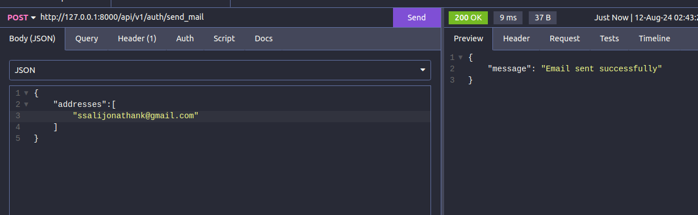
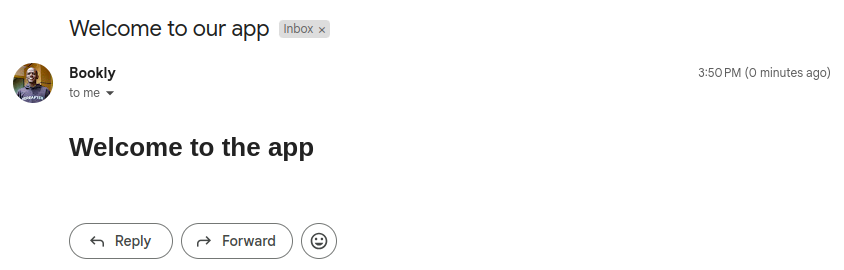
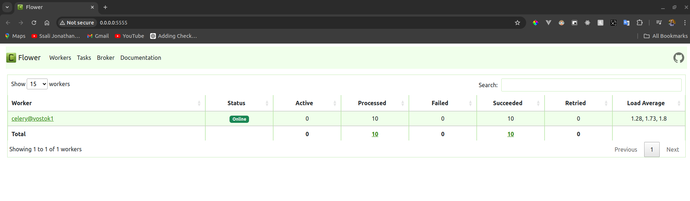
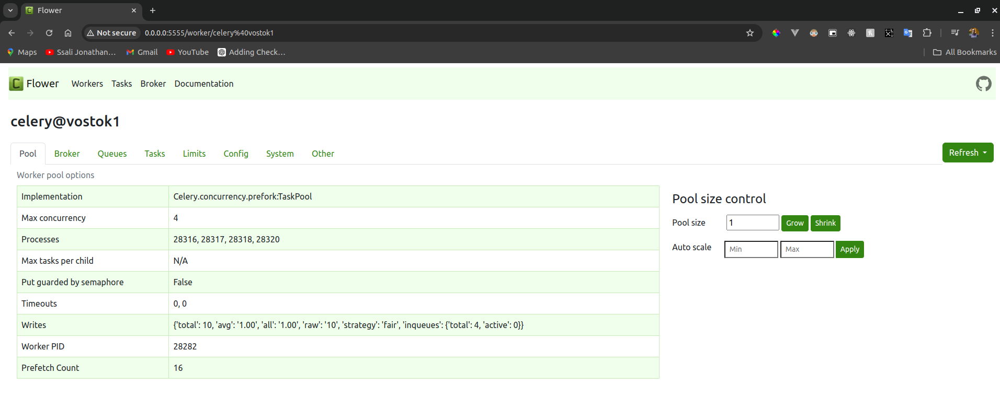
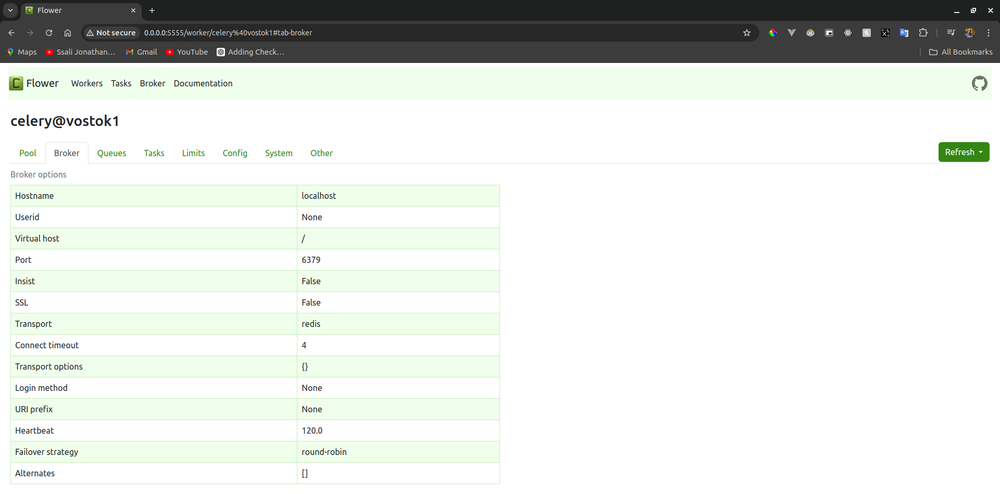
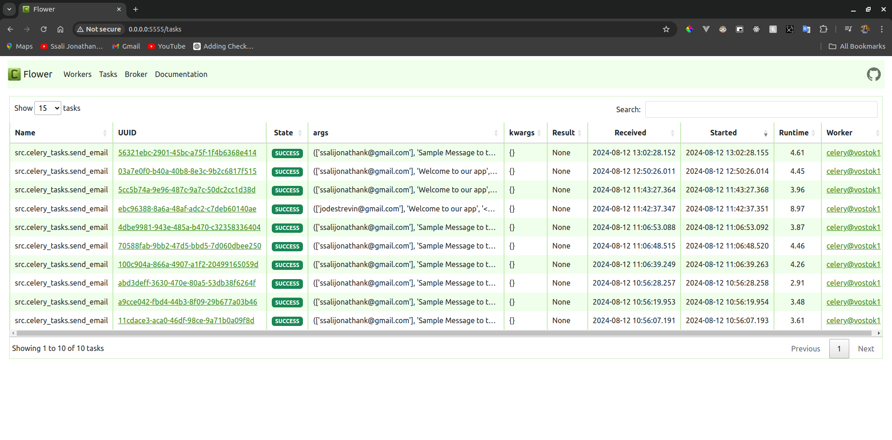

# Background Processing
We have built several features in our API that work as intended. However, some endpoints take longer to respond, causing a poor user experience and affecting our app's performance. To fix this, we need to optimize these endpoints to make them faster and more efficient. This is important to keep our app running smoothly and keep our users happy.


## FastAPI Background tasks
FastAPI provides a built-in solution for implementing background tasks, allowing us to offload tasks from the server and run them in the background.

We can achieve this by using the `BackgroundTasks` class. To create background tasks, we need to inject an object of this class as a parameter into any path handler containing logic we want to push to the background.


Let us start by testing the endpoints for creating user accounts.


It takes about 4 seconds for the server to return a response to the client. While it seems minimal, This can lead to perfoemance issues most especiallky if there are many requests being made to the application.

To fix this, we are going to modify the user creation API path to make sure that the user verification email is sent to a background task.

```python title="changing to a background task"
from fastapi import BackgroundTasks

@auth_router.post("/signup", status_code=status.HTTP_201_CREATED)
async def create_user_Account(
    user_data: UserCreateModel,
    bg_tasks: BackgroundTasks,
    session: AsyncSession = Depends(get_session),
):
    """
    Create user account using email, username, first_name, last_name
    params:
        user_data: UserCreateModel
    """
    email = user_data.email

    user_exists = await user_service.user_exists(email, session)

    if user_exists:
        raise UserAlreadyExists()

    new_user = await user_service.create_user(user_data, session)

    token = create_url_safe_token({"email": email})

    link = f"http://{Config.DOMAIN}/api/v1/auth/verify/{token}"

    html_message = f"""
    <h1>Verify your Email</h1>
    <p>Please click this <a href="{link}">link</a> to verify your email</p>
    """

    message = create_message(
        recipients=[email], subject="Verify your email", body=html_message
    )

    bg_tasks.add_task(mail.send_message, message)

    return {
        "message": "Account Created! Check email to verify your account",
        "user": new_user,
    }

```


In the `create_user_Account` function, after creating a new user and generating a verification link, the background task functionality is used to send an email verification asynchronously. By adding the task `mail.send_message` to `bg_tasks`, the email containing the verification link is sent without blocking the main thread, allowing the response to be returned immediately while the email is sent in the background. 

Let us now testing this with background tasks.


You can notice that the response is returned after 468 milliseconds. Adding the email sending function to background tasks sends the response immediately while the user verification link is sent via email in the backround.


## Background Processing with Celery

FastAPI's background tasks are a convenient way to handle asynchronous operations without blocking the main thread. However, as the number of background tasks increases, running them all on the same FastAPI server can lead to performance bottlenecks. To address this, we can use Celery, a more scalable solution that allows tasks to be distributed across multiple worker processes and servers. This helps manage high loads efficiently and ensures that your application remains responsive even when handling a large number of background tasks.

### What is Celery?

Celery is an open-source, distributed task queue system in Python that allows you to execute tasks asynchronously in the background. It’s particularly useful for handling time-consuming operations like sending emails, processing images, or performing complex calculations without blocking the main application thread.

Before setting up Celery, it's important to understand the key concepts involved:


Let’s break down the working of Celery using the diagram above.

1. **Celery Tasks (Client):**  
   On the server, we have the Celery **tasks** and the FastAPI code where these tasks will be used. A **task** in Celery is simply a Python function that you want to run asynchronously. This can include operations like sending emails, processing data, or interacting with external APIs. We refer to the code that sends tasks to Celery as the **Celery client**.

2. **Broker:**  
   The **broker** acts as a message queue that facilitates communication between the **Celery client** (where tasks are created) and the **workers** (where tasks are executed). The broker holds tasks until they are picked up by a worker. Celery supports various brokers, with RabbitMQ and Redis being the most popular choices. In our setup, we are using Redis as the task queue.

3. **Worker:**  
   A **worker** is a process that runs in the background and is responsible for executing tasks. Celery can manage multiple workers simultaneously, even across different machines, which allows for parallel task processing and resource distribution.

4. **Result Backend:**  
   Once a worker completes a task, its result is stored in the **result backend**. This is an optional component that keeps track of task outcomes, allowing you to check task status and retrieve results later. Common backends include Redis, RabbitMQ, or databases like PostgreSQL. In our case, Redis also serves as the result backend.


### Setting Up Celery

To set up Celery, we have to install it using this command.

```console title="Installing Celery"
$ pip install celery
```

Then create a new file called `src/celery_tasks.py` and add the following code:

```python title="src/celery_tasks.py"
from celery import Celery
from src.mail import mail, create_message
from asgiref.sync import async_to_sync

c_app = Celery()

c_app.config_from_object("src.config")

```
Here, we import the `Celery` class and use it to create the `c_app` (Celery app) instance. We then configure it using the `config_from_object` method, pointing to `src/config.py`.

Next, update `src/config.py` to include settings for the Celery app:

```python
from pydantic_settings import BaseSettings, SettingsConfigDict

class Settings(BaseSettings):
    DATABASE_URL: str
    JWT_SECRET: str
    JWT_ALGORITHM: str
    # add the following setting
    REDIS_URL: str = "redis://localhost:6379/0"
    ... # other settings
    DOMAIN: str
    model_config = SettingsConfigDict(env_file=".env", extra="ignore")

Config = Settings()

# Celery configuration
broker_url = Config.REDIS_URL
result_backend = Config.REDIS_URL
broker_connection_retry_on_startup = True
```


In this configuration, we've added the `REDIS_URL` environment variable, which will be used for both the broker and result backend. The `broker_connection_retry_on_startup` setting is set to `True`, meaning Celery will retry connecting to the broker if it's initially unavailable.

### Updating Redis Connection
We’ll now update how we connect to Redis in src/db/redis.py:

```python title="updating redis connection"
import redis.asyncio as aioredis
from src.config import Config

JTI_EXPIRY = 3600

token_blocklist = aioredis.from_url(Config.REDIS_URL)  # Connect using a URL

async def add_jti_to_blocklist(jti: str) -> None:
    await token_blocklist.set(name=jti, value="", ex=JTI_EXPIRY)

async def token_in_blocklist(jti: str) -> bool:
    jti = await token_blocklist.get(jti)
    return jti is not None
```

Here, we’re using redis.asyncio to connect to Redis via a URL, which is defined by the `REDIS_URL` environment variable.

### Updating Environment Variables
Finally, update your .env file to include the `REDIS_URL`:

```bash title="updating environment variables"
DATABASE_URL=<your database url>
JWT_SECRET=<your jwt secret>
JWT_ALGORITHM=HS256
MAIL_USERNAME=<your mail username>
MAIL_PASSWORD=<your app password>
MAIL_SERVER=smtp.gmail.com
MAIL_PORT=587
MAIL_FROM=<your default name from>
MAIL_FROM_NAME=Bookly
DOMAIN=localhost:8000
REDIS_URL=redis://localhost:6379  # Assuming Redis is running locally
```

### Creating a Celery Task
With this setup, you're ready to create and execute Celery tasks. In the next step, we’ll define our first Celery task.

```python title="creating celery task for sending"
from src.mail import mail, create_message
from asgiref.sync import async_to_sync

...# more code here

@c_app.task()
def send_email(recipients: list[str], subject: str, body: str):

    message = create_message(recipients=recipients, subject=subject, body=body)

    async_to_sync(mail.send_message)(message)
    print("Email sent")
```

We have created a function called `send_email`, which is responsible for constructing an HTML message and handling the process of sending an email. This function takes three parameters: `recipients`, a list of email addresses to which the email will be sent; `subject`, the subject line of the email; and `body`, the content of the email in HTML format.

To create the email message, the `send_email` function uses another function called `create_message`. Once the message is created, the function then utilizes the `mail.send_message` method to actually send the email. However, since this method is asynchronous and we want to call it within a Celery task, we use the `async_to_sync` function from ASGIRef. This function allows us to execute the async `mail.send_message` method in a synchronous context, making it compatible with Celery tasks.

To make this setup work, you need to install ASGIRef by running the following command:

```console title="Installing asgiref"
$ pip install asgiref
```

### Running a Celery Worker
For our tasks to run, we shall need to set up a worker process, Let us do so by running the following.
```console title=""
$ celery -A src.celery_tasks.c_app --loglevel=INFO
 -------------- celery@vostok1 v5.4.0 (opalescent)
--- ***** ----- 
-- ******* ---- Linux-6.5.0-45-generic-x86_64-with-glibc2.35 2024-08-12 13:10:25
- *** --- * --- 
- ** ---------- [config]
- ** ---------- .> app:         __main__:0x748bef45e200
- ** ---------- .> transport:   redis://localhost:6379//
- ** ---------- .> results:     redis://localhost:6379/
- *** --- * --- .> concurrency: 4 (prefork)
-- ******* ---- .> task events: OFF (enable -E to monitor tasks in this worker)
--- ***** ----- 
 -------------- [queues]
                .> celery           exchange=celery(direct) key=celery
                

[tasks]
  . src.celery_tasks.send_email

[2024-08-12 13:10:25,876: INFO/MainProcess] Connected to redis://localhost:6379//
[2024-08-12 13:10:25,881: INFO/MainProcess] mingle: searching for neighbors
[W 240812 13:10:26 inspector:44] Inspect method registered failed
[W 240812 13:10:26 inspector:44] Inspect method active failed
[W 240812 13:10:26 inspector:44] Inspect method conf failed
[W 240812 13:10:26 inspector:44] Inspect method active_queues failed
[W 240812 13:10:26 inspector:44] Inspect method reserved failed
[W 240812 13:10:26 inspector:44] Inspect method revoked failed
[W 240812 13:10:26 inspector:44] Inspect method scheduled failed
[W 240812 13:10:26 inspector:44] Inspect method stats failed
```

This command will run in our virtual environment and will point to the Celery app install `c_app` that is located in the `src/celery_tasks.py` file. We also specify the log-level to determine the verbosity of the logs generated by Celery workers. We set it to `INFO`.

### Modifying Your FastAPI Endpoints to Use Celery

Now, let's modify the signup endpoint and other endpoints that require sending emails so that they use our Celery setup:

```python title="Modifying code to use Celery tasks"
... # more imports
from src.celery_tasks import send_email

... # some code here

@auth_router.post("/send_mail")
async def send_mail(emails: EmailModel):
    emails = emails.addresses

    html = "<h1>Welcome to the app</h1>"
    subject = "Welcome to our app"

    send_email.delay(emails, subject, html) # changed to this

    return {"message": "Email sent successfully"}

@auth_router.post("/signup", status_code=status.HTTP_201_CREATED)
async def create_user_Account(
    user_data: UserCreateModel,
    bg_tasks: BackgroundTasks,
    session: AsyncSession = Depends(get_session),
):
    """
    Create user account using email, username, first_name, last_name
    params:
        user_data: UserCreateModel
    """
    email = user_data.email

    user_exists = await user_service.user_exists(email, session)

    if user_exists:
        raise UserAlreadyExists()

    new_user = await user_service.create_user(user_data, session)

    token = create_url_safe_token({"email": email})

    link = f"http://{Config.DOMAIN}/api/v1/auth/verify/{token}"

    html = f"""
    <h1>Verify your Email</h1>
    <p>Please click this <a href="{link}">link</a> to verify your email</p>
    """

    emails = [email]

    subject = "Verify Your email"

    send_email.delay(emails, subject, html) # changed to this

    return {
        "message": "Account Created! Check email to verify your account",
        "user": new_user,
    }

... # some more code here

@auth_router.post("/password-reset-request")
async def password_reset_request(email_data: PasswordResetRequestModel):
    email = email_data.email

    token = create_url_safe_token({"email": email})

    link = f"http://{Config.DOMAIN}/api/v1/auth/password-reset-confirm/{token}"

    html_message = f"""
    <h1>Reset Your Password</h1>
    <p>Please click this <a href="{link}">link</a> to Reset Your Password</p>
    """
    subject = "Reset Your Password"

    send_email.delay([email], subject, html_message) # changed to this

    return JSONResponse(
        content={
            "message": "Please check your email for instructions to reset your password",
        },
        status_code=status.HTTP_200_OK,
    )
```

The `send_email` function is called using `send_email.delay(...)`, which queues the task to be executed asynchronously by a Celery worker. This allows your FastAPI application to continue processing other requests without being delayed by the time-consuming process of sending emails.

### Testing Celery Background Tasks

Before testing the email-sending functionality in your application, let's see how the Celery task runs by opening a terminal and running the following commands:

```r title="sending email without Celery task"
$ python3
Python 3.10.12 (main, Jul 29 2024, 16:56:48) [GCC 11.4.0] on linux
Type "help", "copyright", "credits" or "license" for more information.
>>> from src.celery_tasks import send_email
>>> recipients = ['ssalijonathank@gmail.com']
>>> subject = "Sample Message to test Background tasks"
>>> 
>>> body = """<h1>Test Message</h1>
... <p>This is to test Celery background tasks</p>
... """
>>> 
>>> # Send the email without a background task
>>> send_email(recipients, subject, body)
Email sent
```

Here, we imported the `send_email` function and ran it as a normal Python function. The outcome is the email being sent successfully.

Now let's test the same with Celery background tasks:

```py title="Sending the email with Celery background tasks"
>>> task1 = send_email.delay(recipients, subject, body)
>>> task2 = send_email.delay(recipients, subject, body)
>>> task3 = send_email.delay(recipients, subject, body)

>>> task1
<AsyncResult: 100c904a-866a-4907-a1f2-20499165059d>
>>> task2
<AsyncResult: 70588fab-9bb2-47d5-bbd5-7d060dbee250>
>>> task3
<AsyncResult: 4dbe9981-943e-485a-b470-c32358336404>

>>> task1.status
'SUCCESS'
>>> task2.status
'SUCCESS'
>>> task3.status
'SUCCESS'

>>> task1.backend
<celery.backends.redis.RedisBackend object at 0x7a8830512530>
>>> task2.backend
<celery.backends.redis.RedisBackend object at 0x7a8830512530>
>>> task3.backend
<celery.backends.redis.RedisBackend object at 0x7a8830512530>
```


In this example, we called the `send_email` function as a Celery task using the `delay` method. The tasks are stored in variables `task1`, `task2`, and `task3`, each returning an `AsyncResult` object. We can monitor the status of each task using the `status` property, and we can see that all tasks have completed successfully.

With our Celery setup verified, we can now test the email-sending functionality within our FastAPI application.



As shown, the response is returned after just 8 milliseconds, and the email is sent successfully, as seen below:



We have successfully configured our emails to be sent in the background using Celery.


### Monitoring Celery Tasks with Flower

With a solid understanding of how Celery works, it's time to explore how we can effectively monitor the tasks we've set up. While viewing task statuses in the terminal is possible, having a dashboard to track task progress and results can be much more convenient. This is where Flower comes in—a web-based dashboard designed to help you monitor Celery background tasks. Let's start by installing Flower:

```console title="Installing Flower"
$ pip install flower
```

Once installed, you can run Flower using the following Celery command:

```console title="Running Flower"
$ celery -A src.celery_tasks.c_app flower
[I 240812 13:10:25 command:168] Visit me at http://0.0.0.0:5555
[I 240812 13:10:25 command:176] Broker: redis://localhost:6379//
[I 240812 13:10:25 command:177] Registered tasks: 
    ['celery.accumulate',
     'celery.backend_cleanup',
     'celery.chain',
     'celery.chord',
     'celery.chord_unlock',
     'celery.chunks',
     'celery.group',
     'celery.map',
     'celery.starmap',
     'src.celery_tasks.send_email']
[I 240812 13:10:25 mixins:228] Connected to redis://localhost:6379//
```

After running this command, the Flower dashboard will be accessible at `http://0.0.0.0:5555`.



The image above shows the active worker process `celery@vostok1`. You can also view details about all tasks executed by the worker, thanks to the result backend (Redis) that we've configured.

When you view the worker details, you'll see something like this:



You can also find information about the broker:



Additionally, you can view details about tasks, their arguments, and their results:



Using Flower is beneficial as it allows you to monitor task statuses, retry failed tasks, and much more. Therefore, it's highly recommended to have Flower set up and installed in your environment.

## Conclusion

In this chapter, we've explored how to enhance our application's performance using background tasks. We began with FastAPI's built-in background tasks, introduced Celery to handle more complex scenarios, and then set up a web dashboard with Flower to monitor these tasks effectively.