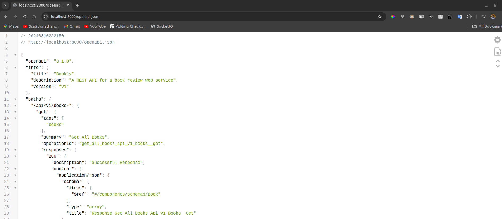
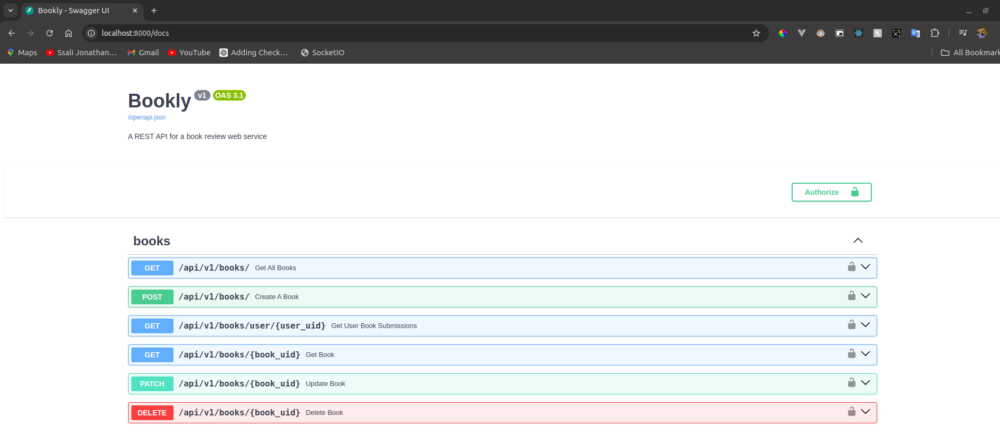
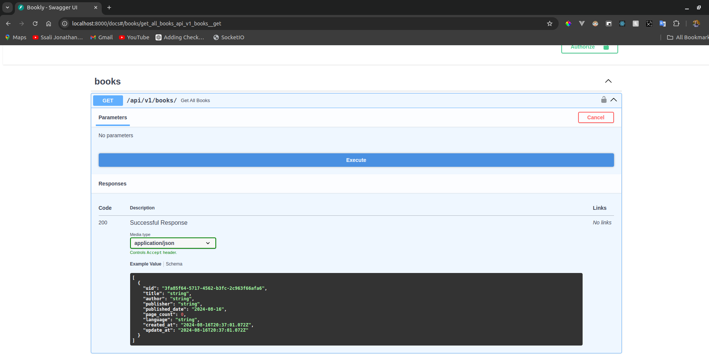
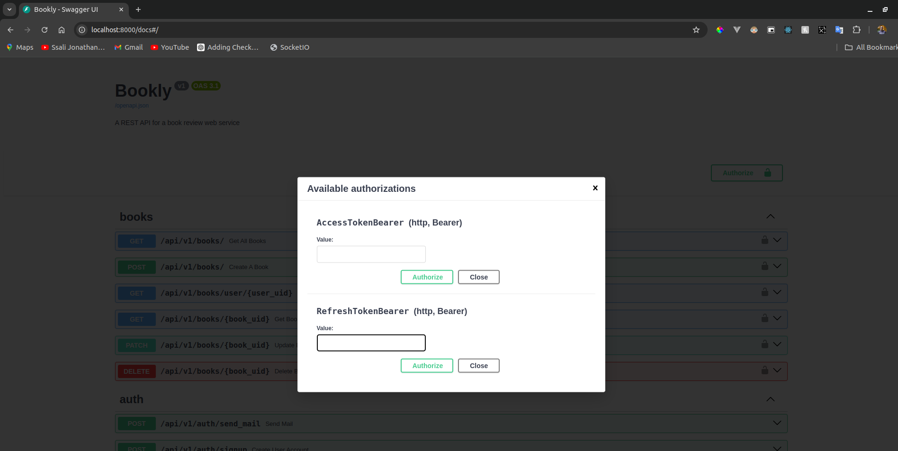
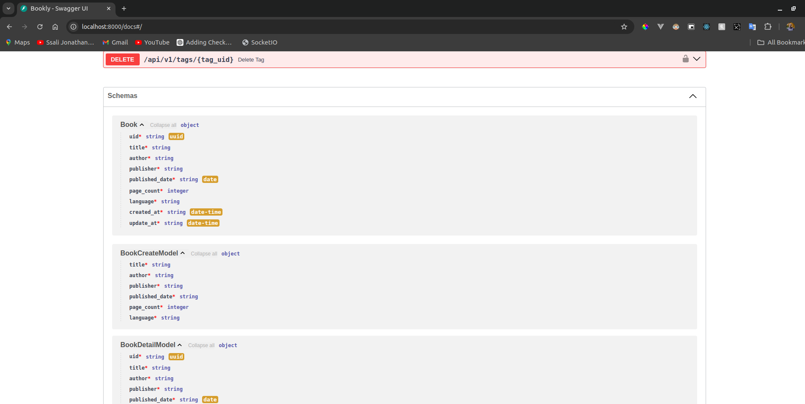
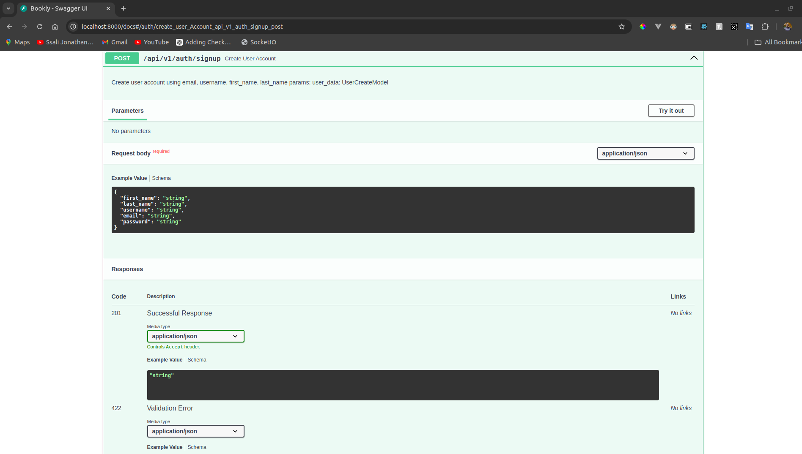
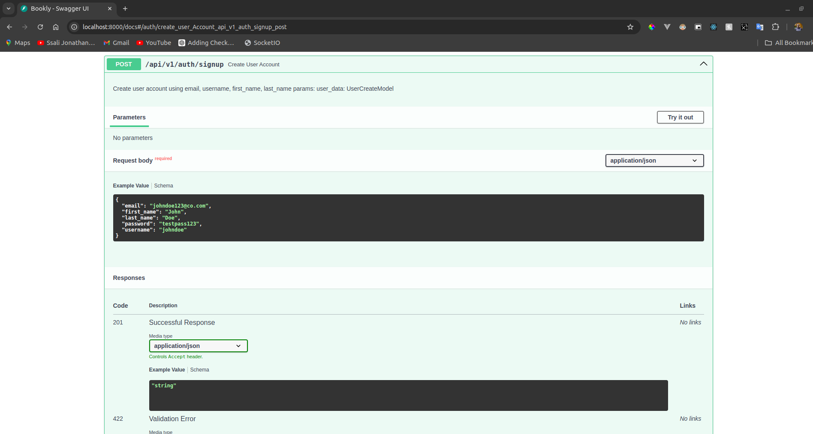
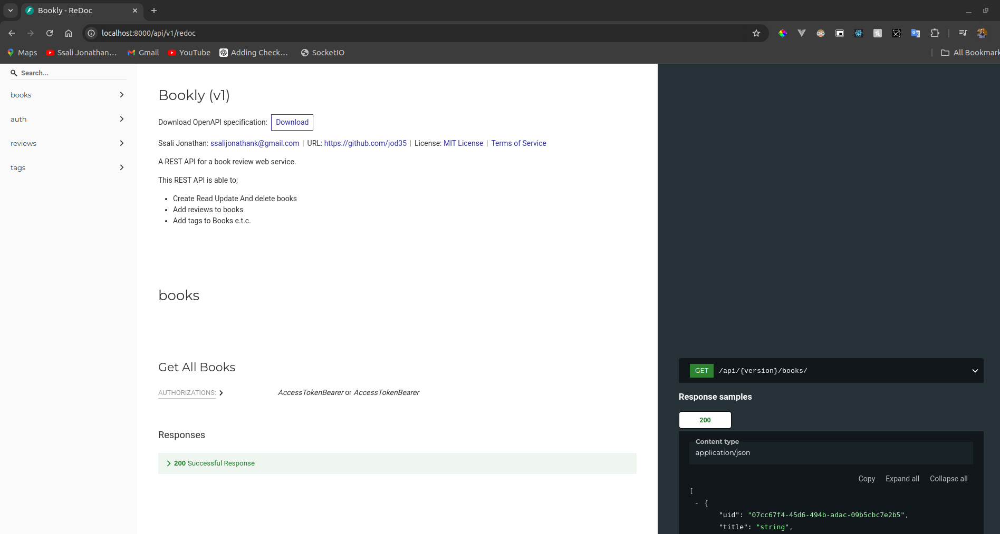
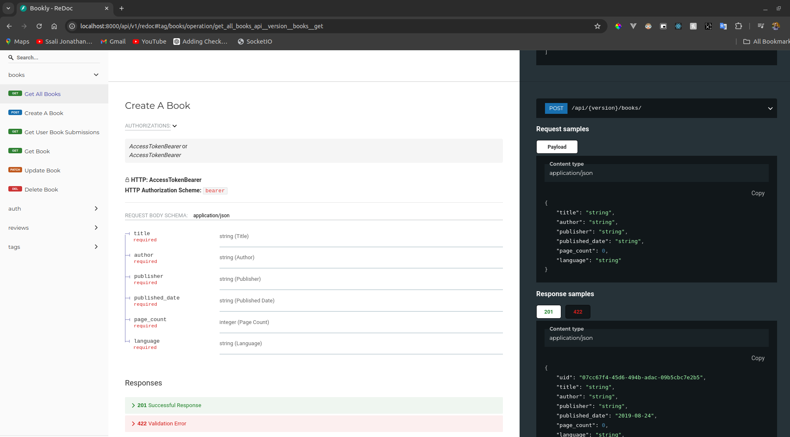

# API Documentation

When building an API, it's crucial to remember that we're creating a platform that clients will use to develop applications that leverage our service. Therefore, it's essential to document the API in a clear and user-friendly manner. Fortunately, FastAPI provides built-in support for comprehensive and easily understandable documentation.

## OpenAPI Specification
FastAPI leverages the **OpenAPI Specification** to automatically document your API. This specification provides a standardized interface that enables both computers and humans to understand an API without needing to understand the underlying code. It is language-agnostic and, when accurately defined, helps clients understand the API's functionality without going into its implementation details.

The OpenAPI Specification can be utilized for generating documentation, creating code, and developing tests for an API (we'll explore testing further later).

In every FastAPI application, this specification is accessible at the `/openapi.json` endpoint. By visiting this URL, you will observe the following:




The `openapi.json` file has the OpenAPI specification with details about all the API endpoints we have so far built. It represents all this information in a JSON format. Keep in mind that JSON is not the only format the OpenAPI spec is represented in. We can also use YAML.

## Swagger
Basing on the OpenAPI spec, FastAPI will generate a [Swagger UI](https://swagger.io/tools/swagger-ui/) to represent it. Let us navigate to `/docs`.



We can use this UI to make requests to our API as shown below. 



Now almost all requests require us to provide some form of authorization token. This can also be done on the same UI by clicking the **Authorize** button at the top.



### Customizing and Documenting the SwaggerUI with Pydantic.

All information about the API endpoints is going to be go from the way you define your API endpoints and your Pydantic models. So information regarding the request bodies is also going to be got from them For example if you go to the bottom of your Swagger UI, you wil notice the documentation of the various schemas we have created so far.



These schemas can also be used as examples when making `POST`, `PUT` and `PATCH` requests. Let us look at the `/api/v1/auth/signup` endpoint. 



We can customize this request body to have an example as shown low. In `src/auth/schemas.py`, we shall update the `UserCreateModel`.

```python title="customizing the signup schema"
class UserCreateModel(BaseModel):
    first_name: str = Field(max_length=25)
    last_name: str = Field(max_length=25)
    username: str = Field(max_length=8)
    email: str = Field(max_length=40)
    password: str = Field(min_length=6)

    model_config = {
        "json_schema_extra": {
            "example": {
                "first_name": "John",
                "last_name": "Doe",
                "username": "johndoe",
                "email": "johndoe123@co.com",
                "password": "testpass123",
            }
        }
    }
```

This will change the request body on the UI to the following.



## Customizing the API Metadata
When you navigate to the very top of the Swagger UI, you will notice the details about the API such as the title, description, the version, and the path to the openapi specification. All these details can be updated by changing some of the attributes we have on the main `app` FastAPI instance. When we navigate to `src/__init__.py`.

```python title="customizing API metadata"

from fastapi import FastAPI
from src.auth.routes import auth_router
from src.books.routes import book_router
from src.reviews.routes import review_router
from src.tags.routes import tags_router
from .errors import register_all_errors
from .middleware import register_middleware


version = "v1"

description = """
A REST API for a book review web service.

This REST API is able to;
- Create Read Update And delete books
- Add reviews to books
- Add tags to Books e.t.c.
    """

version_prefix ="/api/{version}"

app = FastAPI(
    title="Bookly",
    description=description,
    version=version,
    license_info={"name": "MIT License", "url": "https://opensource.org/license/mit"},
    contact={
        "name": "Ssali Jonathan",
        "url": "https://github.com/jod35",
        "email": "ssalijonathank@gmail.com",
    },
    terms_of_service="httpS://example.com/tos",
    openapi_url=f"{version_prefix}/openapi.json",
    docs_url=f"{version_prefix}/docs",
    redoc_url=f"{version_prefix}/redoc"
)

register_all_errors(app)

register_middleware(app)


app.include_router(book_router, prefix=f"{version_prefix}/books", tags=["books"])
app.include_router(auth_router, prefix=f"{version_prefix}/auth", tags=["auth"])
app.include_router(review_router, prefix=f"{version_prefix}/reviews", tags=["reviews"])
app.include_router(tags_router, prefix=f"{version_prefix}/tags", tags=["tags"])

```

What we have done is to add more detail to the data about the API. we have added the contact information, license informationand terms of service.

We can also change the path to the OpenAPI specification by adding the `openapi_url`, `docs_url` for the Swagger UI path and `redoc_url` for the Redoc documentation

!!! Note
    If you want to disable the `openapi_url`, `docs_url`, or `redoc_url`, simply set their values to `None`.

## Redoc

Apart from Swagger, FastAPI also generates documentation using [Redoc](https://github.com/Redocly/redoc). Now that we have modified the `redoc_url`, we can head over to the `/api/v1/redoc` and we shall see the following.



We can get descriptions about the API endpoints, their methods, Request bodies and so on.

