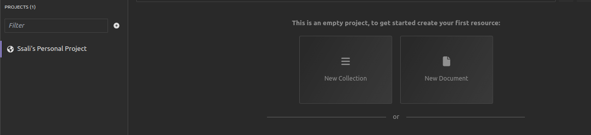

# FastAPI Beyond CRUD (Chapter Two)

## Creating a Simple Web Server
Contents of this chapter are
- [Introduction](#introduction)
- [Creating a FastAPI instance](#creating-a-fastapi-instance)
- [Creating the first API endpoint](#creating-an-api-endpoint)
- [Running a FastAPI server](#running-a-fastapi-application)
- [Choosing a web API client](#choosing-an-api-client)

## Introduction
In this chapter, we are going to create a simple web server on whicn our application shall run using FastAPI.

At this stage, our directory structure is as follows:
```
└── env
```

Let's create a file named `main.py` and populate it with the following code:

```python
from fastapi import FastAPI

app = FastAPI()

@app.get('/')
async def read_root():
    return {"message": "Hello World!"}
```


In this code snippet, we perform the following actions:

## **Creating a FastAPI instance:**
   We import the `FastAPI` class from the `fastapi` library. This class serves as the primary entry point for all FastAPI applications. We then create an instance of our FastAPI application named `app`.

```python
from fastapi import FastAPI

app = FastAPI()
```

## **Creating an API Endpoint:**
   We define our first API endpoint by creating a function named `read_root`. This function, when accessed, will return a JSON message containing "Hello World!".

```python
@app.get('/')
async def read_root():
    return {"message": "Hello World!"}
```

   The `@app.get('/')` decorator associates the `read_root` function with the HTTP GET method for the root path (`/`). This means that whenever the `/` route is accessed, the defined message will be returned.

## **Running the FastAPI Application:**
   To run our FastAPI application, we shall use the `fastapi`command we introduced in the previous chapter. Open a terminal and execute the following command within the virtual environment:

```console
(env)$ fastapi dev main.py
```

The `fastapi dev` command enables us to execute our FastAPI application in development mode. This feature facilitates running our application with auto-reload functionality, ensuring that any modifications we make are automatically applied, restarting the server accordingly. It operates by identifying the FastAPI instance within the specified module or Python package, which in our scenario is `main.py`, where we have defined the app object. When we initiate our application, it will display the following output.
```console

INFO     Using path main.py                                                                              
INFO     Resolved absolute path /home/jod35/Documents/fastapi-beyond-CRUD/main.py                         
INFO     Searching for package file structure from directories with __init__.py files                 
INFO     Importing from /home/jod35/Documents/fastapi-beyond-CRUD                                     
                                                                                                      
 ╭─ Python package file structure ─╮                                                                  
 │                                 │                                                                  
 │      🐍 main.py                 │                                                                  
 │                                 │                                                                  
 ╰─────────────────────────────────╯                                                                  
                                                                                                      
INFO     Importing module main.py                                                                       
INFO     Found importable FastAPI app                                                                 
                                                                                                      
 ╭─ Importable FastAPI app ─╮                                                                         
 │                          │                                                                         
 │  from main import app    │                                                                         
 │                          │                                                                         
 ╰──────────────────────────╯                                                                         
                                                                                                      
INFO     Using import string main:app                                                                  
                                                                                                      
 ╭────────── FastAPI CLI - Development mode ───────────╮                                              
 │                                                     │                                              
 │  Serving at: http://127.0.0.1:8000                  │                                              
 │                                                     │                                              
 │  API docs: http://127.0.0.1:8000/docs               │                                              
 │                                                     │                                              
 │  Running in development mode, for production use:   │                                              
 │                                                     │                                              
 │  fastapi run                                        │                                              
 │                                                     │    

```

Running the server will make your application available at this web address: `http://localhost:8000`.

Following these steps means you've successfully created a basic FastAPI application with a greeting endpoint. You've also learned how to start the application using Uvicorn, which helps you develop more easily because it automatically reloads your code when you make changes.

## Choosing an API Client
Depending on your choice, you may want to test your application with an Api Client, I will begin with [Insomnia](https://insomina.rest) which is a simple open source application for testing and development APIs.

In insomnia, we shall create our simple request collection and we shall now see our response of `Hello World`.
1. Create a new request collection



2. Name the request collection


3. Create an HTTP request


4. Make a request


And just like that, you have created your FastAPI application, run it and even made your HTTP request using an HTTP client.

## Conclusion
In this chapter, we've built a straightforward web server using FastAPI. We've also delved into the process of creating API routes and running our server using the FastAPI Command Line Interface. Next up, we'll construct a simple REST API to execute CRUD operations on an in-memory database.

**Next** [Creating a simple CRUD API](./chapter3.md)

**Previous** [Installation and Configuration](./index.md)