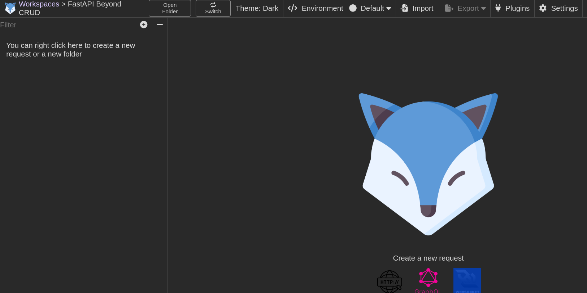
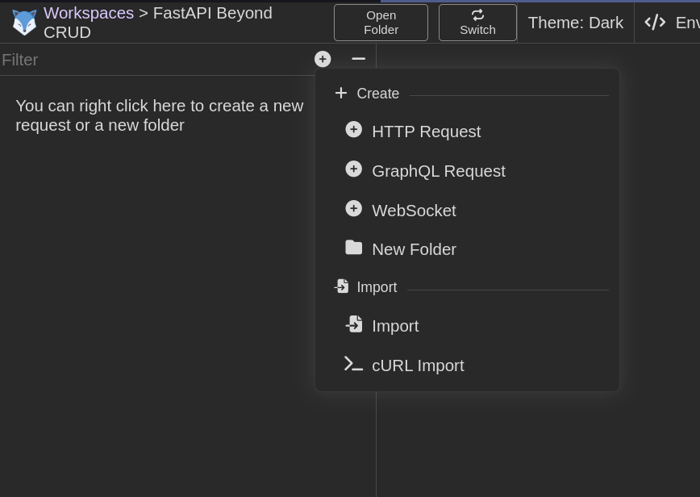
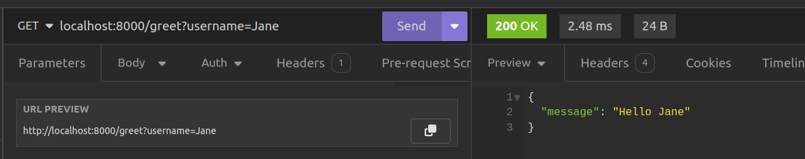
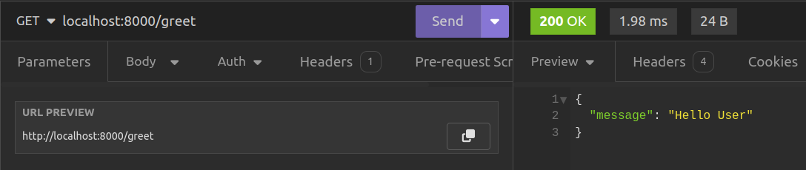

# Chapter 2: Building Your First Web Server

## Introduction

With our environment prepared and FastAPI installed, it is time to breathe life into our project. In this chapter, we will transition from a static installation to a functional web service, exploring the core building blocks that make FastAPI so powerful and intuitive. 

At this stage, your project directory should look familiar. It contains the virtual environment we established and the foundational files created in the previous chapter:

```console title="Current directory structure"
.
├── .gitignore
├── main.py
├── pyproject.toml
├── .python-version
├── README.md
└── uv.lock
```

The heart of our application currently resides in `main.py`. Let's take a closer look at the code we’ve written so far:

```python title="main.py"
from fastapi import FastAPI


app = FastAPI()


@app.get("/")
def index() -> dict:
    return {"Hello": "World"}
```

Even in these few lines, several important things are happening. First, we import the `FastAPI` class, which serves as the primary gateway to the framework. Think of this class as the orchestrator of your application; through it, you will define routes, register middleware, and manage how your server handles everything from basic requests to complex exceptions.

Next, we create an instance of this class, which we've named `app`. While you can technically name this variable anything, `app` is the industry standard and makes your code immediately recognizable to other developers.

Finally, we define our first API route. This is done by creating a standard Python function, `index`, and decorating it with `@app.get("/")`. This decorator tells FastAPI that whenever someone visits the root URL of our server using an HTTP GET request, it should execute the `index` function and return its result—in this case, a simple JSON message.

```python title="Your first API endpoint"
@app.get("/")
def index() -> dict:
    return {"Hello": "World"}
```

FastAPI makes handling different types of interactions seamless. While we are using `get` here to retrieve data, the `@app` decorator supports all standard HTTP methods, including `post`, `put`, `delete`, `patch`, and more, allowing you to build comprehensive and RESTful APIs with ease.

### Running the Application

To see our code in action, we return to the terminal. As we saw in the previous chapter, we can launch our server using the `uv` tool and the FastAPI CLI:

```console title="Running the server with the FastAPI CLI"
(env)$ uv run fastapi dev
```

The `fastapi dev` command is specifically designed for local development. It starts the server in a "hot-reload" mode, meaning it watches your files for changes. The moment you hit save on a file, the server automatically restarts to apply your updates, providing a smooth and efficient feedback loop. By default, it looks for common filenames like `main.py` or `app.py` to find your application instance.

Once the server is running, your application is live and waiting for requests at `http://localhost:8000`.

## Choosing an API Client

While you can visit your API in a web browser, a browser is limited in the types of requests it can make. To truly interact with and test your application, you will want a dedicated API client. 

While tools like [Postman](https://postman.com) and [Insomnia](https://insomnia.rest/) are widely used, [RestFox](https://github.com/flawiddsouza/Restfox/releases) stands out as an excellent open-source alternative. It operates entirely locally, ensuring your data stays on your machine without requiring a cloud account. Throughout this book, we will use RestFox to demonstrate how to test our endpoints.

Setting up your first request in RestFox is a straightforward process:

1. **Create a Request Collection**: This helps you organize your API calls into logical groups.
   

2. **Name Your Collection**: Give your project a clear, descriptive name.
   

3. **Create an HTTP Request**: Add a new request to your collection.
   

4. **Execute the Request**: Enter the URL and hit "Send" to see your "Hello World" response.
   

With these simple steps, you have successfully verified that your server is running and responding as expected.

## Managing Requests and Responses

In a real-world application, a web server rarely just sends back static messages. It needs to receive data from users, process it, and respond accordingly. In FastAPI, there are several standard ways for a client to pass information to your API:

- **Path Parameters**: Data embedded directly in the URL structure.
- **Query Parameters**: Key-value pairs appended to the end of a URL.
- **Request Headers**: Metadata about the request, such as authentication tokens or content types.
- **Request Body**: Data sent as the payload of the request.


### The Importance of Type Declarations

One of FastAPI's most significant advantages is its deep integration with Python type hints. By declaring the types of your parameters, you allow FastAPI to handle data validation and documentation automatically. If you're unfamiliar with this modern Python feature, I recommend reviewing the [Python Type Hints](./type_hints.md) section carefully.

### Path Parameters

Path parameters allow you to make your URLs dynamic. For instance, instead of creating a separate route for every user, you can create a single route that accepts a "username" as part of the URL. In FastAPI, we denote these parameters using curly braces (`{}`).

```python title="path parameters"
#inside main.py
@app.get('/greet/{username}')
async def greet(username: str) -> dict:
   return {"message":f"Hello {username}"}
```

In this example, the `username` captured from the URL is passed directly into our `greet` function. Because we've annotated it as a `str`, FastAPI ensures that it is treated as a string throughout the function's execution.


FastAPI is also smart enough to handle basic data conversion; any value provided in that segment of the URL will be automatically parsed according to your type definition.


### Validating Path params
We can declare and validate path parameters in FastAPI using the `Path` function in FastAPI.

```py
from fastapi import Path

@app.get('/greet/{username}')
async def greet(username: str=Path(... ,max_length=100, min_length=2)) -> dict:
   return {"message":f"Hello {username}"}
```

The use of `...` is to specify that the path param is always going to be required, unlike query params, path params cannot have a default value.

The `Path` function is a function that takes in the following arguments.

- `gt, ge, lt, le`: numeric validations for numeric params
- `min_length / max_length`: string vlidations for string path params
- `title / description`: These are used on the OpenAPI docs. (we shall discuss this later)
- `pattern`: The regex pattern to match with the path param 

### Query Parameters

Query parameters are the key-value pairs you often see at the end of a URL, following a question mark (`?`). They are ideal for optional data, such as search filters or pagination settings.

```python title="Query params"
# inside main.py

user_list = [
   "Jerry",
   "Joey",
   "Phil"
]

@app.get('/search')
async def search_for_user(username: Optional[str] =None) -> dict:
   for user in user_list:
    if username in user_list :
        return {"message":f"details for user {username}"}

    else:
        return {"message":"User Not Found"}
```

Notice that we didn't include `{username}` in the route path this time. In FastAPI, any function parameter that isn't part of the path is automatically treated as a query parameter. To use this endpoint, you would navigate to `/search?username=Jerry`.


If the user isn't found, our logic handles it gracefully:


However, if we attempt to call this endpoint without providing a `username`, FastAPI will return a validation error because we haven't provided a default value, making the parameter required by default.


To make a parameter truly optional, we can provide a default value. By using Python's `Optional` type and assigning a fallback, we can ensure our API remains robust even when certain data is missing.

```python title="Optional Query Params"
from typing import Optional

@app.get('/search')
async def search_for_user(username: Optional[str] = "Jerry") -> dict:
   for user in user_list:
    if username in user_list :
        return {"message":f"details for user {username}"}

    else:
        return {"message":"User Not Found"}
```

Now, if a request arrives without a query string, the API will simply default to searching for "Jerry."


### Refining Optional Parameters

The flexibility of FastAPI allows you to mix and match these approaches. You can even design routes that can handle a parameter as either a path element or a query string, depending on your architectural needs. Consider this alternate version of our greeting:

```python title="Optional Query Params"
from typing import Optional

@app.get('/greet/')
async def greet(username:Optional[str]="User") -> dict:
   return {"message":f"Hello {username}"}
```

By removing `{username}` from the route string and providing a default value in the function signature, we've transformed the requirement. Now, the `username` is an optional query parameter that defaults to "User" if left blank.





### Validating Query Parameters
We can also validate query parameters FastAPI route handlers using FastAPI's `Query` function.

```py title="validating a username using the Query function"
from fastapi import Query

@app.get('/greet/')
async def greet(username: str = Query(default="User", min_length=2, max_length=100)) -> dict:
   return {"message":f"Hello {username}"}
```

Using the `Query` function allows you to add important validations to query parameters. The `Query` has the following arguments. 

- `default` : The default value of the query param if the param is not provided
- `min_length / max_length`: These help to describe string length validations
- `le, lt, ge, gt`: These help to add validations for integer query parameters
- `pattern`: The regular expression to use to match a query param
- `alias`: A different param name that can be used instead of the param described.

### The Request Body and Pydantic

As your application grows, you will often need to send complex data structures to the server for example, when creating a new product or updating a user profile. While you could pass this data through numerous query parameters, it quickly becomes unwieldy. 

Instead, we use a **Request Body**. FastAPI leverages the power of Pydantic to let you define exactly what your data should look like using simple Python classes.

```python title="Request Body"
# inside main.py
from pydantic import BaseModel

# the User model
class ProductSchema(BaseModel):
   name:str
   price:float
   description:str


@app.post("/create_product")
async def create_product(product_data:ProductSchema):
   new_product = {
      "name" : product_data.name,
      "price": product_data.price,
      "description" : product_data.description 
   }
```

In this example, we define a `ProductSchema` that inherits from Pydantic's `BaseModel`. This serves as a blueprint: any data sent to the `/create_product` endpoint *must* match this structure. 

```python title="A simple Pydantic model"
from pydantic import BaseModel

class ProductSchema(BaseModel):
    name: str
    price: float
    description: str
```

FastAPI handles the heavy lifting for you. It automatically parses the incoming JSON, validates the data types, and provides you with a clean Python object (`product_data`) to work with inside your function.

If a client sends an invalid request—for example, by omitting the request body entirely—FastAPI automatically intervenes.


You’ll notice the server returns a `422 Unprocessable Entity` status. This isn't just a generic error; it’s a helpful signal that the data provided (or lack thereof) didn't meet the requirements of your schema. Similarly, if required fields are missing, FastAPI will pinpoint exactly what is wrong:


When the client provides valid data that matches our schema, everything works perfectly:


#### Adding values to Request Body without Pydantic models
At this point you understand that any paramater that is not defined in your path params will be treated as a query paramater. Here is a simple example.

```python title="a query param"
class ProductSchema(BaseModel):
    name: str
    price: float
    description: str

@app.post("/create_product")
async def create_product(product_data:ProductSchema, sku: str):
   new_product = {
      "name" : product_data.name,
      "price": product_data.price,
      "description" : product_data.description 
   }
```

This will treat our new param to our handler as a query parameter. What if we want to use it as part of the request body but not part of our product model? There is where the `Body` function comes in. The `Body` function allows for us to make the `sku` field be part of the request body even if it is not found on a Pydantic model. 

```python title="a param part of the request body"
from fastapi import Body

class ProductSchema(BaseModel):
    name: str
    price: float
    description: str

@app.post("/create_product")
async def create_product(product_data:ProductSchema, sku: str= Body(...)):
   new_product = {
      "name" : product_data.name,
      "price": product_data.price,
      "description" : product_data.description 
   }

   return {"product": product, "sku": sku}
```

### Understanding Request Headers

Beyond the explicit data we send in the URL or the body, every HTTP request carries **Headers**. These provide essential context about the request's origin and preferences, such as:

- **User-Agent**: Identifies the client software making the request.
- **Host**: The domain name the client is reaching out to.
- **Accept-Language**: The user's preferred language for the response.
- **Authorization**: (Often used for security tokens, which we will cover later).

FastAPI allows you to access these headers just as easily as any other parameter. By using the `Header` function, you can retrieve specific values, which FastAPI intelligently maps from standard HTTP kebab-case (like `User-Agent`) to Pythonic snake-case (`user_agent`).

```python title="Request Headers"
# inside main.py
@app.get("/get_headers")
async def get_all_request_headers(
    user_agent: Optional[str] = Header(None),
    accept_encoding: Optional[str] = Header(None),
    referer: Optional[str] = Header(None),
    connection: Optional[str] = Header(None),
    accept_language: Optional[str] = Header(None),
    host: Optional[str] = Header(None),
) -> dict:

    request_headers = {}
    request_headers["User-Agent"] = user_agent
    request_headers["Accept-Encoding"] = accept_encoding
    request_headers["Referer"] = referer
    request_headers["Accept-Language"] = accept_language
    request_headers["Connection"] = connection
    request_headers["Host"] = host

    return request_headers
```

Making a request to this route reveals the fascinating layer of metadata that travels with every click and API call.


## Conclusion

In this chapter, we have moved beyond a simple installation and built a functioning web server. We have explored the various ways clients can communicate with our API through path parameters, query strings, request bodies, and headers and seen how FastAPI uses Python type hints to make this communication safe and reliable.

In the next chapter, we will take these concepts further and begin building a real-world application: a CRUD (Create, Read, Update, Delete) API for managing a bookstore, utilizing an in-memory database to keep our focus on the core logic of web development.
