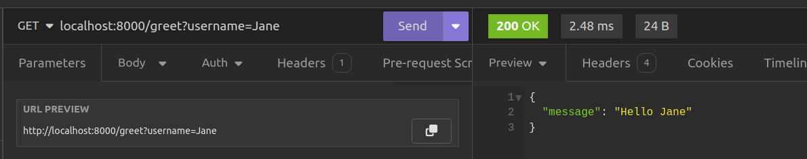
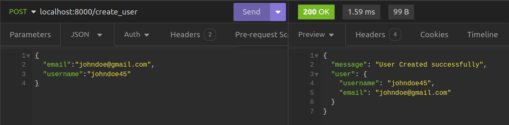

# Creating a Simple Web Server

## Introduction
Now that we have FastAPI installed, we are going to create a simple web server on whicn our application shall run using FastAPI.

At this stage, our directory only contains our virtual environment directory `env` and `requirements.txt` as shown below as follows:
```console title="Current directory structure"
└── env
└── requirements.txt
```

Let's create a file named `main.py` and populate it with the following code:

```python title="main.py"
from fastapi import FastAPI

app = FastAPI()

@app.get('/')
async def read_root():
    return {"message": "Hello World!"}
```


In this code snippet, we perform the following actions:

### **Creating a FastAPI instance:**
We have imported the `FastAPI` class from the `fastapi` package. This class serves as the primary entry point for all FastAPI applications. Through it we can get access to various FastAPI features such as routes , middleware, exception handlers and path operations.


We then create an instance of the `FastAPI` class named `app`. The main FastAPI instance can be called anything as long as it is a valid Python name. 


```python title="Creating the FastAPI instance"
from fastapi import FastAPI

app = FastAPI()
```

### **Creating an API Route:**
   We define our first API route by creating a function named `read_root`. This function, when accessed, will return a JSON message containing "Hello World!".

```python title="Your first API endpoint"
@app.get('/')
async def read_root():
    return {"message": "Hello World!"}
```

The `@app` decorator associates the function with the HTTP GET method  via the `get` method. We then provide the path (route) of the root path (`/`). This means that whenever the `/` route is accessed, the defined message will be returned.

All HTTP methods such as `post`,`put`,`head`,`patch`, `delete`, `trace` and `options` are all available on the `@app` decorator.

### **Running the FastAPI Application:**
   To run our FastAPI application, we shall use the `fastapi`command we introduced in the previous chapter. Open a terminal and execute the following command within the virtual environment:

```console title="Running the server with the FastAPI CLI"
(env)$ fastapi dev main.py
```

The `fastapi dev` command enables us to execute our FastAPI application in development mode. This feature facilitates running our application with auto-reload functionality, ensuring that any modifications we make are automatically applied, restarting the server accordingly. It operates by identifying the FastAPI instance within the specified module or Python package, which in our scenario is `main.py`, where we have defined the app object. When we initiate our application, it will display the following output.
```console title="terminal ouput"

INFO     Using path main.py                                                                              
INFO     Resolved absolute path /home/jod35/Documents/fastapi-beyond-CRUD/main.py                         
INFO     Searching for package file structure from directories with __init__.py files                 
INFO     Importing from /home/jod35/Documents/fastapi-beyond-CRUD                                     
                                                                                                      
 ╭─ Python package file structure ─╮                                                                  
 │                                 │                                                                  
 │      🐍 main.py                 │                                                                  
 │                                 │                                                                  
 ╰─────────────────────────────────╯                                                                  
                                                                                                      
INFO     Importing module main.py                                                                       
INFO     Found importable FastAPI app                                                                 
                                                                                                      
 ╭─ Importable FastAPI app ─╮                                                                         
 │                          │                                                                         
 │  from main import app    │                                                                         
 │                          │                                                                         
 ╰──────────────────────────╯                                                                         
                                                                                                      
INFO     Using import string main:app                                                                  
                                                                                                      
 ╭────────── FastAPI CLI - Development mode ───────────╮                                              
 │                                                     │                                              
 │  Serving at: http://127.0.0.1:8000                  │                                              
 │                                                     │                                              
 │  API docs: http://127.0.0.1:8000/docs               │                                              
 │                                                     │                                              
 │  Running in development mode, for production use:   │                                              
 │                                                     │                                              
 │  fastapi run                                        │                                              
 │                                                     │    

```

Running the server will make your application available at this web address: `http://localhost:8000`.

Following these steps means you've successfully created a basic FastAPI application with a greeting endpoint. You've also learned how to start the application using Uvicorn, which helps you develop more easily because it automatically reloads your code when you make changes.

## Choosing an API Client
Depending on your choice, you may want to test your application with an Api Client, I will begin with [Insomnia](https://insomina.rest) which is a simple open source application for testing and development APIs.

In insomnia, we shall create our simple request collection and we shall now see our response of `Hello World`.

1. Create a new request collection


2. Name the request collection


3. Create an HTTP request


4. Make a request


And just like that, you have created your FastAPI application, run it and even made your HTTP request using an HTTP client.

## Managing Requests and Responses
There are very many ways that clients can pass request data to a FastAPI API route. These include:
- Path Parameters
- Query Parameters
- Headers e.t.c.

Through such ways, we can obtain data from incoming requests to our APIs.


### Parameter type declarations
All parameters in a FastAPI request are requiresd to have a type declaration via *type hints*. Primitive Python types such (`None`,`int`,`str`,`bool`,`float`), container types such as (`dict`,`tuples`,`dict`,`set`) and some other complex types are all supported. 

Additionally FastAPI also allows all types present within Python's `typing` module. 
These data types represent common conventions in Python and are utilized for variable type annotations. They facilitate type checking and model validation during compilation. Examples include `Optional`, `List`, `Dict`, `Set`, `Union`, `Tuple`, `FrozenSet`, `Iterable`, and `Deque`.

### Path Parameters
All request data supplied in the endpoint URL of a FastAPI API is acquired through a path parameter, thus rendering URLs dynamic. FastAPI adopts curly braces (`{}`) to denote path parameters when defining a URL. Once enclosed within the braces, FastAPI requires that they be provided as parameters to the route handler functions we establish for those paths.

```python title="path parameters"
#inside main.py
@app.get('/greet/{username}')
async def greet(username:str):
   return {"message":f"Hello {username}"}
```

In this example the `greet()` route handler function will require `username` which is annotated with `str` indicating that the username shall be a string. Sending a greetings to the user "jona" shall return the response shown below.


Just in we make a request to the route without the param, 


### Query Parameters
These are key-value pairs provided at the end of a URL, indicated by a question mark (`?`). Just like path parameters, they also take in request data. Whenever we want to provide multiple query parameters, we use the ampersand (`&`) sign.

```python title="Query params"
# inside main.py

user_list = [
   "Jerry",
   "Joey",
   "Phil"
] 

@app.get('/search')
async def search_for_user(username:str):
   for user in user_list:
    if username in user_list :
        return {"message":f"details for user {username}"}

    else:
        return {"message":"User Not Found"}
```

In this example, we've set up a route for searching users within a simple list. Notice that there are no path parameters specified in the route's URL. Instead, we're passing the `username` directly to our route handler, `search_for_user`. In FastAPI, any parameter passed to a route handler, like `search_for_user`, and is not provided in the path as a path param is treated as a query parameter. Therefore, to access this route, we need to use `/search?username=sample_name`, where `username` is the key and `sample_name` is the value.

Let us save and test the example above. Saecrning for a user who exists returns the needed response.


And searching for a user who does not exist returns the following response. 


### Optional Parameters
There may also be cases when the API route can operate as needed even in the presence of a path or query param. In this case, we can make the parameters optional when annotating their types in the route handler functions. Forexample, our first example can be modified to the following:
```python title="Optional Query Params"
from typing import Optional

@app.get('/greet/')
async def greet(username:Optional[str]="User"):
   return {"message":f"Hello {username}"}

```


This time, we've made the `username` path parameter optional. We achieved this by removing it from the route definition. Additionally, we updated the type annotation for the `username` parameter in the `greet` route handler function to make it an optional string, with a default value of "User". To accomplish this, we're using the `Optional` type from Python's `typing` module.
```python
username:Optional[str]
```

When we save the example, we shall test it and get the following response.


Note that this time if we do not provide the `username`, we shall get the default username of "User".


## Request Body
Frequently, clients need to send data to the server for tasks like creating or updating resources through methods like POST, PATCH, PUT, DELETE, or for various other operations. FastAPI simplifies this process by enabling you to define a Pydantic model to establish the structure of the data being sent. Furthermore, it aids in validating data types using type hints. Let's delve into a straightforward example to illustrate this concept.

```python title="Request Body"
# inside main.py
from pydantic import BaseModel

# the User model
class UserSchema(BaseModel):
   username:str
   email:str
   

@app.post("/create_user")
async def create_user(user_data:UserSchema):
   new_user = {
      "username" : user_data.username,
      "email": user_data.email
   }

   users.append(new_user)

   return {"message":"User Created successfully","user":new_user}

```

What we have done in the above example is to create a Pydantic model by inheriting Pydantic's `BaseModel` class. On this class we have defined attributes `username` and `email` and also annotated them with the `str` type. 
```python title="A simple Pydantic model"
class UserSchema(BaseModel):
   username:str
   email:str
   
```

Following that, have crafted an API route intended to handle a POST request at /create_user. The handler for this route accepts a parameter representing the user_data obtained from the client, with its type annotated as the Pydantic model UserSchema.
```python
create_user(user_data:UserSchema)
```


Using this `user_data`, we construct a new_user dictionary and append it to our users list.
```python
   new_user = {
      "username" : user_data.username,
      "email": user_data.email
   }

   users.append(new_user)

```


We finally return a response with the newly created `new_user` dictionary. 

```python

   return {"message":"User Created successfully","user":new_user}
```


Let's test this. If we make the request without providing the request body, we should receive the following response.


Please note that we will receive the `422 Unprocessable Entity` status code because FastAPI failed to retrieve data from the request body, as it has not been provided.


When we provide the body without the required fields, we will receive the following output.


We will receive the same output, but this time we will be notified that the required fields (`email`,`username`) for the data are missing.

Let us now provide valid data.




Supplying valid values for the `email` and `username` fields will result in a successful response.

#### Note
There can indeed be scenarios that necessitate the use of all the features we've discussed. You can have an API route that accepts path, query, and optional parameters, and FastAPI is capable of handling such complexity seamlessly.

### Request Headers

During a request-response transaction, the client not only sends parameters to the server but also provides information about the context of the request's origin. This contextual information is crucial as it enables the server to customize the type of response it returns to the client.

Common request headers include:
- `User-Agent`: This string allows network protocol peers to identify the application responsible for the request, the operating system it's running on, or the version of the software being used.

- `Host`: This specifies the domain name of the server, and (optionally) the TCP port number on which the server is listening.

- `Accept`: Informs the server about the types of data that can be sent back.

- `Accept-Language`: This header informs the server about the preferred human language for the response.

- `Accept-Encoding`: The encoding algorithm, usually a compression algorithm, that can be used on the resource sent back.

- `Referer`: This specifies the address of the previous web page from which a link to the currently requested page was followed.

- `Connection`: This header controls whether the network connection stays open after the current transaction finishes. 


To access such headers, FastAPI provides us with the `Header` function giving us the ability to get the values of these headers using the exact names but in a snake-case syntax forexample, `User-Agent` is `user_agent`, `Accept-Encoding` is `accept_encoding` and so on. Let us take a look at a small code example.

```python title="Request Headers"
# inside main.py
@app.get('/get_headers')
async def get_all_request_headers(
    user_agent: Optional[str] = Header(None),
    accept_encoding: Optional[str] = Header(None),
    referer: Optional[str] = Header(None),
    connection: Optional[str] = Header(None),
    accept_language: Optional[str] = Header(None),
    host: Optional[str] = Header(None),
):
    request_headers = {}
    request_headers["User-Agent"] = user_agent
    request_headers["Accept-Encoding"] = accept_encoding
    request_headers["Referer"] = referer
    request_headers["Accept-Language"] = accept_language
    request_headers["Connection"] = connection
    request_headers["Host"] = host

    return request_headers
```
We've started by importing the `Header` function from FastAPI into our route handler. Each header has been added and designated as an optional string. A default value has been assigned by invoking the `Header` function with `None` as a parameter. 
Using the `None` argument allows the Header() function to declare the variable optionally, which aligns with best practices.

```python
    user_agent: Optional[str] = Header(None)
```

we have then created a request_headers dictionary with the names of the headers as keys and the values as what we get by calling the `Header` function.

Making a request to the `/get_headers` route shall return the following response depending on how you have made the request. For my case,


## Conclusion

In this chapter, we utilized FastAPI to construct a basic web server and delved into different methods of communicating and inputting data. We introduced concepts such as path and query parameters, along with request headers. Moving forward, the next chapter will focus on developing a straightforward CRUD API for managing book resources utilizing an in-memory database.

**Next** [Creating a simple CRUD API](./chapter3.md)

**Previous** [Installation and Configuration](./index.md)