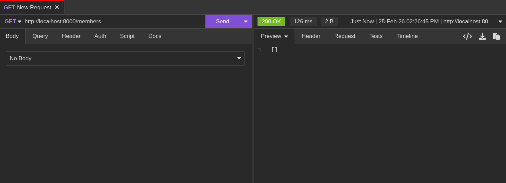

# Building a CRUD REST API 

## Introduction

Having mastered the basics of FastAPI, we are now ready to take a significant step forward by developing a practical application. In this chapter, we will construct a Savings and Credit Cooperative Organization (SACCO) management application. SACCOS are member-owned financial cooperatives that allow groups to pool their resources for collective saving and loan provision, serving as an alternative to conventional banking systems.

In our SACCO application, members will have the ability to deposit savings, access loans based on their savings, repay loans with interest, and share in the profits generated from interest income. A vital aspect of such systems is the onboarding process. Our implementation will facilitate multiple groups registering under a single SACCO, with individual members joining specific groups.

In this chapter, we will lay the groundwork for the onboarding feature by implementing CRUD operations to manage members, marking our first complete CRUD application.

## What is CRUD?

CRUD stands for the four fundamental operations for data management:

- **Create (C):**
    - _Objective:_ To add new data.
    - _Action:_ Insert a new record or entity.

- **Read (R):**
    - _Objective:_ To retrieve existing data.
    - _Action:_ Fetch data without making any modifications.

- **Update (U):**
    - _Objective:_ To modify existing data.
    - _Action:_ Update attributes or values.

- **Delete (D):**
    - _Objective:_ To remove data.
    - _Action:_ Delete a record or entity.

CRUD operations are essential for data management and are commonly utilized in applications that handle data persistence. In **FastAPI Beyond CRUD**, we will focus on extending FastAPI's capabilities beyond standard CRUD applications, exploring advanced features and use cases. However, before going into these aspects, we will first create a simple CRUD API using FastAPI.

## A Simple CRUD API Implementation

Our straightforward CRUD API will feature several endpoints to perform CRUD operations on a basic in-memory database (utilizing Python lists). Below is a list of the endpoints that we will implement in our CRUD API.

| Endpoint             | Method | Description                                  |
| -------------------- | ------ | -------------------------------------------- |
| /members             | GET    | Retrieve all members of the SACCO.           |
| /members             | POST   | Create a new member in the SACCO.            |
| /members/{member_id} | GET    | Retrieve details of a specific member by ID. |
| /members/{member_id} | PUT    | Update details of a specific member by ID.   |
| /members/{member_id} | DELETE | Remove a member from the SACCO by ID.        |

The table above outlines various API endpoints, their corresponding HTTP methods, and their functionalities:

1. **`/members` - GET: Retrieve all members**
        - _Description:_ This endpoint retrieves information about all members registered in the SACCO. When a client sends an HTTP GET request to `/members`, the server responds with details of all members.

2. **`/members` - POST: Create a member**
        - _Description:_ To add a new member to the SACCO, clients can send an HTTP POST request to `/members`. This operation involves creating and storing a new member based on the data provided in the request body.

3. **`/members/{member_id}` - GET: Get a member by ID**
        - _Description:_ By sending an HTTP GET request to `/members/{member_id}`, clients can retrieve detailed information about a specific member. The `member_id` parameter in the path specifies which member to fetch.

4. **`/members/{member_id}` - PUT: Update a member by ID**
        - _Description:_ To modify the information of a specific member, clients can send an HTTP PUT request to `/members/{member_id}`. The `member_id` parameter identifies the target member, and the request body contains the updated data.

5. **`/members/{member_id}` - DELETE: Delete a member by ID**
        - _Description:_ This endpoint allows clients to delete a specific member from the SACCO. By sending an HTTP DELETE request to `/members/{member_id}`, the member identified by `member_id` will be removed from the records.

With a clear plan for our simple API in place, we can now proceed to implement our CRUD API by integrating the functionalities outlined above into `main.py`. We will begin by creating simple list to serve as our in-memory database for members.

```python title="In-memory database for members and groups"
# inside main.py

members = []
```

After establishing these lists, we will define the data models that will be utilized throughout our application.

```python title="Data models for CRUD endpoints"
# inside main.py
# ... additional code here
from pydantic import BaseModel
from typing import List, Optional
from enum import Enum

# additional code here
members: list["Member"] = []


class MemberStatus(Enum):
    ACTIVE = "active"
    INACTIVE = "inactive"
    SUSPENDED = "suspended"
    REJECTED = "rejected"


class Member(BaseModel):
    id: int
    first_name: str
    last_name: str
    address: str
    phone_number: str
    national_id_number: str
    occupation: str
    status: MemberStatus
```

The code above establishes the necessary data models for our endpoints. First, we define the `MemberStatus` enum, which indicates the status of a member in a SACCO, with possible values of `active`, `inactive`, `suspended`, and `rejected`.

Next, we introduce the `Member` model, which encapsulates the information we will store about individual group members. 

We are making extensive use of [type hints](./type_hints.md) here, as evidenced by the specifications of the types of items stored in our lists.

### Reading All Members (HTTP GET)

This route responds to GET requests made to `/members`, providing a list of all members in the SACCO. It ensures that the response adheres to the `List[Member]` model, guaranteeing consistency with the structure defined by the `Member` model.

```python title="Get all members"
@app.get("/members", tags=["Members"])
def get_members() -> list[Member]:
        return members
```

FastAPI significantly simplifies the process of returning any JSON serializable object as a response. You should also be able to return Pydantic models as we have done in the example above using `list[Member]`. 

!!! Note
    JSON (JavaScript Object Notation) serialization involves transforming a data structure or object from a programming language (such as Python, JavaScript, or others) into a JSON-formatted string. This string representation can then be transmitted over a network or stored in a file, subsequently allowing deserialization back into the original data structure.
 
In Python, the following data types are natively serializable to JSON Lists, Dictionaries, Strings, Numbers (int, float), Tuples (converted to JSON arrays), Booleans, None (converted to JSON null)

!!! Note
    Some types like custom objects, datetime objects, and sets are not natively JSON serializable and require custom encoders or conversion before serialization.

This capability enables us to effortlessly respond with a list of member objects (which is currently an empty list of objects) when issuing a `GET` request to `http://localhost:8000/members`, as illustrated below:



### Create a Member (HTTP POST)

```python title="Create a member"
from fastapi import FastAPI, status

# ...more code here

@app.post("/members", status_code=status.HTTP_201_CREATED, tags=["Members"])
def create_member(member: Member) -> dict:
    members.append(member)
    return {"message": "Member created successfully", "member_id": member.id}
```

In the code above, we have established a new endpoint accessible via a POST request at `/members`. This time, the route handler is provided with a parameter `member`, which is expected to conform to the `Member` model. We will explore how this functions shortly.

Next, we retrieve the `member` data and add it to our members list using the `append` method of the Python `members` list. Finally, we return a dictionary response indicating that the member has been created successfully.

To test this, we will create a new request to the URL `http://localhost:8000/members` and specify the HTTP method as **POST**. We will then set the request body to JSON using the menu, as illustrated below.


Next, we will make the request to the API with an empty body (an empty dictionary), which will trigger validation errors as defined in the `Member` model.


When we provide all the required fields, a successful response message will be returned along with a 201 response status code.


By default, all endpoints return a 200 status code, but we can customize the response status code by specifying it in the route path decorator, as demonstrated in this case.

```python title="specify response status code"
@app.post("/members", status_code=status.HTTP_201_CREATED, tags=["Members"])
```

We can test this out by making a **GET** request to `http://localhost:8000/members/`


### Get a member BY ID (HTTP GET)

```python title="Get member by ID"
@app.get("/members/{member_id}", tags=["Members"])
def get_member(member_id: int) -> Member | dict:
    for member in members:
        if member.id == member_id:
            return member
    return {"message": "Member not found"}
```

To retrieve the member by ID, we have created a new endpoint on the `/members/{member_id}` path. Its route handler takes a parameter `member_id` which is an integer and we then loop through all members to find the member with the `member_id`. 


If we find it, we return it else we return a not found response. Keep in mind that we are storing `Member` objects in the `members` list which is JSON serializable. We are also making use of the return Type to allow FastAPI automatically validate what we return in our response (it has to be a dict or a `Member` object). 


### Update a Member by ID (HTTP PUT)
```python title="Update a member using their ID"
@app.put("/members/{member_id}", tags=["Members"])
def update_member(member_id: int, updated_member: Member) -> dict:
    for index, member in enumerate(members):
        if member.id == member_id:
            members[index] = updated_member
            return {"message": "Member updated successfully", "member": updated_member}
    return {"message": "Member not found"}
```

The update endpoint is accessed via the `/members/{member_id}` path using the HTTP PUT method, which is designed for fully updating an existing resource. The route handler requires two parameters: `member_id` (the identifier of the member to update) and `updated_member` (a `Member` object containing the new data).

The function searches through the members list to find the member matching the provided `member_id`. When a match is found, it replaces the existing member data at that index with the updated information and returns a success message. If no matching member is found, it returns a "Member not found" response.

To validate the endpoint, you can test it in two scenarios. First, submit a request with incomplete data (missing required fields from the `Member` model) to see FastAPI's validation error responses. Second, submit a complete request with all required fields to verify that the member data is successfully updated.


### Delete a Member by ID (HTTP DELETE)

Finally, the delete endpoint:

```python title="delete member by ID"
from enum import Enum
from fastapi import FastAPI, HTTPException, status
from pydantic import BaseModel

app = FastAPI()

members: list["Member"] = []

class MemberStatus(Enum):
    ACTIVE = "active"
    INACTIVE = "inactive"
    SUSPENDED = "suspended"
    REJECTED = "rejected"

class Member(BaseModel):
    id: int
    first_name: str
    last_name: str
    address: str
    phone_number: str
    national_id_number: str
    occupation: str
    status: MemberStatus

@app.get("/members", tags=["Members"])
def get_members() -> list[Member]:
    return members

@app.post("/members", status_code=status.HTTP_201_CREATED, tags=["Members"])
def create_member(member: Member) -> dict:
    members.append(member)
    return {"message": "Member created successfully", "member_id": member.id}

@app.get("/members/{member_id}", tags=["Members"])
def get_member(member_id: int) -> Member | dict:
    for member in members:
        if member.id == member_id:
            return member
    return {"message": "Member not found"}

@app.put("/members/{member_id}", tags=["Members"])
def update_member(member_id: int, updated_member: Member) -> dict:
    for index, member in enumerate(members):
        if member.id == member_id:
            members[index] = updated_member
            return {"message": "Member updated successfully", "member": updated_member}
    return {"message": "Member not found"}

@app.delete(
    "/members/{member_id}", status_code=status.HTTP_204_NO_CONTENT, tags=["Members"]
)
def delete_member(member_id: int) -> None:
    for index, member in enumerate(members):
        if member.id == member_id:
            del members[index]
            return
    raise HTTPException(status_code=status.HTTP_404_NOT_FOUND, detail="Member not found")
```

The delete endpoint is accessed at the `/members/{member_id}` path using the HTTP DELETE method. The route handler accepts the `member_id` path parameter, which identifies the member to delete. The function iterates through the members list to locate the member with the matching ID. Once found, it removes the member from the list. If the member is not found, it returns a "Member not found" response.


All the member endpoints will look like this for now.

```python title="all member CRUD endpoints"

# inside main.py
from enum import Enum
from typing import Optional
from fastapi import FastAPI, Header, HTTPException, status
from pydantic import BaseModel

app = FastAPI()

members: list["Member"] = []

class MemberStatus(Enum):
    ACTIVE = "active"
    INACTIVE = "inactive"
    SUSPENDED = "suspended"
    REJECTED = "rejected"

class Member(BaseModel):
    id: int
    first_name: str
    last_name: str
    address: str
    phone_number: str
    national_id_number: str
    occupation: str
    status: MemberStatus

@app.get("/members", tags=["Members"])
def get_members() -> list[Member]:
    return members

@app.post("/members", status_code=status.HTTP_201_CREATED, tags=["Members"])
def create_member(member: Member) -> dict:
    members.append(member)
    return {"message": "Member created successfully", "member_id": member.id}

@app.get("/members/{member_id}", tags=["Members"])
def get_member(member_id: int) -> Member | dict:
    for member in members:
        if member.id == member_id:
            return member
    return {"message": "Member not found"}

@app.put("/members/{member_id}", tags=["Members"])
def update_member(member_id: int, updated_member: Member) -> dict:
    for index, member in enumerate(members):
        if member.id == member_id:
            members[index] = updated_member
            return {"message": "Member updated successfully", "member": updated_member}
    return {"message": "Member not found"}

@app.delete(
    "/members/{member_id}", status_code=status.HTTP_204_NO_CONTENT, tags=["Members"]
)
def delete_member(member_id: int) -> None:
    for index, member in enumerate(members):
        if member.id == member_id:
            del members[index]
            return
    raise HTTPException(status_code=status.HTTP_404_NOT_FOUND, detail="Member not found")
```

## Conclusion

In this chapter, we successfully implemented a foundational CRUD API for managing SACCO members. This exercise provided practical experience in defining HTTP routes using the FastAPI framework, mapping standard CRUD operations to their appropriate HTTP methods, and using Python type hints to ensure data integrity. While our current implementation relies on a simple in-memory list for storage, it establishes the essential patterns for more complex data management.

CRUD operations form the cornerstone of most modern web applications, serving as the interface for core business logic. However, as applications grow in complexity, a single-file structure becomes difficult to maintain. In the next chapter, we will evolve our project by introducing a modular architecture using FastAPI routers, setting the stage for a more scalable and production-ready application.
