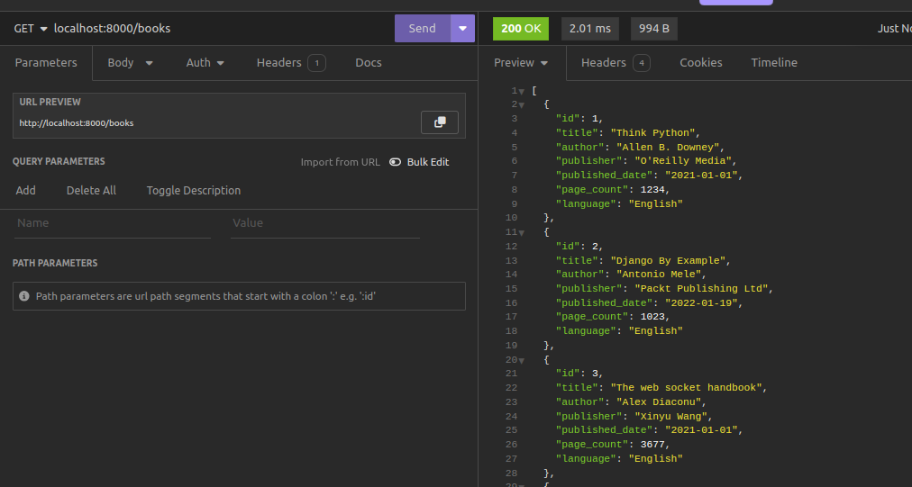
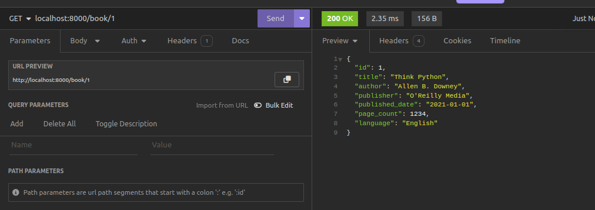
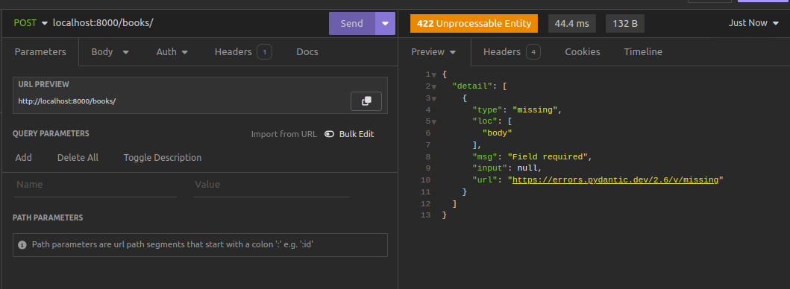
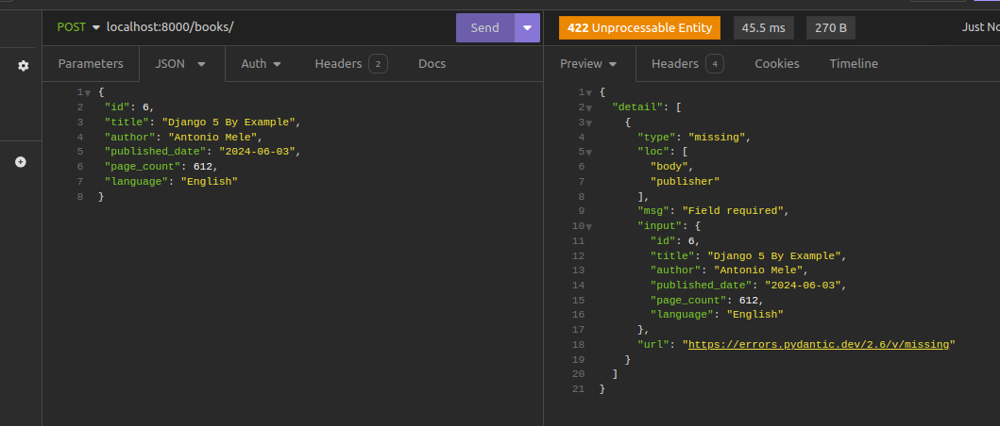
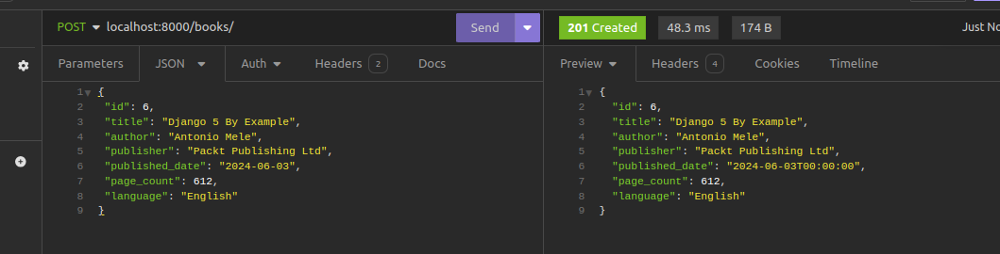
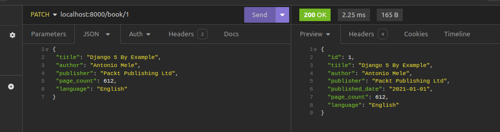
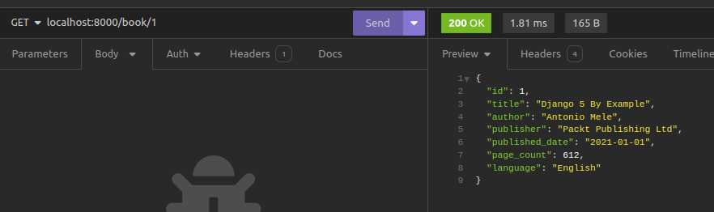
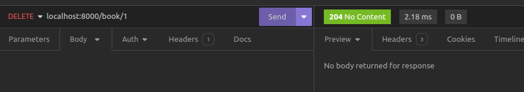

# Building a CRUD REST API 

## Introduction

Now that you've grasped the fundamentals of building with FastAPI, let's advance further by constructing a practical FastAPI project. Throughout this book, we'll develop a SACCO management application. SACCOS (Savings and Credit Cooperative Organizations) are member-owned financial cooperatives where groups pool resources to save collectively and provide loans to one another, creating an alternative to traditional banking systems.

In a SACCO application, members can deposit savings, access loans against their savings, repay loans with interest, and benefit from shared profits generated by interest income. A critical component of such systems is the onboarding process. Our implementation will support multiple groups registering under a single SACCO, with individual members joining specific groups.

In this chapter, we'll build the foundational onboarding feature by implementing CRUD operations to manage groups and members—serving as our first complete CRUD application.


## What is CRUD?

CRUD represents the four basic data operations:

- **Create (C):**

  - _Objective:_ Add new data.
  - _Action:_ Insert a new record or entity.

- **Read (R):**

  - _Objective:_ Retrieve existing data.
  - _Action:_ Fetch data without modification.

- **Update (U):**

  - _Objective:_ Modify existing data.
  - _Action:_ Update attributes or values.

- **Delete (D):**
  - _Objective:_ Remove data.
  - _Action:_ Delete a record or entity.

CRUD operations are fundamental in data management, commonly used in applications dealing with data persistence. In **FastAPI Beyond CRUD**, the focus is on extending FastAPI capabilities beyond typical CRUD applications, exploring advanced features and use cases. But before diving into such aspects, let us build a simple CRUD API using FastAPI.

### A simple CRUD API implementation
Our simple CRUD API will have a few endpoints to perform CRUD operations on a simple in-memory database (Python lists). Here's a list of endpoints that we shall have in our CRUD API.

| Endpoint | Method  | Description |
|----------|---------|-------------|
| /members | GET | Retrieve all members of the SACCO. |
| /members | POST | Create a new member in the SACCO. |
| /members/{member_id} | GET | Retrieve details of a specific member by ID. |
| /members/{member_id} | PUT | Update details of a specific member by ID. |
| /members/{member_id} | DELETE | Remove a member from the SACCO by ID. |
| /groups | GET | Retrieve all groups within the SACCO. |
| /groups | POST | Create a new group in the SACCO. |
| /groups/{group_id} | GET | Retrieve details of a specific group by ID. |
| /groups/{group_id} | PUT | Update details of a specific group by ID. |
| /groups/{group_id} | DELETE | Remove a group from the SACCO by ID. |
| /groups/{group_id}/members/{member_id} | POST | Add a member to a specific group. |
| /groups/{group_id}/members/{member_id} | DELETE | Remove a member from a specific group. |

The provided table describes various API endpoints, their associated HTTP methods, and their functionalities:

1. **`/members` - GET: Retrieve all members**
    - _Description:_ This endpoint retrieves information about all members registered in the SACCO. When a client makes an HTTP GET request to `/members`, the server responds with details of all members.

2. **`/members` - POST: Create a member**
    - _Description:_ To add a new member to the SACCO, clients can make an HTTP POST request to `/members`. This operation involves creating and storing a new member based on the data provided in the request body.

3. **`/members/{member_id}` - GET: Get a member by ID**
    - _Description:_ By making an HTTP GET request to `/members/{member_id}`, clients can retrieve detailed information about a specific member. The `member_id` parameter in the path specifies which member to fetch.

4. **`/members/{member_id}` - PUT: Update a member by ID**
    - _Description:_ To modify the information of a specific member, clients can send an HTTP PUT request to `/members/{member_id}`. The `member_id` parameter identifies the target member, and the request body contains the updated data.

5. **`/members/{member_id}` - DELETE: Delete a member by ID**
    - _Description:_ This endpoint allows clients to delete a specific member from the SACCO. By sending an HTTP DELETE request to `/members/{member_id}`, the member identified by `member_id` will be removed from the records.

6. **`/groups` - GET: Retrieve all groups**
    - _Description:_ This endpoint retrieves information about all groups within the SACCO. When a client makes an HTTP GET request to `/groups`, the server responds with details of all groups.

7. **`/groups` - POST: Create a group**
    - _Description:_ To add a new group to the SACCO, clients can make an HTTP POST request to `/groups`. This operation involves creating and storing a new group based on the data provided in the request body.

8. **`/groups/{group_id}` - GET: Get a group by ID**
    - _Description:_ By making an HTTP GET request to `/groups/{group_id}`, clients can retrieve detailed information about a specific group. The `group_id` parameter in the path specifies which group to fetch.

9. **`/groups/{group_id}` - PUT: Update a group by ID**
    - _Description:_ To modify the information of a specific group, clients can send an HTTP PUT request to `/groups/{group_id}`. The `group_id` parameter identifies the target group, and the request body contains the updated data.

10. **`/groups/{group_id}` - DELETE: Delete a group by ID**
     - _Description:_ This endpoint allows clients to delete a specific group from the SACCO. By sending an HTTP DELETE request to `/groups/{group_id}`, the group identified by `group_id` will be removed from the records.

11. **`/groups/{group_id}/members/{member_id}` - POST: Add a member to a group**
     - _Description:_ This endpoint allows clients to add a specific member to a group. By sending an HTTP POST request to `/groups/{group_id}/members/{member_id}`, the member will be added to the specified group.

12. **`/groups/{group_id}/members/{member_id}` - DELETE: Remove a member from a group**
     - _Description:_ This endpoint allows clients to remove a specific member from a group. By sending an HTTP DELETE request to `/groups/{group_id}/members/{member_id}`, the member will be removed from the specified group.

Now that we have a plan for our simple API, we can proceed to implement our CRUD API by incorporating the functionalities outlined above into `main.py`. We will start by creating two simple lists to serve as our in-memory database for members and groups.

```python title="In-memory database for members and groups"
# inside main.py

groups = []

members = []
```

After establishing these lists, we will define the data models that we will utilize throughout our application.

```python title="Data models for CRUD endpoints"
# inside main.py
# ... additional code here
from pydantic import BaseModel
from typing import List, Optional
from enum import Enum

# additional code here
members: list["Member"] = []
groups: list["Group"] = []


class MemberStatus(Enum):
    ACTIVE = "active"
    INACTIVE = "inactive"
    SUSPENDED = "suspended"
    REJECTED = "rejected"


class Member(BaseModel):
    id: int
    first_name: str
    last_name: str
    address: str
    phone_number: str
    national_id_number: str
    occupation: str
    status: MemberStatus
    group_id: Optional[int] = None


class Group(BaseModel):
    id: int
    name: str
    description: Optional[str] = None
    members: list[Member] = []
```

The code above establishes the necessary data models for our endpoints. First, we define the `MemberStatus` enum, which will indicate the status of a member in a SACCO, with possible values of `active`, `inactive`, `suspended`, and `rejected`.

Next, we introduce the `Member` model, which encapsulates the information we will store about individual group members. Finally, we have the `Group` model for managing group information. Notably, the `Member` model includes a `group_id` field, which will be used to associate a member with a group, establishing a one-to-many relationship. (We will elaborate on this in the databases chapter).

We are making extensive use of [type hints](./type_hints.md) here, as evidenced by the specifications of the types of items stored in our lists.

## Reading All Members (HTTP GET)
This route responds to GET requests made to `/members`, providing a list of all members in the SACCO. It ensures that the response adheres to the `List[Member]` model, guaranteeing consistency with the structure defined by the `Member` model.

```python title="Get all members"
@app.get("/members", tags=["Members"])
def get_members() -> list[Member]:
    return members
```

FastAPI significantly simplifies the process of returning any JSON serializable object as a response. You should also be able to return Pydantic models as we have done in the example above using `list[Member]`. 

> Note
> JSON (JavaScript Object Notation) serialization involves transforming a data structure or object from a programming language (such as Python, JavaScript, or others) into a JSON-formatted string. This string representation can then be transmitted over a network or stored in a file, subsequently allowing deserialization back into the original data structure.
> 
> In Python, the following data types are natively serializable to JSON:
> - Lists
> - Dictionaries
> - Strings
> - Numbers (int, float)
> - Tuples (converted to JSON arrays)
> - Booleans
> - None (converted to JSON null)
>
> **Note:** Some types like custom objects, datetime objects, and sets are not natively JSON serializable and require custom encoders or conversion before serialization.

This capability enables us to effortlessly respond with a list of member objects when issuing a `GET` request to `http://localhost:8000/members`, as illustrated below:




## Read one Book (HTTP GET)
To retrieve a single book by its ID, the FastAPI application employs the `read_book` function whenever a request is made to `book/{book_id}`. The `{book_id}` serves as a path parameter passed to the `read_book` function to locate the book with the corresponding ID. The process involves iterating through the list of books to verify the existence of a book with the provided ID. If the book is not found, an `HTTPException` is raised, signaling that the book resource is not available. Notably, FastAPI's `status` module facilitates access to status codes, enabling the use of codes such as `HTTP_404_NOT_FOUND` to indicate resource absence.

```python title="Retrieve a book by ID"
@app.get("/book/{book_id}")
async def get_book(book_id: int) -> dict:
    for book in books:
        if book["id"] == book_id:
            return book

    raise HTTPException(status_code=status.HTTP_404_NOT_FOUND, detail="Book not found")
```




## Adding a New Book (HTTP POST)

To facilitate the insertion of a new book into the system, the Book model is utilized to define the structure and constraints for creating a new book resource.

```python title="Pydantic model to define a book structure"
from pydantic import BaseModel

class Book(BaseModel):
    id: int
    title: str
    author: str
    publisher: str
    published_date: str
    page_count: int
    language: str
```

Subsequently, an endpoint is established to enable the addition of a new book. This endpoint is designed to receive data formatted according to the specifications outlined by our Book model. Upon receipt, the incoming data undergoes validation to ensure its adherence to the predefined schema, thereby maintaining data integrity and security.
```python title="Creating a new book"

@app.post("/books", status_code=status.HTTP_201_CREATED)
async def create_a_book(book_data: Book) -> dict:
    new_book = book_data.model_dump()

    books.append(new_book)

    return new_book
```

Upon successful validation, the provided book data is appended to the list of existing books within the system. This systematic approach guarantees the integrity of the data being transmitted to the server. Furthermore, the endpoint is configured to return a status code of 201 (Created) upon successful creation of the new book, signifying the successful addition of the resource.

The `Book` class ensures that the data sent to the server follows the expected format. If invalid data is submitted, the server responds with errors, as shown below when no data is sent:



Similarly, submitting incomplete or incorrect data results in validation errors:



On the other hand, sending valid JSON data to the server creates a new book record. The response includes a 201 Created status code:



### Note

It's crucial to use the right HTTP status code in each response. In this case, we use `status_code=201` to indicate the successful creation of a resource. The default status code is 200, which represents a standard successful response.


## Update a book (HTTP PATCH)
Let us look at the update endpoint. This is quite similar to the create endpoint as it allows data to be sent to the server via the **PATCH** HTTP method. But it also requires we provide the `book_id` of the book that we will be updating. we loop through the book list and find the book that matches the `book_id` as shown below:

```python title="Updating a Book"
@app.patch("/book/{book_id}")
async def update_book(book_id: int,book_update_data:BookUpdateModel) -> dict:
    
    for book in books:
        if book['id'] == book_id:
            book['title'] = book_update_data.title
            book['publisher'] = book_update_data.publisher
            book['page_count'] = book_update_data.page_count
            book['language'] = book_update_data.language

            return book
        
    raise HTTPException(status_code=status.HTTP_404_NOT_FOUND, detail="Book not found")
```

If you notice, we have added the `book_update_data` parameter to our handler function and this is to be the validator for the data we shall use to update the book record. Notice this has a different schema called `BookUpdateModel`.

```python title="Pydantic model for updating a book"
class BookUpdateSchema(BaseModel):
    title:str
    author:str
    publisher:str
    page_count:int
    language:str
```

Notice how we have neglected some of the fields that are available in our Book structure as shown in our list of books. This is to ensure that we only send those fields that will be updated. Let us update our book record.



Let us confirm if our book record has been updated successfully. To do so we are going to retrieve the book by its ID. The book record has been updated successfully.




## Delete a book (HTTP Delete)
Let us finally look at the deletion of a book record. This is carried out in the following example:

```python title="Delete a book"
from fastapi import HTTPException, status

@app.delete("/book/{book_id}", status_code=status.HTTP_204_NO_CONTENT)
async def delete_book(book_id: int):
    for book in books:
        if book["id"] == book_id:
            books.remove(book)
            return {}
        
    raise HTTPException(status_code=status.HTTP_404_NOT_FOUND, detail="Book not found")
```

In this code, we loop through the books and find the book associated with the given `book_id`. We then remove it from the list of books using the `remove` list method. Notice that we return a 204 response status code, indicating that the book has been deleted and therefore no content is returned.

Here is a visual example of the deletion process:



And just like that, we have created a CRUD REST API using a simple in memory database. 


## Conclusion
In this chapter, we've developed a basic CRUD REST API using FastAPI. We utilized a simple in-memory database, represented by a Python list, to explore all CRUD actions. Moving forward, we'll restructure our project files to achieve a more organized and easily maintainable file structure.


