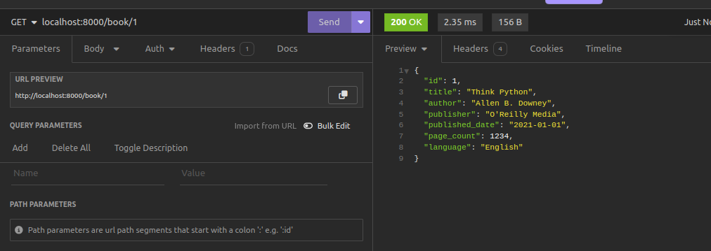
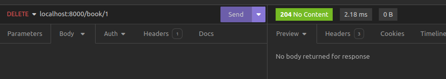

# Building a CRUD REST API 

## What is CRUD?

CRUD represents the four basic data operations:

- **Create (C):**

  - _Objective:_ Add new data.
  - _Action:_ Insert a new record or entity.

- **Read (R):**

  - _Objective:_ Retrieve existing data.
  - _Action:_ Fetch data without modification.

- **Update (U):**

  - _Objective:_ Modify existing data.
  - _Action:_ Update attributes or values.

- **Delete (D):**
  - _Objective:_ Remove data.
  - _Action:_ Delete a record or entity.

CRUD operations are fundamental in data management, commonly used in applications dealing with data persistence. In **FastAPI Beyond CRUD**, the focus is on extending FastAPI capabilities beyond typical CRUD applications, exploring advanced features and use cases. But before diving into such aspects, let us build a simple CRUD API using FastAPI.

### A simple CRUD API implementation
Our simple CRUD API will have a few endpoints to perform CRUD operations on a simple in-memory database of books. Here's a list of endpoints that we shall have in our CRUD API.

| Endpoint        | Method | Description         |
| --------------- | ------ | ------------------- |
| /books          | Get    | Read all books      |
| /books          | POST   | Create a book       |
| /book/{book_id} | GET    | Get a book by id    |
| /book/{book_id} | PATCH  | Update a book by id |
| /book/{book_id} | DELETE | Delete a book by id |

The provided table describes various API endpoints, their associated HTTP methods, and their functionalities:

1. **`/books` - GET: Read all books**

   - _Description:_ This endpoint is designed to retrieve information about all available books. When a client makes an HTTP GET request to `/books`, the server responds by providing details on all books in the system.

2. **`/books` - POST: Create a book**

   - _Description:_ To add a new book to the system, clients can make an HTTP POST request to `/books`. This operation involves creating and storing a new book based on the data provided in the request body.

3. **`/book/{book_id}` - GET: Get a book by id**

   - _Description:_ By making an HTTP GET request to `/book/{book_id}`, clients can retrieve detailed information about a specific book. The `book_id` parameter in the path specifies which book to fetch.

4. **`/book/{book_id}` - PATCH: Update a book by id**

   - _Description:_ To modify the information of a specific book, clients can send an HTTP PATCH request to `/book/{book_id}`. The `book_id` parameter identifies the target book, and the request body contains the updated data.

5. **`/book/{book_id}` - DELETE: Delete a book by id**
   - _Description:_ This endpoint allows clients to delete a specific book from the system. By sending an HTTP DELETE request to `/book/{book_id}`, the book identified by `book_id` will be removed from the records.

Now that we have a plan of our simple API, we can now build our simple CRUD API by adding the following code to `main.py`. We shall begin by creating a very simple list of books that we will use as our database.

```py title="in memory database of the books"

books = [
    {
        "id": 1,
        "title": "Think Python",
        "author": "Allen B. Downey",
        "publisher": "O'Reilly Media",
        "published_date": "2021-01-01",
        "page_count": 1234,
        "language": "English",
    },
    {
        "id": 2,
        "title": "Django By Example",
        "author": "Antonio Mele",
        "publisher": "Packt Publishing Ltd",
        "published_date": "2022-01-19",
        "page_count": 1023,
        "language": "English",
    },
    {
        "id": 3,
        "title": "The web socket handbook",
        "author": "Alex Diaconu",
        "publisher": "Xinyu Wang",
        "published_date": "2021-01-01",
        "page_count": 3677,
        "language": "English",
    },
    {
        "id": 4,
        "title": "Head first Javascript",
        "author": "Hellen Smith",
        "publisher": "Oreilly Media",
        "published_date": "2021-01-01",
        "page_count": 540,
        "language": "English",
    },
    {
        "id": 5,
        "title": "Algorithms and Data Structures In Python",
        "author": "Kent Lee",
        "publisher": "Springer, Inc",
        "published_date": "2021-01-01",
        "page_count": 9282,
        "language": "English",
    },
    {
        "id": 6,
        "title": "Head First HTML5 Programming",
        "author": "Eric T Freeman",
        "publisher": "O'Reilly Media",
        "published_date": "2011-21-01",
        "page_count": 3006,
        "language": "English",
    },
]
```

Once we have that, we shall build our endpoints on the simple database.

```python title="All CRUD endpoints on the in-memory store"
from fastapi import FastAPI, status
from fastapi.exceptions import HTTPException
from pydantic import BaseModel
from typing import List


app = FastAPI()

class Book(BaseModel):
    id: int
    title: str
    author: str
    publisher: str
    published_date: str
    page_count: int
    language: str

class BookUpdateModel(BaseModel):
    title: str
    author: str
    publisher: str
    page_count: int
    language: str


@app.get("/books", response_model=List[Book])
async def get_all_books():
    return books


@app.post("/books", status_code=status.HTTP_201_CREATED)
async def create_a_book(book_data: Book) -> dict:
    new_book = book_data.model_dump()

    books.append(new_book)

    return new_book


@app.get("/book/{book_id}")
async def get_book(book_id: int) -> dict:
    for book in books:
        if book["id"] == book_id:
            return book

    raise HTTPException(status_code=status.HTTP_404_NOT_FOUND, detail="Book not found")


@app.patch("/book/{book_id}")
async def update_book(book_id: int,book_update_data:BookUpdateModel) -> dict:
    
    for book in books:
        if book['id'] == book_id:
            book['title'] = book_update_data.title
            book['publisher'] = book_update_data.publisher
            book['page_count'] = book_update_data.page_count
            book['language'] = book_update_data.language

            return book
        
    raise HTTPException(status_code=status.HTTP_404_NOT_FOUND, detail="Book not found")


@app.delete("/book/{book_id}",status_code=status.HTTP_204_NO_CONTENT)
async def delete_book(book_id: int):
    for book in books:
        if book["id"] == book_id:
            books.remove(book)

            return {}
        
    raise HTTPException(status_code=status.HTTP_404_NOT_FOUND, detail="Book not found")

```

## Reading All Books (HTTP GET)
This route responds to GET requests made to `/books`, providing a list of all books available in the application. It ensures that the response adheres to the `List[Book]` model, guaranteeing consistency with the structure defined by the `Book` model.
```python title="Read all books"
class Book(BaseModel):
    id: int
    title: str
    author: str
    publisher: str
    published_date: str
    page_count: int
    language: str


@app.get("/books", response_model=List[Book])
async def get_all_books():
    return books
```

FastAPI significantly simplifies the process of returning any JSON serializable object as a response.

### Note

JSON (JavaScript Object Notation) serialization involves transforming a data structure or object from a programming language (such as Python, JavaScript, or others) into a JSON-formatted string. This string representation can then be transmitted over a network or stored in a file, subsequently allowing deserialization back into the original data structure.

In Python, the following data types are serializable:

- Lists
- Dictionaries
- Strings
- Tuples
- Booleans
- None

This capability enables us to effortlessly respond with a list of book objects when issuing a `GET` request to `http://localhost:8000/books`, as illustrated below:


## Read one Book (HTTP GET)
To retrieve a single book by its ID, the FastAPI application employs the `read_book` function whenever a request is made to `book/{book_id}`. The `{book_id}` serves as a path parameter passed to the `read_book` function to locate the book with the corresponding ID. The process involves iterating through the list of books to verify the existence of a book with the provided ID. If the book is not found, an `HTTPException` is raised, signaling that the book resource is not available. Notably, FastAPI's `status` module facilitates access to status codes, enabling the use of codes such as `HTTP_404_NOT_FOUND` to indicate resource absence.

```python title="Retrieve a book by ID"
@app.get("/book/{book_id}")
async def get_book(book_id: int) -> dict:
    for book in books:
        if book["id"] == book_id:
            return book

    raise HTTPException(status_code=status.HTTP_404_NOT_FOUND, detail="Book not found")
```




## Adding a New Book (HTTP POST)

To facilitate the insertion of a new book into the system, the Book model is utilized to define the structure and constraints for creating a new book resource.

```python title="Pydantic model to define a book structure"
from pydantic import BaseModel

class Book(BaseModel):
    id: int
    title: str
    author: str
    publisher: str
    published_date: str
    page_count: int
    language: str
```

Subsequently, an endpoint is established to enable the addition of a new book. This endpoint is designed to receive data formatted according to the specifications outlined by our Book model. Upon receipt, the incoming data undergoes validation to ensure its adherence to the predefined schema, thereby maintaining data integrity and security.
```python title="Creating a new book"

@app.post("/books", status_code=status.HTTP_201_CREATED)
async def create_a_book(book_data: Book) -> dict:
    new_book = book_data.model_dump()

    books.append(new_book)

    return new_book
```

Upon successful validation, the provided book data is appended to the list of existing books within the system. This systematic approach guarantees the integrity of the data being transmitted to the server. Furthermore, the endpoint is configured to return a status code of 201 (Created) upon successful creation of the new book, signifying the successful addition of the resource.

The `Book` class ensures that the data sent to the server follows the expected format. If invalid data is submitted, the server responds with errors, as shown below when no data is sent:


Similarly, submitting incomplete or incorrect data results in validation errors:


On the other hand, sending valid JSON data to the server creates a new book record. The response includes a 201 Created status code:


### Note

It's crucial to use the right HTTP status code in each response. In this case, we use `status_code=201` to indicate the successful creation of a resource. The default status code is 200, which represents a standard successful response.


## Update a book (HTTP PATCH)
Let us look at the update endpoint. This is quite similar to the create endpoint as it allows data to be sent to the server via the **PATCH** HTTP method. But it also requires we provide the `book_id` of the book that we will be updating. we loop through the book list and find the book that matches the `book_id` as shown below:

```python title="Updating a Book"
@app.patch("/book/{book_id}")
async def update_book(book_id: int,book_update_data:BookUpdateModel) -> dict:
    
    for book in books:
        if book['id'] == book_id:
            book['title'] = book_update_data.title
            book['publisher'] = book_update_data.publisher
            book['page_count'] = book_update_data.page_count
            book['language'] = book_update_data.language

            return book
        
    raise HTTPException(status_code=status.HTTP_404_NOT_FOUND, detail="Book not found")
```

If you notice, we have added the `book_update_data` parameter to our handler function and this is to be the validator for the data we shall use to update the book record. Notice this has a different schema called `BookUpdateModel`.

```python title="Pydantic model for updating a book"
class BookUpdateSchema(BaseModel):
    title:str
    author:str
    publisher:str
    page_count:int
    language:str
```

Notice how we have neglected some of the fields that are available in our Book structure as shown in our list of books. This is to ensure that we only send those fields that will be updated. Let us update our book record.


Let us confirm if our book record has been updated successfully. To do so we are going to retrieve the book by its ID. The book record has been updated successfully.


## Delete a book (HTTP Delete)
Let us finally look at the deletion of a book record. This is carried out in the following example:

```python title="Delete a book"
from fastapi import HTTPException, status

@app.delete("/book/{book_id}", status_code=status.HTTP_204_NO_CONTENT)
async def delete_book(book_id: int):
    for book in books:
        if book["id"] == book_id:
            books.remove(book)
            return {}
        
    raise HTTPException(status_code=status.HTTP_404_NOT_FOUND, detail="Book not found")
```

In this code, we loop through the books and find the book associated with the given `book_id`. We then remove it from the list of books using the `remove` list method. Notice that we return a 204 response status code, indicating that the book has been deleted and therefore no content is returned.

Here is a visual example of the deletion process:



And just like that, we have created a CRUD REST API using a simple in memory database. 


## Conclusion
In this chapter, we've developed a basic CRUD REST API using FastAPI. We utilized a simple in-memory database, represented by a Python list, to explore all CRUD actions. Moving forward, we'll restructure our project files to achieve a more organized and easily maintainable file structure.

**Previous** [Creating a Simple Web Server](./index.md)

**Next** [Improved Project Structure Using Routers](./chapter4.md)
