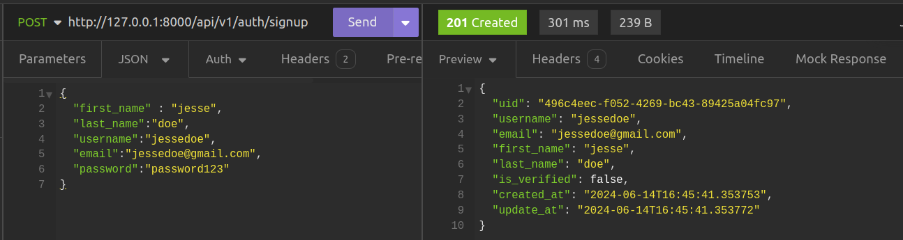
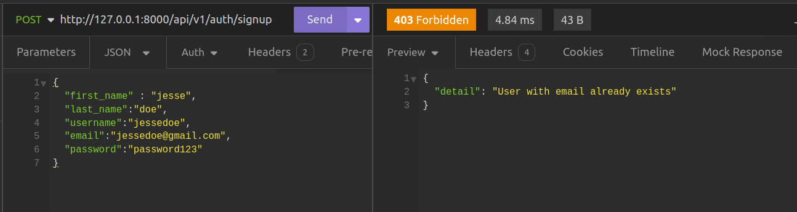

## User account Creation
In the previous chapter, we created a database model for user accounts. Using this, we are going to authenticate (show that our users are who they claim to be) and also authorize (show that they have the right access to specific parts of our application.)

## Creating User Accounts
Ths first task shall be one of making users join our application through signing up. Using thisstep, users shall have user accounts that can allow them use the application.

Our current project structure is something like this.
```console title="Current Project structure"
├── alembic.ini
├── migrations
│   ├── env.py
│   ├── README
│   ├── script.py.mako
│   └── versions
│       └── 8cf8276d5f3c_init.py
├── README.md
├── requirements.txt
└── src
    ├── auth
    │   ├── __init__.py
    │   ├── models.py
    ├── books
    │   ├── book_data.py
    │   ├── __init__.py
    │   ├── models.py
    │   ├── routes.py
    │   ├── schemas.py
    │   └── service.py
    ├── config.py
    ├── db
    │   ├── __init__.py
    │   └── main.py
    └── __init__.pyz
```


Let us begin by creating `src/auth/service.py` and adding the folowing code to it.
```python title="src/auth/service.py"
from .models import User
from .schemas import UserCreateModel
from .utils import generate_passwd_hash
from sqlmodel.ext.asyncio.session import AsyncSession
from sqlmodel import select


class UserService:
    async def get_user_by_email(self, email: str, session: AsyncSession):
        statement = select(User).where(User.email == email)

        result = await session.exec(statement)

        user = result.first()

        return user

    async def user_exists(self, email, session: AsyncSession):
        user = await self.get_user_by_email(email, session)

        return True if user is not None else False

    async def create_user(self, user_data: UserCreateModel, session: AsyncSession):
        user_data_dict = user_data.model_dump()

        new_user = User(**user_data_dict)

        new_user.password_hash = generate_passwd_hash(user_data_dict["password"])

        session.add(new_user)

        await session.commit()

        return new_user

```

### Retrieving a user by their email
Inside this file, we have created a class `UserService` containing some methods that shall be necessary when creating user accounts. Let us begin by looking at the first method `get_user_by_email` .

```python title="src/auth/service.py"

async def get_user_by_email(self, email: str, session: AsyncSession):
    statement = select(User).where(User.email == email)

    result = await session.exec(statement)

    user = result.first()

    return user
```

This function is responsible for retrieving a user by their username. First we create a statement the queries for a user by their email.
```python title="select a user by their email"
statement = select(User).where(User.email == email)
```

Next, we create a result object from using our session object to execute the statement.

```python title="Using the session to execute the statement"
result = await session.exec(statement)

user = result.first()

```

We then access to the returned user object using the `first` method. Finally, we return the user object.

### Checking if a user exists
The next method is the `user_exists` method that shows if a user exists by returning `True` if the user exists else `False`.

```python title="Checking is the user account exists"
async def user_exists(self, email, session: AsyncSession):
    user = await self.get_user_by_email(email, session)

    return True if user is not None else False
```

### Creating the user account
Lastly we have the `create_user` function that is responsible fo creating a user account.
```python title="Creating a user account"
async def create_user(self, user_data: UserCreateModel, session: AsyncSession):
    user_data_dict = user_data.model_dump()

    new_user = User(**user_data_dict)

    new_user.password_hash = generate_passwd_hash(user_data_dict["password"])

    session.add(new_user)

    await session.commit()

    return new_user
``` 

This function has two parameters, the `user_data` and the `session` object. The `user_data` parameter is of type `BookCreateModel` which we are going to define in a  `schemas.py`
we have to created inside our `auth` directory.

```python title="src/auth/schemas.py"
class UserCreateModel(BaseModel):
    first_name: str =Field(max_length=25)
    last_name:  str =Field(max_length=25)
    username: str = Field(max_length=8)
    email: str = Field(max_length=40)
    password: str  = Field(min_length=6)
```

This example demonstrates a typical Pydantic model used for defining the structure required to create a new user account. The model includes fields from the `User` database model that are necessary for account creation.

We use the `Field` class to enforce additional validation on certain fields, such as specifying `max_length` and `min_length`. This ensures that any data received from a client adheres to these constraints. 

The `session` object, which is instantiated from the `get_session` dependency, is then utilized.

A dictionary named `new_user` is created from the `user_data` object. This dictionary is then unpacked to instantiate a new `User` object with the corresponding attributes. Subsequently, the `session` object is used to add this new `User` object to the session. We commit the session to persist the new user to the database. Finally, we return the newly created user object.

```python
user_data_dict = user_data.model_dump()

new_user = User(**user_data_dict)

new_user.password_hash = generate_passwd_hash(user_data_dict["password"])

session.add(new_user)

await session.commit()

return new_user
```

Let's take a closer look at how the password is hashed using the generate_password_hash function defined in src/auth/utils.py.

First, note how we utilize the generate_password_hash function within our user creation process to securely hash the user's password before storing it in the database. This ensures that passwords are not stored in plain text, enhancing security.

```python title="src/auth/utils.py"
from passlib.context import CryptContext

passwd_context = CryptContext(
    schemes=['bcrypt']
)

def generate_password_hash(password: str) -> str:
    hash = passwd_context.hash(password)
    return hash

def verify_password(password: str, hash: str) -> bool:
    return passwd_context.verify(password, hash)
```

This file contains two crucial functions:

1. **generate_password_hash**: This function takes a plain text password and returns its hashed version.
2. **verify_password**: This function checks if a given plain text password matches a stored hash, returning `True` if they match and `False` otherwise.

To make these functions work, we use Passlib, a library that supports various password hashing algorithms. You can install it with the following command:

```console title="Installing passlib"
pip install passlib
```

Passlib's `CryptContext` class allows us to specify which hashing algorithms to use. In this case, we create a `passwd_context` object configured to use the Bcrypt algorithm:

```python title="Creating the password context"
passwd_context = CryptContext(
    schemes=['bcrypt']
)
```

This object is initialized with the `schemes` parameter, a list of the hashing algorithms we want to use. Here, we've chosen Bcrypt.

We then use this object to hash and verify passwords by calling its methods:
1. **hash**: This method takes a plain text password and returns a hashed version of it.
2. **verify**: This method takes a plain text password and a hash, returning `True` if they match and `False` if they don't.

## Creating the Auth Router

After creating our `UserService`, we can now create an API endpoint to utilize this service. First, we will create a `routes.py` file and add the following code to it:

```python title="src/auth/routes.py"
from fastapi import APIRouter, Depends, status
from .schemas import UserCreateModel, UserModel
from .service import UserService
from src.db.main import get_session
from sqlmodel.ext.asyncio.session import AsyncSession
from fastapi.exceptions import HTTPException

auth_router = APIRouter()
user_service = UserService()

@auth_router.post(
    "/signup", response_model=UserModel, status_code=status.HTTP_201_CREATED
)
async def create_user_account(
    user_data: UserCreateModel, session: AsyncSession = Depends(get_session)
):
    email = user_data.email

    user_exists = await user_service.user_exists(email, session)

    if user_exists:
        raise HTTPException(
            status_code=status.HTTP_403_FORBIDDEN,
            detail="User with email already exists",
        )

    new_user = await user_service.create_user(user_data, session)

    return new_user
```

In this file, we create a router object called `auth_router` to group all routes related to authentication. We also instantiate `user_service` to access the methods defined in the UserService object. Then, we create an endpoint for creating user accounts. The primary endpoint in this file is for creating user accounts. This endpoint extracts the email from the `user_data` object and checks if a user with that email already exists using the `user_service.user_exists` method. 

If the user exists, it raises an `HTTPException` with a 403 status code and an appropriate message. If the user does not exist, it creates and saves the new user in the database using the user_service.create_user method and returns the newly created user object. To test this endpoint, use a tool like Insomnia to send a POST request to the /signup endpoint with the required fields in the request body, ensuring the user account is created successfully or that the correct error message is returned if the user already exist.

Making a sucessful request to the endpoint creates a new user account.


Making the same request again shows that the user already exists with the defined status code.



## Conclusion
For now, we have been successful in creating user accounts using the database model we created in the previous section. In the next section, we are going to allow users identify themselves, so that they access various API endpoints.

**Previous**: [Creating the User Authentication Model](./chapter7.md)

**Next**: [Authentication Using JWTs](./chapter9.md)

