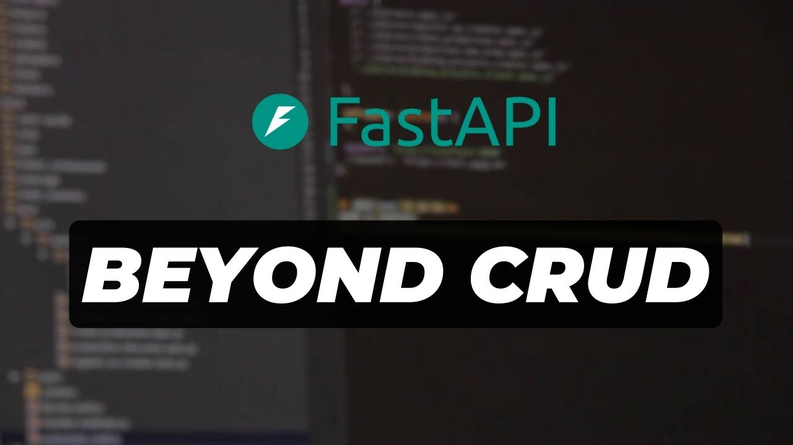

# FastAPI Beyond CRUD

  

This course material is tailored for my [FastAPI](http://fastapi.tiangolo.com) Framework course. FastAPI has quickly emerged as one of Python's leading frameworks for crafting server-side web applications. I'm excited to present this comprehensive course, dedicated to helping you understand API development with FastAPI. I trust you'll find immense value in it as we delve into the complexities of building robust APIs.

## About Me:

My name is Ssali Jonathan. I am a software engineer based in Uganda. For about 3 years, I have been building a [Youtube channel](https://youtube.com/@SsaliJonathan) where I educate people about programming mainly using the Python language. I have worked on freelance, and fulltime roles. I have a passion for educating others and sharing knowledge.

## Please donate to the project
I have made this course available for free on my [Youtube channel](https://youtube.com/@SsaliJonathan) and on this website. If you can support me to create more projects like this, please consider donating to my work using the following channels.

<a href="https://www.patreon.com/bePatron?u=60087138" data-patreon-widget-type="become-patron-button">Become a Patron!</a>

## Follow me on the following platforms
- [Twitter](https://twitter.com/jod35_)
- [Github](https://github.com/jod35)
- [Youtube](https://youtube.com/@SsaliJonathan)
