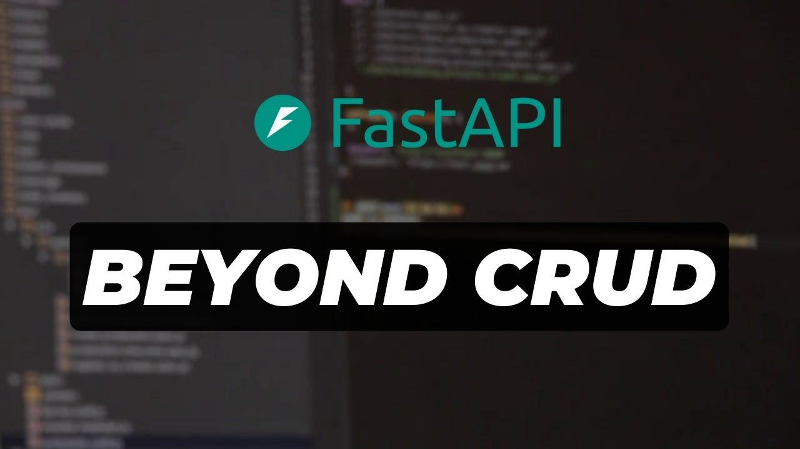

# FastAPI Beyond CRUD (2026 Edition)

  

This website is built for the 2026 edition of my FastAPI Beyond CRUD course a hands-on course focused on building real-world web applications with FastAPI. This edition builds on the previous one, taking things further by developing a larger and more advanced application while introducing stronger backend and software engineering practices. 

The course starts with core FastAPI features and gradually moves into more advanced backend development topics, giving you practical experience with patterns and techniques used in production systems. My goal is to help you confidently build your own FastAPI applications while gaining a deeper understanding of real-world web application development.

## About Me:

My name is **Ssali Jonathan**, a software engineer based in Uganda. For the past five years, I’ve been building a [YouTube channel](https://youtube.com/@SsaliJonathan) where I teach programming, with a strong focus on Python.

I’ve worked in both freelance and full-time roles, gaining hands-on experience building real-world software. Beyond writing code, I’m deeply passionate about educating others and sharing knowledge in a clear, practical way.

I also produce music for fun in my free time using [FL Studio](https://www.image-line.com/flstudio/).

## Please donate to the project
I have made this course available for free on my [Youtube channel](https://youtube.com/@SsaliJonathan) and on this website. If you can support me to create more projects like this, please consider donating to my work using the following channelS.

- [Become a Patron](https://www.patreon.com/jod35)
- [Become a Youtube channel member](https://www.youtube.com/@SsaliJonathan)
- [Buy me a coffee](https://www.buymeacoffee.com/jod35)

## My socials
Follow me on the following platforms for updates and more content

- [Twitter](https://twitter.com/jod35_)
- [Github](https://github.com/jod35)
- [Youtube](https://youtube.com/@SsaliJonathan)
- [Dev.to](https://dev.to/jod35)
